# MySQL Business to Schema - Roadmap Visual Summary

## 🎯 2024 Timeline

```
Q1 2024 (Now → March)
├── Phase 1: Foundation Completion ✅
│   ├── Complete 3 missing generators
│   ├── Documentation enhancement
│   └── Quick wins & improvements
│
Q2 2024 (April → June)
├── Phase 2: Performance & Analytics 📊
│   ├── Enhanced query executor
│   ├── Performance toolkit
│   └── Advanced monitoring
│
├── Phase 3: Interactive Learning 🎓
│   ├── SQL Playground
│   ├── Schema challenges
│   └── Performance labs
│
Q3 2024 (July → September)
├── Phase 4: Modern Architecture 🏗️
│   ├── AI/ML examples (Vector DB, RAG)
│   ├── Microservices patterns
│   └── 7 new examples total
│
Q4 2024 (October → December)
└── Phase 5: API & Integration 🔌
    ├── REST/GraphQL APIs
    ├── CLI tool
    └── Integration examples
```

## 🚀 2025 Timeline

```
Q1 2025 (January → March)
├── Phase 6: Cloud Native ☁️
│   ├── AWS/Azure/GCP scripts
│   ├── Kubernetes native
│   └── Serverless patterns
│
Q2 2025 (April → June)
├── Phase 7: Security & Compliance 🔐
│   ├── Security hardening
│   ├── Compliance templates
│   └── Security testing
│
Q3 2025 (July → Ongoing)
└── Phase 8: Community & Ecosystem 🌍
    ├── Community platform
    ├── Educational content
    └── Business intelligence
```

## 📊 Quick Stats by Phase

| Phase | New Examples | New Features | Effort | Priority |
|-------|-------------|--------------|--------|----------|
| **Phase 1** | 0 | 3 generators | 🟢 Low | 🔴 P0 |
| **Phase 2** | 0 | Query tools | 🟡 Medium | 🔴 P1 |
| **Phase 3** | 0 | Learning platform | 🔴 High | 🔴 P1 |
| **Phase 4** | 7 | ML/AI patterns | 🔴 High | 🟡 P2 |
| **Phase 5** | 0 | API/CLI | 🟡 Medium | 🟡 P2 |
| **Phase 6** | 0 | Cloud deploy | 🔴 High | 🟢 P3 |
| **Phase 7** | 0 | Security | 🟡 Medium | 🟢 P3 |
| **Phase 8** | ∞ | Community | 🔴 High | 🔵 P4 |

## 🎯 Key Milestones

### 🏁 Q1 2024
- **100% Generator Coverage** - All 15 examples have data generators
- **Performance Baselines** - Recorded for all queries

### 🏁 Q2 2024
- **Interactive Learning Launch** - 50+ exercises available
- **Performance Toolkit** - Index advisor operational

### 🏁 Q3 2024
- **25 Total Examples** - Including AI/ML and microservices
- **22 Working Generators** - Full coverage maintained

### 🏁 Q4 2024
- **API/CLI Release** - v1.0 of programmatic access
- **1000+ API calls/day** - Active usage

### 🏁 Q1 2025
- **Cloud Ready** - One-click deployments for AWS/Azure/GCP
- **Enterprise Ready** - Production deployment guides

### 🏁 Q2 2025
- **Security Certified** - Pass security audit
- **Compliance Ready** - Templates for major standards

### 🏁 Q3 2025
- **Community Thriving** - 1000+ active members
- **Education Standard** - University adoption

## 🎨 Development Themes

```mermaid
graph LR
    A[Current State] --> B[Complete]
    B --> C[Enhance]
    C --> D[Modernize]
    D --> E[Integrate]
    E --> F[Scale]
    F --> G[Secure]
    G --> H[Community]

    style A fill:#f9f,stroke:#333,stroke-width:4px
    style B fill:#9f9,stroke:#333,stroke-width:2px
    style C fill:#99f,stroke:#333,stroke-width:2px
    style D fill:#f99,stroke:#333,stroke-width:2px
    style E fill:#9ff,stroke:#333,stroke-width:2px
    style F fill:#ff9,stroke:#333,stroke-width:2px
    style G fill:#f9f,stroke:#333,stroke-width:2px
    style H fill:#9f9,stroke:#333,stroke-width:2px
```



## 📈 Growth Projections

| Metric | Current | 6 Months | 1 Year | 2 Years |
|--------|---------|----------|--------|---------|
| **Examples** | 15 | 15 | 25 | 30+ |
| **Generators** | 11 | 15 | 22 | 30+ |
| **GitHub Stars** | ~100 | 5,000 | 10,000 | 20,000 |
| **Contributors** | 1 | 20 | 100 | 500 |
| **Active Users** | ~50 | 1,000 | 10,000 | 50,000 |
| **Interactive Exercises** | 0 | 50 | 100 | 200 |
| **API Calls/Day** | 0 | 100 | 1,000 | 10,000 |
| **Cloud Platforms** | 0 | 1 | 5 | 10 |

## 🔄 Continuous Activities

Throughout all phases:
- 📝 Documentation updates
- 🧪 Test coverage improvement
- 🚀 Performance optimization
- 🐛 Bug fixes
- 🔍 Code reviews
- 📊 Metrics tracking

## 💡 Quick Start Priorities

### This Week
1. ✅ Complete Real Estate generator
2. ✅ Add README badges
3. ✅ Create project board

### This Month
1. ✅ All 3 missing generators
2. ✅ Performance baselines
3. ✅ Enhanced documentation

### This Quarter
1. ✅ Query executor enhancements
2. ✅ Interactive learning MVP
3. ✅ Community setup

## 🎯 Success Criteria

### Phase Success = All boxes checked:
- [ ] All deliverables complete
- [ ] Tests passing (>90% coverage)
- [ ] Documentation updated
- [ ] Performance targets met
- [ ] User feedback incorporated
- [ ] No critical bugs

## 🚦 Status Key

- 🟢 **Complete**: Ready to use
- 🟡 **In Progress**: Active development
- 🔴 **Planned**: Not started
- 🔵 **Ongoing**: Continuous improvement
- ⚫ **Blocked**: Waiting on dependencies

---

*Visual roadmap for quick reference. See [ROADMAP.md](./ROADMAP.md) for complete details.*