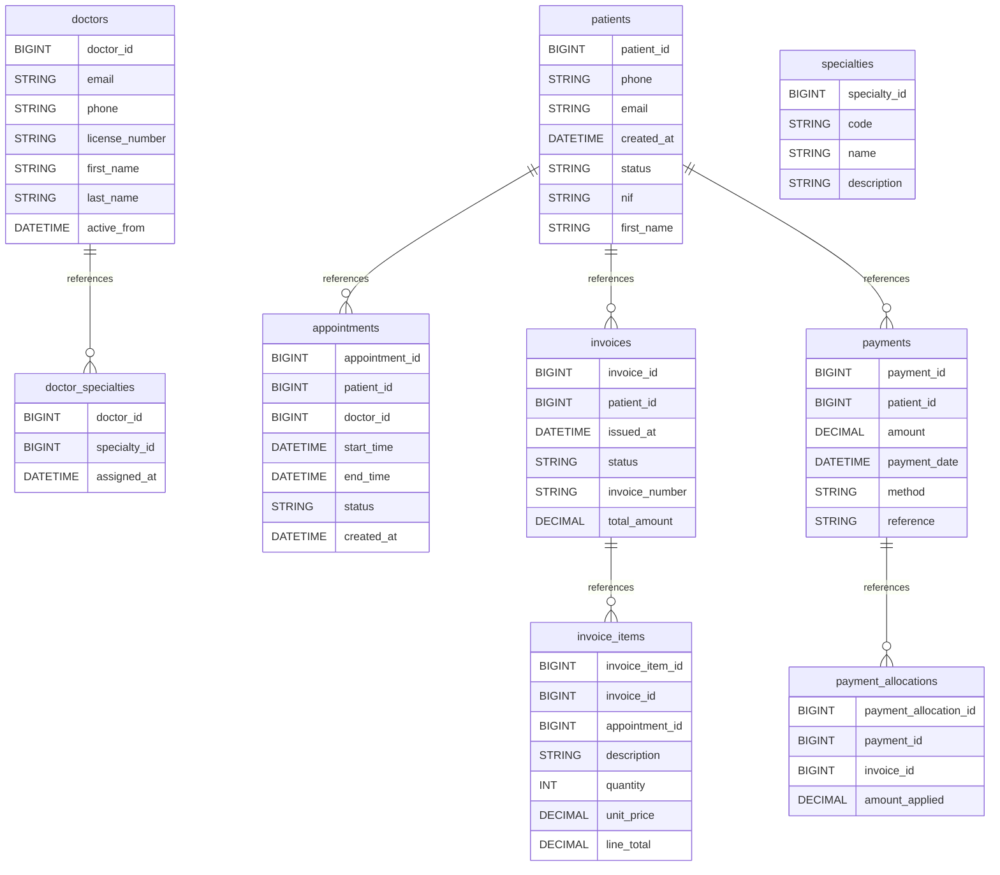

# 🏥 Medical Clinic Management System

A comprehensive MySQL database schema for managing a medical clinic, including patient records, doctor profiles, appointment scheduling, billing, and payment processing.

## 📊 Database Overview

- **Industry**: Healthcare
- **Complexity**: Medium
- **Tables**: 9
- **Key Features**: Appointments, Medical Records, Billing, Insurance
- **Data Generator**: ✅ Available

## 🗂️ Schema Structure

### Core Tables

1. **patients** - Patient demographics and contact information

  - Personal details (name, date of birth)
  - Contact information (phone, email)
  - Portuguese NIF (tax identification)
  - Active/inactive status tracking

2. **doctors** - Medical practitioners

  - License number tracking
  - Contact details
  - Active period management (from/to dates)
  - Support for doctor lifecycle

3. **specialties** - Medical specializations

  - Specialty codes and descriptions
  - Supports multiple specialties per doctor

4. **doctor_specialties** - Many-to-many relationship

  - Links doctors to their specialties
  - Tracks when specialty was assigned

### Appointment Management

1. **appointments** - Patient appointments

  - Scheduled time slots (start/end times)
  - Status tracking (scheduled, completed, cancelled, no_show)
  - Cancellation and no-show reason tracking
  - Automatic timestamp updates

### Billing & Payments

1. **invoices** - Patient billing

  - Unique invoice numbering
  - Status tracking (open, partially_paid, paid, void)
  - Total amount calculation
  - Patient association

2. **invoice_items** - Invoice line items

  - Service descriptions
  - Quantity and pricing
  - Optional appointment linkage
  - Line total calculations

3. **payments** - Payment records

  - Multiple payment methods (cash, card, transfer)
  - Payment reference tracking
  - Patient association

4. **payment_allocations** - Payment applications

  - Links payments to specific invoices
  - Supports partial payments
  - Enables payment splitting across invoices

## 🔑 Key Features

### Appointment System

- **Time slot management** with start/end times
- **Status workflow**: scheduled → completed/cancelled/no_show
- **Reason tracking** for cancellations and no-shows
- **Doctor-patient assignment** with specialty matching

### Billing Features

- **Flexible invoicing** with multiple line items
- **Partial payment support** through allocations
- **Payment method tracking** (cash, card, transfer, other)
- **Invoice status lifecycle** (open → partially_paid → paid)

### Data Integrity

- **Foreign key constraints** ensuring referential integrity
- **ENUM types** for controlled vocabularies
- **DEFAULT values** for timestamps and status fields
- **AUTO_INCREMENT** primary keys

## 📈 Use Cases

### Common Queries

1. **Patient Management**

  ```sql
  -- Find active patients with upcoming appointments
  SELECT p.*, COUNT(a.appointment_id) as upcoming_appointments
  FROM patients p
  LEFT JOIN appointments a ON p.patient_id = a.patient_id
  WHERE p.status = 'active'
   AND a.start_time > NOW()
   AND a.status = 'scheduled'
  GROUP BY p.patient_id;
  ```

2. **Doctor Scheduling**

  ```sql
  -- Doctor availability and appointment load
  SELECT
   d.doctor_id,
   CONCAT(d.first_name, ' ', d.last_name) as doctor_name,
   s.name as specialty,
   COUNT(a.appointment_id) as total_appointments
  FROM doctors d
  JOIN doctor_specialties ds ON d.doctor_id = ds.doctor_id
  JOIN specialties s ON ds.specialty_id = s.specialty_id
  LEFT JOIN appointments a ON d.doctor_id = a.doctor_id
  WHERE d.active_to IS NULL
  GROUP BY d.doctor_id, s.specialty_id;
  ```

3. **Revenue Tracking**

  ```sql
  -- Monthly revenue summary
  SELECT
   DATE_FORMAT(i.issued_at, '%Y-%m') as month,
   COUNT(DISTINCT i.invoice_id) as total_invoices,
   SUM(i.total_amount) as billed_amount,
   SUM(CASE WHEN i.status = 'paid' THEN i.total_amount ELSE 0 END) as paid_amount
  FROM invoices i
  GROUP BY DATE_FORMAT(i.issued_at, '%Y-%m')
  ORDER BY month DESC;
  ```

4. **Outstanding Balances**

  ```sql
  -- Patients with outstanding balances
  SELECT
   p.patient_id,
   CONCAT(p.first_name, ' ', p.last_name) as patient_name,
   SUM(i.total_amount) as total_billed,
   COALESCE(SUM(pa.amount_applied), 0) as total_paid,
   SUM(i.total_amount) - COALESCE(SUM(pa.amount_applied), 0) as balance_due
  FROM patients p
  JOIN invoices i ON p.patient_id = i.patient_id
  LEFT JOIN payment_allocations pa ON i.invoice_id = pa.invoice_id
  WHERE i.status IN ('open', 'partially_paid')
  GROUP BY p.patient_id
  HAVING balance_due > 0;
  ```

## 🚀 Getting Started

### 1\. Create Database

```bash
mysql -u root -p < schema/00_create_database.sql
```

### 2\. Create Schema

```bash
mysql -u root -p clinic < schema/01_tables.sql
mysql -u root -p clinic < schema/02_constraints.sql
mysql -u root -p clinic < schema/03_indexes.sql
```

### 3\. Generate Test Data

```bash
# Using the unified runner (recommended)
python generators/run_generators.py clinic --test

# Or run directly
cd generators/clinic
python generator.py
```

### 4\. Load Generated Data

```bash
mysql -u root -p clinic < generators/clinic/output/*.sql
```

### 5\. Run Example Queries

```bash
mysql -u root -p clinic < queries/01_basic_selects.sql
mysql -u root -p clinic < queries/02_joins.sql
mysql -u root -p clinic < queries/03_aggregations.sql
mysql -u root -p clinic < queries/04_reports.sql
```

## 📋 Business Rules

### Appointment Scheduling

- Appointments must not overlap for the same doctor
- Status transitions: scheduled → completed/cancelled/no_show
- End time must be after start time
- Cancelled appointments should have a reason

### Billing Rules

- Invoices start with status 'open'
- Invoice items must have positive quantities
- Line totals = quantity × unit_price
- Payments can be split across multiple invoices

### Payment Processing

- Payments cannot exceed invoice amounts
- Payment allocations track partial payments
- Void invoices should not accept payments
- Payment methods are restricted to defined types

## 🔍 Indexes

Optimized indexes for common query patterns:

- **appointments**: `(patient_id)`, `(doctor_id)`, `(start_time)`
- **invoices**: `(patient_id)`, `(status)`, `(invoice_number)`
- **payments**: `(patient_id)`, `(payment_date)`
- **payment_allocations**: `(payment_id)`, `(invoice_id)`

## 📊 Sample Data Statistics

When using the data generator with default configuration:

- **Patients**: 30 records
- **Doctors**: 10 practitioners
- **Specialties**: 8 medical specializations
- **Appointments**: 200 appointments over 30 days
- **Invoices**: 120 invoices
- **Payments**: 150 payment transactions
- **Total Records**: ~500+

## 🎯 Learning Objectives

This example demonstrates:

1. **Normalized Design** - Proper use of junction tables (doctor_specialties)
2. **Status Management** - ENUM types for controlled state transitions
3. **Financial Tracking** - Double-entry style payment allocations
4. **Temporal Data** - Managing time slots and scheduling conflicts
5. **Audit Trails** - Automatic timestamps with `ON UPDATE`
6. **Business Logic** - Implementing real-world clinic workflows

## 🔧 Customization

### Extending the Schema

Common extensions you might consider:

1. **Insurance Integration**

  ```sql
  CREATE TABLE insurance_providers (
   provider_id BIGINT UNSIGNED PRIMARY KEY,
   name VARCHAR(100),
   code VARCHAR(50)
  );

  CREATE TABLE patient_insurance (
   patient_id BIGINT UNSIGNED,
   provider_id BIGINT UNSIGNED,
   policy_number VARCHAR(50),
   valid_from DATE,
   valid_to DATE
  );
  ```

2. **Medical Records**

  ```sql
  CREATE TABLE medical_records (
   record_id BIGINT UNSIGNED PRIMARY KEY,
   appointment_id BIGINT UNSIGNED,
   diagnosis TEXT,
   treatment TEXT,
   prescription TEXT,
   follow_up_required BOOLEAN
  );
  ```

3. **Prescription Management**

  ```sql
  CREATE TABLE prescriptions (
   prescription_id BIGINT UNSIGNED PRIMARY KEY,
   appointment_id BIGINT UNSIGNED,
   medication VARCHAR(200),
   dosage VARCHAR(100),
   duration_days INT,
   instructions TEXT
  );
  ```

## 🛠️ Technologies

- **Database**: MySQL 8.0+
- **Engine**: InnoDB (ACID compliance, foreign keys)
- **Character Set**: utf8mb4
- **Collation**: utf8mb4_unicode_ci

## 📚 Additional Resources

- [Generator Documentation](../generators/clinic/README.md)
- [Query Examples](queries/)
- [Schema DDL](schema/)
- [Performance Tuning Guide](../performance-testing/README.md)

## 🤝 Contributing

To improve this example:

1. Add more complex medical scenarios
2. Implement audit logging
3. Add HIPAA compliance features
4. Create stored procedures for common operations
5. Add trigger examples for business rules

See [CONTRIBUTING.md](../CONTRIBUTING.md) for guidelines.

## 📝 License

This example is part of the MySQL Business-to-Schema project, licensed under MIT License.

## Database Architecture (Mermaid ERD)


