# Smart Energy Monitoring System

## Overview

This example demonstrates a comprehensive smart energy monitoring and optimization system for commercial buildings, featuring real-time power consumption tracking, renewable energy integration, demand response capabilities, and predictive maintenance for HVAC systems.

## Business Context

Commercial buildings face significant energy management challenges:

- **Rising Energy Costs**: Electricity costs continue to increase, especially during peak hours
- **Sustainability Goals**: Pressure to reduce carbon footprint and meet environmental targets
- **Grid Reliability**: Need to participate in demand response programs
- **Equipment Efficiency**: Aging HVAC systems waste energy and require maintenance
- **Tenant Billing**: Complex sub-metering and cost allocation requirements

This smart energy solution addresses these challenges through:

- Real-time monitoring of energy consumption at multiple levels
- Integration of renewable energy sources (solar, battery storage)
- Automated demand response participation
- Predictive maintenance for equipment
- Fair and transparent tenant billing

## Key Differentiators from IoT Bins Example

While both are IoT systems, this example focuses on different aspects:

### Data Characteristics

- **High-Frequency Time Series**: Readings every 5 seconds vs 5 minutes
- **Multi-Dimensional Data**: Power factor, voltage, current, frequency
- **Complex Aggregations**: Peak/off-peak, time-of-use, demand charges
- **Hierarchical Metering**: Building → Floor → Zone → Equipment

### Business Logic

- **Cost Optimization**: Time-of-use rates, demand charge management
- **Renewable Integration**: Solar generation, battery storage optimization
- **Multi-Tenant Management**: Sub-metering, cost allocation, billing
- **Demand Response**: Grid interaction, load shedding, incentives

### Technical Features

- **Power Quality Monitoring**: Voltage sags, harmonics, power factor
- **Equipment Efficiency Tracking**: COP, degradation, performance
- **Weather Integration**: Temperature impact on load, solar generation
- **Predictive Analytics**: Load forecasting, equipment failure prediction

## Learning Objectives

### Advanced Time Series

- Sub-second data ingestion strategies
- Multi-level aggregation patterns
- Sliding window calculations
- Gap filling and interpolation

### Energy Domain Concepts

- Power vs energy calculations
- Demand charge optimization
- Load factor analysis
- Power quality metrics

### Complex Business Rules

- Time-of-use billing
- Tenant cost allocation
- Demand response strategies
- Renewable energy optimization

### Predictive Analytics

- Load forecasting models
- Equipment failure prediction
- Anomaly detection
- Pattern recognition

## Database Schema Highlights

### Core Design Principles

1. **Hierarchical Structure**

  ```
  Building → Floors → Zones → Equipment
         ↓
       Meters → Readings → Aggregations
  ```

2. **Time Series Optimization**

  - Separate tables for different frequencies
  - Pre-computed aggregations
  - Efficient partitioning strategy

3. **Multi-Tenancy Support**

  - Tenant-zone assignments with time validity
  - Shared space allocation
  - Individual billing records

4. **Renewable Energy Integration**

  - Solar production tracking
  - Battery state management
  - Net metering calculations

## Setup Instructions

### Prerequisites

- MySQL 8.0+ (for JSON support and window functions)
- Python 3.10+ (for data generator)
- 5GB+ free disk space (high-frequency data)

### Quick Start

1. **Create Database**

  ```bash
  mysql -u root -p < schema/00_create_database.sql
  ```

2. **Install Schema**

  ```bash
  mysql -u root -p smart_energy < schema/01_tables.sql
  mysql -u root -p smart_energy < schema/02_constraints.sql
  ```

3. **Generate Test Data**

  ```bash
  cd ../generators/smart_energy
  python generate.py --config config.yaml
  ```

4. **Load Data**

  ```bash
  mysql -u root -p smart_energy < ../../example_03_smart_energy/schema/10_load_generated.sql
  ```

## Key Queries and Use Cases

### 1\. Real-Time Energy Monitoring

```sql
-- Current power consumption by building
SELECT
    b.building_name,
    SUM(er.power_value) AS total_power_kw,
    COUNT(DISTINCT em.meter_id) AS active_meters,
    AVG(er.power_factor) AS avg_power_factor
FROM energy_readings er
JOIN energy_meters em ON er.meter_id = em.meter_id
JOIN buildings b ON em.building_id = b.building_id
WHERE er.reading_timestamp >= NOW() - INTERVAL 1 MINUTE
GROUP BY b.building_id;
```

### 2\. Demand Response Optimization

```sql
-- Identify load shedding opportunities
SELECT
    z.zone_name,
    z.zone_type,
    AVG(er.power_value) AS current_load_kw,
    lp.typical_load_kw,
    (AVG(er.power_value) - lp.typical_load_kw) AS reduction_potential_kw
FROM zones z
JOIN energy_meters em ON z.zone_id = em.zone_id
JOIN energy_readings er ON em.meter_id = er.meter_id
JOIN load_profiles lp ON z.floor_id IN (
    SELECT floor_id FROM floors WHERE building_id = lp.building_id
)
WHERE er.reading_timestamp >= NOW() - INTERVAL 15 MINUTE
    AND lp.hour_of_day = HOUR(NOW())
GROUP BY z.zone_id
HAVING reduction_potential_kw > 10
ORDER BY reduction_potential_kw DESC;
```

### 3\. Solar Generation vs Consumption

```sql
-- Net energy position
WITH consumption AS (
    SELECT
        DATE(reading_timestamp) AS date,
        HOUR(reading_timestamp) AS hour,
        SUM(power_value) AS grid_power_kw
    FROM energy_readings er
    JOIN energy_meters em ON er.meter_id = em.meter_id
    WHERE em.meter_type_id = (SELECT meter_type_id FROM meter_types WHERE type_code = 'MAIN')
        AND DATE(reading_timestamp) = CURDATE()
    GROUP BY DATE(reading_timestamp), HOUR(reading_timestamp)
),
generation AS (
    SELECT
        DATE(timestamp) AS date,
        HOUR(timestamp) AS hour,
        SUM(power_kw) AS solar_power_kw
    FROM solar_production
    WHERE DATE(timestamp) = CURDATE()
    GROUP BY DATE(timestamp), HOUR(timestamp)
)
SELECT
    c.hour,
    c.grid_power_kw,
    COALESCE(g.solar_power_kw, 0) AS solar_power_kw,
    c.grid_power_kw - COALESCE(g.solar_power_kw, 0) AS net_consumption_kw,
    CASE
        WHEN g.solar_power_kw > c.grid_power_kw THEN 'Exporting'
        WHEN g.solar_power_kw > 0 THEN 'Partial Solar'
        ELSE 'Grid Only'
    END AS energy_status
FROM consumption c
LEFT JOIN generation g ON c.date = g.date AND c.hour = g.hour
ORDER BY c.hour;
```

### 4\. Tenant Billing Calculation

```sql
-- Monthly tenant energy costs
WITH tenant_consumption AS (
    SELECT
        t.tenant_id,
        t.company_name,
        SUM(ech.energy_consumed_kwh) AS total_kwh,
        SUM(CASE
            WHEN HOUR(ech.hour_start) BETWEEN 14 AND 20 THEN ech.energy_consumed_kwh
            ELSE 0
        END) AS peak_kwh,
        MAX(ech.max_power_kw) AS peak_demand_kw
    FROM tenants t
    JOIN tenant_zone_assignments tza ON t.tenant_id = tza.tenant_id
    JOIN energy_meters em ON tza.zone_id = em.zone_id
    JOIN energy_consumption_hourly ech ON em.meter_id = ech.meter_id
    WHERE MONTH(ech.hour_start) = MONTH(CURDATE())
        AND YEAR(ech.hour_start) = YEAR(CURDATE())
    GROUP BY t.tenant_id
)
SELECT
    company_name,
    total_kwh,
    peak_kwh,
    peak_demand_kw,
    (peak_kwh * 0.25 + (total_kwh - peak_kwh) * 0.12) AS energy_charge,
    (peak_demand_kw * 15.00) AS demand_charge,
    250.00 AS fixed_charge,
    (peak_kwh * 0.25 + (total_kwh - peak_kwh) * 0.12 + peak_demand_kw * 15.00 + 250.00) AS total_bill
FROM tenant_consumption
ORDER BY total_bill DESC;
```

### 5\. Equipment Efficiency Analysis

```sql
-- HVAC efficiency trends
SELECT
    hu.unit_name,
    hu.unit_type,
    DATE(ht.timestamp) AS date,
    AVG(ht.efficiency_cop) AS avg_cop,
    SUM(ht.power_kw * ht.runtime_minutes / 60) AS energy_consumed_kwh,
    AVG(ht.outdoor_temp_c) AS avg_outdoor_temp,
    COUNT(DISTINCT ht.fault_code) AS fault_count
FROM hvac_units hu
JOIN hvac_telemetry ht ON hu.unit_id = ht.unit_id
WHERE ht.timestamp >= DATE_SUB(NOW(), INTERVAL 7 DAY)
GROUP BY hu.unit_id, DATE(ht.timestamp)
HAVING avg_cop < 2.5 OR fault_count > 0
ORDER BY date DESC, avg_cop ASC;
```

## Advanced Features

### 1\. Demand Response Automation

The system automatically:

- Monitors grid signals for DR events
- Calculates optimal load reduction strategy
- Controls HVAC and lighting systems
- Tracks compliance and calculates incentives
- Reports results to utility

### 2\. Predictive Maintenance

Using machine learning patterns to:

- Detect equipment degradation
- Predict failure probability
- Schedule maintenance optimally
- Track repair history
- Calculate maintenance ROI

### 3\. Energy Optimization

Continuous optimization of:

- Battery charge/discharge cycles
- Solar self-consumption
- Peak demand management
- Time-of-use arbitrage
- Load balancing

### 4\. Tenant Portal Features

- Real-time consumption dashboard
- Cost forecasting
- Benchmark comparisons
- Energy saving tips
- Billing history

## Performance Considerations

### High-Frequency Data Management

- 12 readings/hour × 15 meters × 5 buildings = 900 readings/hour
- 21,600 readings/day = ~650,000 readings/month

### Optimization Strategies

1. **Partitioning**: Monthly partitions for readings
2. **Aggregation**: Pre-computed hourly/daily summaries
3. **Indexing**: Covering indexes for dashboard queries
4. **Archival**: Move old data to cold storage

### Query Best Practices

```sql
-- Good: Use aggregated data for reports
SELECT * FROM energy_consumption_daily
WHERE consumption_date BETWEEN '2025-01-01' AND '2025-01-31';

-- Avoid: Scanning raw readings for reports
SELECT DATE(reading_timestamp), SUM(energy_value)
FROM energy_readings
WHERE reading_timestamp BETWEEN '2025-01-01' AND '2025-01-31'
GROUP BY DATE(reading_timestamp);
```

## Integration Points

### External Systems

- **Building Management System (BMS)**: BACnet/Modbus protocols
- **Utility APIs**: Real-time pricing, DR signals
- **Weather Services**: Temperature, solar irradiance
- **Billing Systems**: Invoice generation, payment processing
- **Analytics Platforms**: Tableau, Power BI, Grafana

### IoT Protocols

- **MQTT**: Real-time sensor data
- **Modbus TCP**: Industrial meters
- **BACnet**: HVAC systems
- **REST APIs**: Cloud services

## Troubleshooting Guide

### Common Issues

**Missing Readings**

```sql
-- Find gaps in time series
SELECT
    meter_id,
    MIN(reading_timestamp) AS gap_start,
    MAX(reading_timestamp) AS gap_end,
    TIMESTAMPDIFF(MINUTE, MIN(reading_timestamp), MAX(reading_timestamp)) AS gap_minutes
FROM (
    SELECT
        meter_id,
        reading_timestamp,
        LAG(reading_timestamp) OVER (PARTITION BY meter_id ORDER BY reading_timestamp) AS prev_timestamp
    FROM energy_readings
    WHERE reading_timestamp >= NOW() - INTERVAL 1 DAY
) t
WHERE TIMESTAMPDIFF(MINUTE, prev_timestamp, reading_timestamp) > 10
GROUP BY meter_id;
```

**Abnormal Consumption**

```sql
-- Detect anomalies using z-score
WITH stats AS (
    SELECT
        meter_id,
        AVG(energy_consumed_kwh) AS mean_consumption,
        STDDEV(energy_consumed_kwh) AS std_consumption
    FROM energy_consumption_hourly
    WHERE hour_start >= DATE_SUB(NOW(), INTERVAL 30 DAY)
    GROUP BY meter_id
)
SELECT
    em.meter_name,
    ech.hour_start,
    ech.energy_consumed_kwh,
    s.mean_consumption,
    (ech.energy_consumed_kwh - s.mean_consumption) / s.std_consumption AS z_score
FROM energy_consumption_hourly ech
JOIN stats s ON ech.meter_id = s.meter_id
JOIN energy_meters em ON ech.meter_id = em.meter_id
WHERE ABS((ech.energy_consumed_kwh - s.mean_consumption) / s.std_consumption) > 3
    AND ech.hour_start >= DATE_SUB(NOW(), INTERVAL 1 DAY)
ORDER BY ABS(z_score) DESC;
```

## Learning Exercises

### Beginner

1. Calculate daily energy consumption by building
2. Find the peak demand hour for each floor
3. List all active HVAC units with their efficiency

### Intermediate

1. Implement time-of-use billing calculation
2. Analyze correlation between temperature and consumption
3. Calculate solar panel ROI

### Advanced

1. Build a demand forecast model using historical data
2. Optimize battery charge/discharge schedule
3. Implement anomaly detection algorithm
4. Design multi-tenant cost allocation system

### Expert

1. Create real-time optimization engine for demand response
2. Implement predictive maintenance scoring system
3. Build machine learning pipeline for load forecasting
4. Design distributed energy resource management system

## Additional Resources

### Documentation

- [MySQL JSON Functions](https://dev.mysql.com/doc/refman/8.0/en/json.html)
- [Window Functions](https://dev.mysql.com/doc/refman/8.0/en/window-functions.html)
- [Partitioning](https://dev.mysql.com/doc/refman/8.0/en/partitioning.html)

### Industry Standards

- [ASHRAE 90.1](https://www.ashrae.org/technical-resources/standards-and-guidelines) - Energy Standard
- [ISO 50001](https://www.iso.org/iso-50001-energy-management.html) - Energy Management
- [OpenADR](https://www.openadr.org/) - Demand Response Protocol

### Related Examples

- `example_02_iot_bins`: IoT sensor patterns and time series
- `example_01_clinic`: Scheduling and resource management
- `example_04_manufacturing`: Industrial IoT (planned)

## Future Enhancements

1. **Machine Learning Integration**

  - TensorFlow model serving
  - Automated hyperparameter tuning
  - Online learning capabilities

2. **Blockchain Integration**

  - Renewable energy certificates
  - Peer-to-peer energy trading
  - Smart contracts for DR

3. **Edge Computing**

  - Local anomaly detection
  - Reduced latency control
  - Offline operation capability

4. **Digital Twin**

  - Building physics simulation
  - What-if scenario analysis
  - Virtual commissioning

## License

This educational example is provided as-is for learning purposes.

## Database Architecture (Mermaid ERD)

```mermaid
erDiagram
  buildings {
    INT building_id
    STRING status
    DATETIME created_at
    DATETIME updated_at
    STRING building_code
    STRING building_name
    STRING address
  }
  floors {
    INT floor_id
    INT building_id
    DATETIME created_at
    DATETIME updated_at
    INT floor_number
    STRING floor_name
    DECIMAL area_sqm
  }
  zones {
    INT zone_id
    INT floor_id
    DATETIME created_at
    DATETIME updated_at
    STRING zone_code
    STRING zone_name
    STRING zone_type
  }
  tenants {
    INT tenant_id
    STRING status
    DATETIME created_at
    DATETIME updated_at
    STRING tenant_code
    STRING company_name
    STRING contact_name
  }
  tenant_zone_assignments {
    INT assignment_id
    INT tenant_id
    INT zone_id
    DATETIME created_at
    DATETIME assignment_start_date
    DATETIME assignment_end_date
    BOOLEAN is_exclusive
  }
  meter_types {
    INT meter_type_id
    DATETIME created_at
    STRING type_code
    STRING type_name
    STRING measurement_unit
    INT reading_frequency_seconds
    BOOLEAN is_utility_meter
  }
  energy_meters {
    INT meter_id
    INT meter_type_id
    INT building_id
    INT zone_id
    STRING status
    INT parent_meter_id
    DATETIME created_at
  }
  solar_systems {
    INT system_id
    INT building_id
    STRING status
    DATETIME created_at
    DATETIME updated_at
    STRING system_code
    STRING system_name
  }
  battery_storage {
    INT battery_id
    INT building_id
    STRING status
    DATETIME created_at
    DATETIME updated_at
    STRING battery_code
    STRING system_name
  }
  hvac_units {
    INT unit_id
    INT building_id
    STRING status
    DATETIME created_at
    DATETIME updated_at
    STRING unit_code
    STRING unit_name
  }
  equipment_inventory {
    INT equipment_id
    INT zone_id
    STRING status
    DATETIME created_at
    DATETIME updated_at
    STRING equipment_code
    STRING equipment_type
  }
  energy_readings {
    BIGINT reading_id
    INT meter_id
    DATETIME created_at
    DATETIME reading_timestamp
    DECIMAL energy_value
    DECIMAL power_value
    DECIMAL power_factor
  }
  energy_consumption_hourly {
    BIGINT consumption_id
    INT meter_id
    DATETIME created_at
    DATETIME hour_start
    DECIMAL energy_consumed_kwh
    DECIMAL avg_power_kw
    DECIMAL max_power_kw
  }
  energy_consumption_daily {
    BIGINT consumption_id
    INT meter_id
    DATETIME created_at
    DATETIME consumption_date
    DECIMAL total_energy_kwh
    DECIMAL peak_power_kw
    DATETIME peak_hour
  }
  solar_production {
    BIGINT production_id
    INT system_id
    DATETIME created_at
    DATETIME timestamp
    DECIMAL power_kw
    DECIMAL energy_kwh
    DECIMAL irradiance_w_m2
  }
  battery_status {
    BIGINT status_id
    INT battery_id
    DATETIME created_at
    DATETIME timestamp
    DECIMAL state_of_charge_pct
    DECIMAL power_kw
    DECIMAL energy_kwh
  }
  hvac_telemetry {
    BIGINT telemetry_id
    INT unit_id
    DATETIME created_at
    DATETIME timestamp
    DECIMAL supply_temp_c
    DECIMAL return_temp_c
    DECIMAL setpoint_temp_c
  }
  demand_response_events {
    INT event_id
    DATETIME start_time
    DATETIME end_time
    DATETIME created_at
    DATETIME updated_at
    STRING event_code
    STRING event_type
  }
  load_profiles {
    INT profile_id
    INT building_id
    DATETIME created_at
    STRING profile_type
    STRING season
    INT hour_of_day
    DECIMAL typical_load_kw
  }
  energy_forecasts {
    BIGINT forecast_id
    INT building_id
    DATETIME created_at
    DATETIME forecast_timestamp
    INT forecast_horizon_hours
    DECIMAL predicted_load_kw
    DECIMAL confidence_lower_kw
  }
  utility_rates {
    INT rate_id
    DATETIME created_at
    STRING rate_name
    STRING utility_company
    STRING rate_type
    DATETIME effective_date
    DATETIME end_date
  }
  tenant_billing {
    INT bill_id
    INT tenant_id
    DATETIME created_at
    DATETIME updated_at
    DATETIME billing_period_start
    DATETIME billing_period_end
    DECIMAL total_energy_kwh
  }
  alert_rules {
    INT rule_id
    DATETIME created_at
    DATETIME updated_at
    STRING rule_name
    STRING rule_type
    STRING entity_type
    JSON condition_json
  }
  energy_alerts {
    BIGINT alert_id
    INT rule_id
    INT entity_id
    DATETIME created_at
    STRING entity_type
    STRING alert_type
    STRING severity
  }
  maintenance_schedules {
    INT schedule_id
    INT equipment_id
    STRING status
    DATETIME created_at
    DATETIME updated_at
    STRING equipment_type
    STRING maintenance_type
  }
  performance_metrics {
    INT metric_id
    INT building_id
    DATETIME created_at
    DATETIME metric_date
    DECIMAL energy_intensity_kwh_sqm
    DECIMAL peak_demand_kw
    DECIMAL load_factor
  }

  buildings ||--o{ floors : references
  floors ||--o{ zones : references
  tenants ||--o{ tenant_zone_assignments : references
  meter_types ||--o{ energy_meters : references
  buildings ||--o{ solar_systems : references
  buildings ||--o{ battery_storage : references
  buildings ||--o{ hvac_units : references
  zones ||--o{ equipment_inventory : references
  energy_meters ||--o{ energy_readings : references
  energy_meters ||--o{ energy_consumption_hourly : references
  energy_meters ||--o{ energy_consumption_daily : references
  solar_systems ||--o{ solar_production : references
  battery_storage ||--o{ battery_status : references
  hvac_units ||--o{ hvac_telemetry : references
  buildings ||--o{ load_profiles : references
  buildings ||--o{ energy_forecasts : references
  tenants ||--o{ tenant_billing : references
  alert_rules ||--o{ energy_alerts : references
  buildings ||--o{ performance_metrics : references
```


