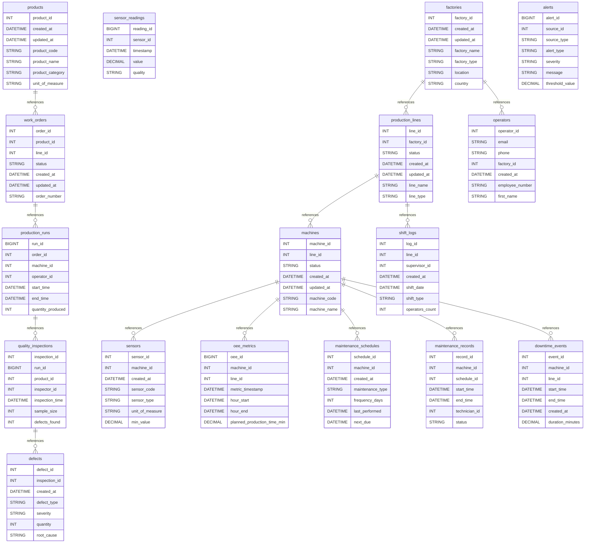

# Industrial IoT Manufacturing System

## Overview

This example demonstrates a comprehensive Industrial IoT (IIoT) system for smart manufacturing, featuring real-time production monitoring, predictive maintenance, quality control, and Overall Equipment Effectiveness (OEE) tracking.

## Business Context

Modern manufacturing faces Industry 4.0 challenges:

- **Equipment Downtime**: Unexpected failures cost millions in lost production
- **Quality Control**: Manual inspection misses defects, causing recalls
- **Resource Efficiency**: Energy and material waste reduce margins
- **Supply Chain**: Lack of real-time visibility causes delays
- **Compliance**: Strict regulations require detailed tracking
- **Worker Safety**: Hazardous conditions need continuous monitoring

This IIoT solution provides:

- Real-time machine health monitoring with predictive maintenance
- Automated quality inspection using computer vision
- OEE calculation and optimization
- Energy consumption tracking per unit produced
- Digital twin simulation capabilities
- Safety and environmental monitoring

## Unique IIoT Patterns (vs Other IoT Examples)

### Manufacturing-Specific Features

- **Production Tracking**: Units produced, cycle times, batch genealogy
- **OEE Metrics**: Availability × Performance × Quality
- **Recipe Management**: Product specifications and parameters
- **Shift Patterns**: Production by shift with operator tracking
- **Quality Control**: Defect classification, root cause analysis

### Industrial Protocols

- **OPC UA**: Unified Architecture for industrial communication
- **Modbus**: Legacy equipment integration
- **MQTT Sparkplug**: Industrial MQTT specification
- **EtherNet/IP**: Real-time industrial ethernet

### Advanced Analytics

- **Predictive Maintenance**: Remaining Useful Life (RUL)
- **Process Optimization**: Six Sigma, SPC charts
- **Digital Twin**: Virtual representation of physical assets
- **Edge Computing**: Local processing for low latency

## Key Metrics & KPIs

### OEE Components

```
OEE = Availability × Performance × Quality

Where:
- Availability = Run Time / Planned Production Time
- Performance = (Ideal Cycle Time × Count) / Run Time
- Quality = Good Count / Total Count
```

### TEEP (Total Effective Equipment Performance)

```
TEEP = OEE × Utilization
Where: Utilization = Planned Time / Calendar Time
```

## Database Schema Highlights

### Core Manufacturing Entities

1. **Production Hierarchy**

  ```
  Factory → Production Lines → Work Cells → Machines → Components
  ```

2. **Product Flow**

  ```
  Raw Materials → Work in Progress → Finished Goods
  ```

3. **Data Collection Points**

4. Machine sensors (vibration, temperature, pressure)
5. Process parameters (speed, feed rate, temperature)
6. Quality measurements (dimensions, weight, defects)
7. Environmental conditions (humidity, dust, temperature)

## Key Tables

### Production Management

- `production_lines` - Assembly lines and cells
- `machines` - Equipment and devices
- `production_orders` - Manufacturing orders
- `production_runs` - Actual production execution
- `product_recipes` - Manufacturing parameters

### Sensor & Telemetry

- `machine_sensors` - IoT sensors on equipment
- `sensor_readings` - High-frequency telemetry
- `process_parameters` - Production settings
- `alarm_events` - Equipment alarms and faults

### Quality Control

- `quality_inspections` - QC checkpoints
- `defect_records` - Defect tracking
- `measurement_data` - Dimensional measurements
- `statistical_control` - SPC data

### Maintenance

- `maintenance_schedules` - Preventive maintenance
- `maintenance_history` - Completed work
- `spare_parts` - Inventory tracking
- `failure_predictions` - ML predictions

### OEE Tracking

- `oee_hourly` - Hourly OEE calculations
- `downtime_events` - Downtime reasons
- `performance_losses` - Speed/minor stops
- `quality_losses` - Defects and rework

## Sample Queries

### 1\. Real-Time OEE Dashboard

```sql
SELECT
    pl.line_name,
    DATE_FORMAT(NOW(), '%Y-%m-%d %H:00:00') as hour,
    ROUND(AVG(oee.availability), 3) as availability,
    ROUND(AVG(oee.performance), 3) as performance,
    ROUND(AVG(oee.quality), 3) as quality,
    ROUND(AVG(oee.availability * oee.performance * oee.quality), 3) as oee,
    SUM(pr.units_produced) as units_produced,
    SUM(pr.units_defective) as defects
FROM production_lines pl
JOIN production_runs pr ON pl.line_id = pr.line_id
JOIN oee_hourly oee ON pr.run_id = oee.run_id
WHERE oee.hour_start >= NOW() - INTERVAL 24 HOUR
GROUP BY pl.line_id, DATE_FORMAT(NOW(), '%Y-%m-%d %H:00:00');
```

### 2\. Predictive Maintenance Alert

```sql
WITH vibration_trend AS (
    SELECT
        m.machine_name,
        ms.sensor_location,
        AVG(sr.value) as avg_vibration,
        STDDEV(sr.value) as std_vibration,
        MAX(sr.value) as peak_vibration,
        (MAX(sr.value) - AVG(sr.value)) / STDDEV(sr.value) as z_score
    FROM machines m
    JOIN machine_sensors ms ON m.machine_id = ms.machine_id
    JOIN sensor_readings sr ON ms.sensor_id = sr.sensor_id
    WHERE ms.sensor_type = 'vibration'
        AND sr.timestamp >= NOW() - INTERVAL 4 HOUR
    GROUP BY m.machine_id, ms.sensor_id
)
SELECT
    machine_name,
    sensor_location,
    ROUND(avg_vibration, 3) as avg_vibration_mm_s,
    ROUND(peak_vibration, 3) as peak_vibration_mm_s,
    CASE
        WHEN peak_vibration > 11.2 THEN 'CRITICAL - Immediate attention required'
        WHEN peak_vibration > 7.1 THEN 'WARNING - Schedule maintenance'
        WHEN peak_vibration > 4.5 THEN 'CAUTION - Monitor closely'
        ELSE 'GOOD'
    END as vibration_severity
FROM vibration_trend
WHERE z_score > 3 OR peak_vibration > 4.5
ORDER BY peak_vibration DESC;
```

### 3\. Production Efficiency by Shift

```sql
SELECT
    s.shift_name,
    DATE(pr.start_time) as production_date,
    COUNT(DISTINCT pr.run_id) as production_runs,
    SUM(pr.units_produced) as total_units,
    SUM(pr.units_produced - pr.units_defective) as good_units,
    ROUND(AVG(pr.units_produced / TIMESTAMPDIFF(MINUTE, pr.start_time, pr.end_time)), 2) as units_per_minute,
    ROUND(100.0 * SUM(pr.units_produced - pr.units_defective) / SUM(pr.units_produced), 2) as quality_rate,
    SEC_TO_TIME(SUM(TIMESTAMPDIFF(SECOND, pr.start_time, pr.end_time))) as total_runtime,
    COUNT(DISTINCT pr.operator_id) as operators
FROM shifts s
JOIN production_runs pr ON s.shift_id = pr.shift_id
WHERE pr.start_time >= DATE_SUB(NOW(), INTERVAL 7 DAY)
GROUP BY s.shift_id, DATE(pr.start_time)
ORDER BY production_date DESC, s.shift_name;
```

### 4\. Energy Consumption per Unit

```sql
WITH energy_consumption AS (
    SELECT
        pr.run_id,
        pr.product_id,
        pr.units_produced,
        SUM(
            CASE
                WHEN ms.sensor_type = 'power' THEN
                    sr.value * TIMESTAMPDIFF(SECOND, sr.timestamp, LEAD(sr.timestamp) OVER (PARTITION BY sr.sensor_id ORDER BY sr.timestamp)) / 3600
                ELSE 0
            END
        ) as total_kwh
    FROM production_runs pr
    JOIN machines m ON pr.line_id = m.line_id
    JOIN machine_sensors ms ON m.machine_id = ms.machine_id
    JOIN sensor_readings sr ON ms.sensor_id = sr.sensor_id
    WHERE sr.timestamp BETWEEN pr.start_time AND pr.end_time
        AND pr.end_time IS NOT NULL
    GROUP BY pr.run_id
)
SELECT
    p.product_name,
    p.product_code,
    COUNT(DISTINCT ec.run_id) as production_runs,
    SUM(ec.units_produced) as total_units,
    ROUND(SUM(ec.total_kwh), 2) as total_energy_kwh,
    ROUND(SUM(ec.total_kwh) / SUM(ec.units_produced), 4) as kwh_per_unit,
    ROUND(SUM(ec.total_kwh) * 0.12, 2) as energy_cost_usd -- $0.12 per kWh
FROM energy_consumption ec
JOIN products p ON ec.product_id = p.product_id
GROUP BY p.product_id
ORDER BY total_units DESC;
```

## Advanced Features

### 1\. Digital Twin Integration

- Real-time synchronization with physical equipment
- What-if scenario simulation
- Virtual commissioning of new lines
- Predictive modeling

### 2\. Edge Computing

- Local anomaly detection
- Real-time control loops
- Data filtering and aggregation
- Offline operation capability

### 3\. AI/ML Applications

- Predictive maintenance models
- Quality prediction
- Process optimization
- Demand forecasting

### 4\. Supply Chain Integration

- Raw material tracking
- Just-in-time delivery
- Supplier quality metrics
- Blockchain traceability

## Performance Characteristics

### Data Volume

- **Sensor Readings**: 100+ sensors × 10Hz = 1000+ readings/second
- **Daily Volume**: ~86 million readings/day
- **Storage**: ~10GB/day raw data

### Latency Requirements

- **Control Loop**: <10ms
- **Alarm Detection**: <100ms
- **Dashboard Update**: <1 second
- **Analytics**: <5 seconds

### Reliability

- **Uptime Target**: 99.95%
- **Data Loss**: <0.01%
- **Redundancy**: N+1 for critical sensors

## Industry Standards

### Protocols

- **OPC UA**: IEC 62541
- **ISA-95**: Enterprise-Control Integration
- **ISO 22400**: KPIs for manufacturing

### Quality Standards

- **ISO 9001**: Quality Management
- **Six Sigma**: Process improvement
- **ISO 14001**: Environmental Management

### Safety Standards

- **ISO 45001**: Occupational Health & Safety
- **IEC 61508**: Functional Safety
- **OSHA**: Compliance requirements

## Integration Points

### MES/ERP Systems

- SAP Manufacturing Execution
- Siemens Opcenter
- Rockwell FactoryTalk
- Oracle Manufacturing Cloud

### Industrial Protocols

- Modbus TCP/RTU
- EtherNet/IP
- PROFINET
- BACnet

### Analytics Platforms

- Azure IoT Hub
- AWS IoT SiteWise
- GE Predix
- PTC ThingWorx

## Benefits & ROI

### Typical Improvements

- **OEE Increase**: 10-20%
- **Unplanned Downtime**: -50%
- **Quality Defects**: -30%
- **Energy Costs**: -15%
- **Maintenance Costs**: -25%

### ROI Calculation

```
Annual Savings = (OEE Improvement × Production Value) +
                 (Downtime Reduction × Hourly Cost) +
                 (Quality Improvement × Defect Cost) +
                 (Energy Savings × Energy Cost)

Typical ROI: 6-18 months
```

## Future Enhancements

1. **5G Integration**: Ultra-low latency communication
2. **Computer Vision**: Automated visual inspection
3. **Collaborative Robots**: Human-robot interaction
4. **Augmented Reality**: Maintenance guidance
5. **Blockchain**: Supply chain transparency

This Industrial IoT system provides comprehensive manufacturing intelligence, enabling data-driven decisions for operational excellence.

## Database Architecture (Mermaid ERD)


