# Healthcare IoT - Remote Patient Monitoring System

## Overview

This example demonstrates a comprehensive healthcare IoT platform for remote patient monitoring, featuring real-time vital signs tracking, medication adherence, fall detection, chronic disease management, and predictive health analytics.

## Business Context

Healthcare systems face critical challenges:

- **Aging Population**: Increasing demand for chronic care management
- **Hospital Readmissions**: 30-day readmission rates affect reimbursements
- **Staff Shortages**: Need for efficient remote monitoring
- **Healthcare Costs**: Prevention cheaper than emergency care
- **Patient Outcomes**: Early intervention saves lives
- **Pandemic Response**: Need for remote care capabilities

This Healthcare IoT solution provides:

- Continuous vital signs monitoring (HR, BP, SpO2, temperature)
- Medication compliance tracking
- Fall detection and emergency response
- Chronic disease management (diabetes, heart disease, COPD)
- Early warning score calculations
- Telehealth integration

## Unique Healthcare IoT Patterns

### Medical Device Integration

- **Wearables**: Smartwatches, fitness trackers
- **Medical Sensors**: ECG, blood glucose, blood pressure
- **Environmental**: Air quality, temperature, humidity
- **Activity Monitors**: Step count, sleep patterns, fall detection

### Clinical Data

- **Vital Signs**: Continuous and spot measurements
- **Symptoms**: Patient-reported outcomes
- **Medications**: Adherence and effectiveness
- **Lab Results**: Integration with EHR systems

### Compliance & Privacy

- **HIPAA**: PHI protection requirements
- **HL7/FHIR**: Healthcare data standards
- **FDA**: Medical device regulations
- **Audit Trails**: Complete access logging

## Database Schema Highlights

### Core Entities

1. **Healthcare Hierarchy**

  ```
  Healthcare Systems → Facilities → Departments → Care Teams
                 → Patients → Devices → Sensors
                          → Conditions → Care Plans
  ```

2. **Patient Journey**

  ```
  Enrollment → Assessment → Monitoring → Intervention → Outcome
  ```

3. **Data Types**

4. Continuous monitoring (1-60 second intervals)
5. Spot checks (multiple times daily)
6. Patient-reported data
7. Clinical observations

## Key Tables

### Patient Management

- `patients` - Patient demographics and medical history
- `medical_conditions` - Diagnosed conditions
- `care_plans` - Treatment protocols
- `care_teams` - Healthcare providers

### Device Management

- `medical_devices` - Registered IoT devices
- `device_assignments` - Patient-device pairings
- `device_calibrations` - Calibration records
- `device_batteries` - Battery status tracking

### Vital Signs & Measurements

- `vital_signs` - HR, BP, SpO2, temperature (time-series)
- `blood_glucose` - Glucose readings
- `weight_measurements` - Daily weight tracking
- `activity_data` - Steps, sleep, calories

### Medication Management

- `medications` - Prescribed medications
- `medication_schedules` - Dosing schedules
- `medication_adherence` - Compliance tracking
- `medication_reminders` - Alert configuration

### Alerts & Interventions

- `alert_thresholds` - Personalized alert limits
- `clinical_alerts` - Generated alerts
- `interventions` - Clinical responses
- `emergency_events` - Falls, cardiac events

### Clinical Scores

- `early_warning_scores` - NEWS2, MEWS calculations
- `risk_assessments` - Readmission risk, fall risk
- `health_scores` - Overall health metrics

## Sample Queries

### 1\. Real-Time Patient Monitoring Dashboard

```sql
-- Current vital signs and alert status for all monitored patients
WITH latest_vitals AS (
    SELECT
        p.patient_id,
        p.patient_name,
        p.date_of_birth,
        TIMESTAMPDIFF(YEAR, p.date_of_birth, CURDATE()) as age,
        MAX(CASE WHEN vs.vital_type = 'heart_rate' THEN vs.value END) as heart_rate,
        MAX(CASE WHEN vs.vital_type = 'systolic_bp' THEN vs.value END) as systolic_bp,
        MAX(CASE WHEN vs.vital_type = 'diastolic_bp' THEN vs.value END) as diastolic_bp,
        MAX(CASE WHEN vs.vital_type = 'spo2' THEN vs.value END) as oxygen_saturation,
        MAX(CASE WHEN vs.vital_type = 'temperature' THEN vs.value END) as temperature_c,
        MAX(CASE WHEN vs.vital_type = 'respiratory_rate' THEN vs.value END) as respiratory_rate,
        MAX(vs.measurement_time) as last_reading_time
    FROM patients p
    JOIN vital_signs vs ON p.patient_id = vs.patient_id
    WHERE vs.measurement_time >= NOW() - INTERVAL 30 MINUTE
        AND p.monitoring_status = 'active'
    GROUP BY p.patient_id
),
active_alerts AS (
    SELECT
        patient_id,
        COUNT(*) as alert_count,
        MAX(severity) as max_severity,
        GROUP_CONCAT(DISTINCT alert_type) as alert_types
    FROM clinical_alerts
    WHERE resolved_at IS NULL
    GROUP BY patient_id
),
risk_scores AS (
    SELECT
        patient_id,
        ews_score,
        readmission_risk_score,
        fall_risk_score,
        calculated_at
    FROM (
        SELECT
            patient_id,
            ews_score,
            readmission_risk_score,
            fall_risk_score,
            calculated_at,
            ROW_NUMBER() OVER (PARTITION BY patient_id ORDER BY calculated_at DESC) as rn
        FROM early_warning_scores
        WHERE calculated_at >= NOW() - INTERVAL 6 HOUR
    ) ranked
    WHERE rn = 1
)
SELECT
    lv.patient_name,
    lv.age,
    lv.heart_rate,
    CONCAT(lv.systolic_bp, '/', lv.diastolic_bp) as blood_pressure,
    lv.oxygen_saturation as spo2,
    lv.temperature_c,
    lv.respiratory_rate,
    TIMESTAMPDIFF(MINUTE, lv.last_reading_time, NOW()) as minutes_since_reading,
    COALESCE(aa.alert_count, 0) as active_alerts,
    COALESCE(aa.max_severity, 'none') as alert_severity,
    rs.ews_score,
    CASE
        WHEN rs.ews_score >= 7 THEN 'CRITICAL'
        WHEN rs.ews_score >= 5 THEN 'HIGH'
        WHEN rs.ews_score >= 3 THEN 'MEDIUM'
        WHEN rs.ews_score >= 1 THEN 'LOW'
        ELSE 'STABLE'
    END as clinical_risk,
    CASE
        WHEN aa.max_severity = 'critical' THEN 'IMMEDIATE_ATTENTION'
        WHEN TIMESTAMPDIFF(MINUTE, lv.last_reading_time, NOW()) > 60 THEN 'CONNECTION_LOST'
        WHEN rs.ews_score >= 5 THEN 'MONITOR_CLOSELY'
        ELSE 'STABLE'
    END as patient_status
FROM latest_vitals lv
LEFT JOIN active_alerts aa ON lv.patient_id = aa.patient_id
LEFT JOIN risk_scores rs ON lv.patient_id = rs.patient_id
ORDER BY patient_status DESC, rs.ews_score DESC;
```

### 2\. Medication Adherence Analysis

```sql
-- Track medication compliance rates
WITH scheduled_doses AS (
    SELECT
        p.patient_id,
        p.patient_name,
        m.medication_name,
        m.dosage,
        ms.scheduled_time,
        DATE(ms.scheduled_time) as scheduled_date,
        ma.taken_time,
        ma.status as adherence_status,
        CASE
            WHEN ma.status = 'taken' AND ABS(TIMESTAMPDIFF(MINUTE, ms.scheduled_time, ma.taken_time)) <= 60 THEN 'on_time'
            WHEN ma.status = 'taken' AND ABS(TIMESTAMPDIFF(MINUTE, ms.scheduled_time, ma.taken_time)) <= 240 THEN 'late'
            WHEN ma.status = 'taken' THEN 'very_late'
            WHEN ma.status = 'missed' THEN 'missed'
            WHEN ma.status = 'skipped' THEN 'skipped'
            ELSE 'pending'
        END as compliance_category
    FROM patients p
    JOIN medications m ON p.patient_id = m.patient_id
    JOIN medication_schedules ms ON m.medication_id = ms.medication_id
    LEFT JOIN medication_adherence ma ON ms.schedule_id = ma.schedule_id
    WHERE ms.scheduled_time >= DATE_SUB(NOW(), INTERVAL 30 DAY)
        AND ms.scheduled_time <= NOW()
        AND m.active = TRUE
),
adherence_summary AS (
    SELECT
        patient_id,
        patient_name,
        medication_name,
        COUNT(*) as total_doses,
        SUM(CASE WHEN compliance_category = 'on_time' THEN 1 ELSE 0 END) as on_time_doses,
        SUM(CASE WHEN compliance_category IN ('on_time', 'late') THEN 1 ELSE 0 END) as taken_doses,
        SUM(CASE WHEN compliance_category = 'missed' THEN 1 ELSE 0 END) as missed_doses,
        SUM(CASE WHEN compliance_category = 'skipped' THEN 1 ELSE 0 END) as skipped_doses
    FROM scheduled_doses
    GROUP BY patient_id, medication_name
)
SELECT
    patient_name,
    medication_name,
    total_doses,
    taken_doses,
    missed_doses,
    ROUND(taken_doses * 100.0 / total_doses, 1) as adherence_rate_pct,
    ROUND(on_time_doses * 100.0 / total_doses, 1) as on_time_rate_pct,
    CASE
        WHEN taken_doses * 100.0 / total_doses >= 90 THEN 'EXCELLENT'
        WHEN taken_doses * 100.0 / total_doses >= 80 THEN 'GOOD'
        WHEN taken_doses * 100.0 / total_doses >= 70 THEN 'FAIR'
        ELSE 'POOR'
    END as adherence_rating,
    CASE
        WHEN medication_name LIKE '%insulin%' AND taken_doses * 100.0 / total_doses < 80 THEN 'HIGH_RISK'
        WHEN medication_name LIKE '%warfarin%' AND taken_doses * 100.0 / total_doses < 90 THEN 'HIGH_RISK'
        WHEN taken_doses * 100.0 / total_doses < 70 THEN 'INTERVENTION_NEEDED'
        ELSE 'ACCEPTABLE'
    END as clinical_impact
FROM adherence_summary
WHERE total_doses > 0
ORDER BY adherence_rate_pct, patient_name;
```

### 3\. Early Warning Score (NEWS2) Calculation

```sql
-- Calculate National Early Warning Score 2 for patient deterioration
WITH vital_parameters AS (
    SELECT
        p.patient_id,
        p.patient_name,
        -- Get most recent vital signs
        (SELECT value FROM vital_signs WHERE patient_id = p.patient_id AND vital_type = 'respiratory_rate' ORDER BY measurement_time DESC LIMIT 1) as resp_rate,
        (SELECT value FROM vital_signs WHERE patient_id = p.patient_id AND vital_type = 'spo2' ORDER BY measurement_time DESC LIMIT 1) as spo2,
        (SELECT value FROM vital_signs WHERE patient_id = p.patient_id AND vital_type = 'systolic_bp' ORDER BY measurement_time DESC LIMIT 1) as systolic_bp,
        (SELECT value FROM vital_signs WHERE patient_id = p.patient_id AND vital_type = 'heart_rate' ORDER BY measurement_time DESC LIMIT 1) as heart_rate,
        (SELECT value FROM vital_signs WHERE patient_id = p.patient_id AND vital_type = 'temperature' ORDER BY measurement_time DESC LIMIT 1) as temperature,
        (SELECT value FROM vital_signs WHERE patient_id = p.patient_id AND vital_type = 'consciousness' ORDER BY measurement_time DESC LIMIT 1) as avpu_score,
        p.on_oxygen_therapy
    FROM patients p
    WHERE p.monitoring_status = 'active'
),
news2_scores AS (
    SELECT
        patient_id,
        patient_name,
        resp_rate,
        spo2,
        systolic_bp,
        heart_rate,
        temperature,
        avpu_score,
        -- Respiratory Rate Score
        CASE
            WHEN resp_rate <= 8 THEN 3
            WHEN resp_rate <= 11 THEN 1
            WHEN resp_rate <= 20 THEN 0
            WHEN resp_rate <= 24 THEN 2
            ELSE 3
        END as resp_score,
        -- SpO2 Score
        CASE
            WHEN on_oxygen_therapy THEN
                CASE
                    WHEN spo2 <= 83 THEN 3
                    WHEN spo2 <= 85 THEN 2
                    WHEN spo2 <= 87 THEN 1
                    WHEN spo2 >= 97 THEN 3
                    ELSE 0
                END
            ELSE
                CASE
                    WHEN spo2 <= 91 THEN 3
                    WHEN spo2 <= 93 THEN 2
                    WHEN spo2 <= 95 THEN 1
                    ELSE 0
                END
        END as spo2_score,
        -- Systolic BP Score
        CASE
            WHEN systolic_bp <= 90 THEN 3
            WHEN systolic_bp <= 100 THEN 2
            WHEN systolic_bp <= 110 THEN 1
            WHEN systolic_bp <= 219 THEN 0
            ELSE 3
        END as bp_score,
        -- Heart Rate Score
        CASE
            WHEN heart_rate <= 40 THEN 3
            WHEN heart_rate <= 50 THEN 1
            WHEN heart_rate <= 90 THEN 0
            WHEN heart_rate <= 110 THEN 1
            WHEN heart_rate <= 130 THEN 2
            ELSE 3
        END as hr_score,
        -- Temperature Score
        CASE
            WHEN temperature <= 35.0 THEN 3
            WHEN temperature <= 36.0 THEN 1
            WHEN temperature <= 38.0 THEN 0
            WHEN temperature <= 39.0 THEN 1
            ELSE 2
        END as temp_score,
        -- Consciousness Score
        CASE
            WHEN avpu_score != 'Alert' THEN 3
            ELSE 0
        END as consciousness_score
    FROM vital_parameters
)
SELECT
    patient_name,
    resp_rate,
    spo2,
    systolic_bp,
    heart_rate,
    temperature,
    resp_score + spo2_score + bp_score + hr_score + temp_score + consciousness_score as total_news2_score,
    CASE
        WHEN resp_score + spo2_score + bp_score + hr_score + temp_score + consciousness_score >= 7 THEN 'HIGH - Continuous monitoring, urgent review'
        WHEN resp_score + spo2_score + bp_score + hr_score + temp_score + consciousness_score >= 5 THEN 'MEDIUM - Increase frequency, urgent review'
        WHEN resp_score = 3 OR spo2_score = 3 OR bp_score = 3 OR hr_score = 3 OR temp_score = 3 OR consciousness_score = 3 THEN 'MEDIUM - Single parameter critical'
        WHEN resp_score + spo2_score + bp_score + hr_score + temp_score + consciousness_score >= 1 THEN 'LOW - Ward-based response'
        ELSE 'BASELINE - Continue routine monitoring'
    END as clinical_response
FROM news2_scores
WHERE resp_score + spo2_score + bp_score + hr_score + temp_score + consciousness_score >= 3
ORDER BY total_news2_score DESC;
```

### 4\. Fall Detection and Response

```sql
-- Monitor fall events and response times
WITH fall_events AS (
    SELECT
        fe.event_id,
        p.patient_name,
        p.age,
        p.fall_risk_category,
        fe.detected_at,
        fe.detection_method,
        fe.confidence_score,
        fe.location,
        fe.emergency_contacted,
        fe.response_time_seconds,
        fe.outcome,
        fe.injury_severity
    FROM emergency_events fe
    JOIN patients p ON fe.patient_id = p.patient_id
    WHERE fe.event_type = 'fall'
        AND fe.detected_at >= DATE_SUB(NOW(), INTERVAL 30 DAY)
),
response_metrics AS (
    SELECT
        COUNT(*) as total_falls,
        AVG(response_time_seconds) as avg_response_seconds,
        MIN(response_time_seconds) as min_response_seconds,
        MAX(response_time_seconds) as max_response_seconds,
        SUM(CASE WHEN emergency_contacted = TRUE THEN 1 ELSE 0 END) as emergency_calls,
        SUM(CASE WHEN injury_severity IN ('moderate', 'severe') THEN 1 ELSE 0 END) as injuries_reported
    FROM fall_events
)
SELECT
    fe.patient_name,
    fe.age,
    fe.fall_risk_category,
    fe.detected_at,
    fe.detection_method,
    ROUND(fe.confidence_score * 100, 1) as confidence_pct,
    fe.location,
    fe.response_time_seconds,
    fe.outcome,
    fe.injury_severity,
    CASE
        WHEN fe.response_time_seconds <= 60 THEN 'EXCELLENT'
        WHEN fe.response_time_seconds <= 180 THEN 'GOOD'
        WHEN fe.response_time_seconds <= 300 THEN 'ACCEPTABLE'
        ELSE 'NEEDS_IMPROVEMENT'
    END as response_rating
FROM fall_events fe
CROSS JOIN response_metrics rm
ORDER BY fe.detected_at DESC;
```

### 5\. Chronic Disease Management - Diabetes

```sql
-- Monitor glucose control and intervention effectiveness
WITH glucose_patterns AS (
    SELECT
        p.patient_id,
        p.patient_name,
        mc.condition_name,
        DATE(bg.measurement_time) as date,
        AVG(bg.glucose_value) as avg_glucose,
        MIN(bg.glucose_value) as min_glucose,
        MAX(bg.glucose_value) as max_glucose,
        STDDEV(bg.glucose_value) as glucose_variability,
        COUNT(*) as readings_count,
        SUM(CASE WHEN bg.glucose_value < 70 THEN 1 ELSE 0 END) as hypoglycemic_events,
        SUM(CASE WHEN bg.glucose_value > 180 THEN 1 ELSE 0 END) as hyperglycemic_events
    FROM patients p
    JOIN medical_conditions mc ON p.patient_id = mc.patient_id
    JOIN blood_glucose bg ON p.patient_id = bg.patient_id
    WHERE mc.condition_name LIKE '%diabetes%'
        AND mc.active = TRUE
        AND bg.measurement_time >= DATE_SUB(NOW(), INTERVAL 30 DAY)
    GROUP BY p.patient_id, DATE(bg.measurement_time)
),
hba1c_estimate AS (
    SELECT
        patient_id,
        patient_name,
        AVG(avg_glucose) as month_avg_glucose,
        -- Estimated HbA1c from average glucose
        (AVG(avg_glucose) + 46.7) / 28.7 as estimated_hba1c,
        SUM(hypoglycemic_events) as total_hypo_events,
        SUM(hyperglycemic_events) as total_hyper_events,
        AVG(glucose_variability) as avg_variability,
        COUNT(DISTINCT date) as days_monitored
    FROM glucose_patterns
    GROUP BY patient_id
)
SELECT
    patient_name,
    ROUND(month_avg_glucose, 1) as avg_glucose_mg_dl,
    ROUND(estimated_hba1c, 1) as estimated_hba1c_pct,
    total_hypo_events,
    total_hyper_events,
    ROUND(avg_variability, 1) as glucose_variability,
    days_monitored,
    ROUND(days_monitored * 100.0 / 30, 1) as monitoring_compliance_pct,
    CASE
        WHEN estimated_hba1c < 7.0 AND total_hypo_events < 3 THEN 'EXCELLENT_CONTROL'
        WHEN estimated_hba1c < 7.5 AND total_hypo_events < 5 THEN 'GOOD_CONTROL'
        WHEN estimated_hba1c < 8.5 THEN 'FAIR_CONTROL'
        ELSE 'POOR_CONTROL'
    END as diabetes_control,
    CASE
        WHEN total_hypo_events >= 3 THEN 'ADJUST_MEDICATION - Frequent hypoglycemia'
        WHEN estimated_hba1c > 8.0 THEN 'INTENSIFY_TREATMENT - Poor control'
        WHEN avg_variability > 50 THEN 'STABILIZE_REGIMEN - High variability'
        ELSE 'MAINTAIN_CURRENT'
    END as recommendation
FROM hba1c_estimate
ORDER BY estimated_hba1c DESC;
```

## Advanced Features

### 1\. Predictive Analytics

- Hospital readmission risk
- Disease progression modeling
- Medication effectiveness prediction
- Fall risk assessment

### 2\. Clinical Decision Support

- Automated alert escalation
- Treatment recommendations
- Drug interaction checking
- Care plan optimization

### 3\. Telehealth Integration

- Video consultation triggers
- Remote assessment tools
- Virtual ward rounds
- Family engagement portal

### 4\. AI/ML Applications

- Anomaly detection in vitals
- Pattern recognition for deterioration
- Natural language processing for symptoms
- Computer vision for wound assessment

## Compliance & Security

### HIPAA Requirements

- Encryption at rest and in transit
- Access controls and audit logs
- Business Associate Agreements
- Data retention policies

### Medical Device Standards

- FDA Class II compliance
- IEC 60601 safety standards
- ISO 13485 quality management
- CE marking for EU

### Clinical Standards

- HL7 FHIR for interoperability
- SNOMED CT terminology
- LOINC for lab codes
- ICD-10 for diagnoses

## Benefits & Outcomes

### Clinical Outcomes

- **Readmission Reduction**: 25-30%
- **Emergency Visits**: -40%
- **Medication Adherence**: +35%
- **Patient Satisfaction**: +45%

### Economic Benefits

- **Cost per Patient**: -$8,000/year
- **Hospital Days Saved**: 2.5 days/patient
- **Staff Efficiency**: +30%
- **ROI**: 3.2x in first year

### Quality of Life

- Increased independence
- Reduced caregiver burden
- Better disease management
- Peace of mind for families

This Healthcare IoT system enables proactive, personalized care management for improved patient outcomes.

## Database Architecture (Mermaid ERD)

```mermaid
erDiagram
  hospitals {
    INT hospital_id
    STRING phone
    STRING email
    DATETIME created_at
    DATETIME updated_at
    STRING hospital_name
    STRING hospital_code
  }
  departments {
    INT department_id
    INT hospital_id
    DATETIME created_at
    STRING department_name
    STRING department_code
    STRING department_type
    INT floor_number
  }
  rooms {
    INT room_id
    INT department_id
    DATETIME created_at
    STRING room_number
    STRING room_type
    INT bed_count
    INT floor
  }
  staff {
    INT staff_id
    INT hospital_id
    STRING employee_id
    STRING title
    INT department_id
    STRING email
    STRING phone
  }
  staff_schedules {
    INT schedule_id
    INT staff_id
    INT department_id
    DATETIME created_at
    DATETIME shift_date
    DATETIME shift_start
    DATETIME shift_end
  }
  patients {
    INT patient_id
    STRING phone
    STRING email
    STRING insurance_id
    INT primary_physician_id
    DATETIME created_at
    DATETIME updated_at
  }
  admissions {
    INT admission_id
    INT patient_id
    INT hospital_id
    INT department_id
    INT room_id
    INT attending_physician_id
    INT admitting_physician_id
  }
  devices {
    INT device_id
    INT hospital_id
    INT department_id
    INT room_id
    INT current_patient_id
    DATETIME created_at
    DATETIME updated_at
  }
  device_assignments {
    INT assignment_id
    INT device_id
    INT patient_id
    INT admission_id
    DATETIME created_at
    DATETIME assigned_at
    DATETIME unassigned_at
  }
  vital_signs {
    BIGINT reading_id
    INT patient_id
    INT admission_id
    INT device_id
    DATETIME created_at
    DATETIME recorded_at
    INT heart_rate
  }
  device_readings {
    BIGINT reading_id
    INT device_id
    INT patient_id
    DATETIME created_at
    DATETIME timestamp
    STRING metric_type
    DECIMAL metric_value
  }
  alerts {
    BIGINT alert_id
    INT patient_id
    INT admission_id
    INT device_id
    DATETIME created_at
    STRING alert_type
    STRING alert_category
  }
  alert_rules {
    INT rule_id
    INT department_id
    DATETIME created_at
    DATETIME updated_at
    STRING rule_name
    STRING rule_type
    STRING metric_type
  }
  medications {
    INT medication_id
    DATETIME created_at
    STRING medication_name
    STRING generic_name
    STRING drug_class
    STRING ndc_code
    STRING dosage_form
  }
  prescriptions {
    INT prescription_id
    INT patient_id
    INT admission_id
    INT medication_id
    INT prescribing_physician_id
    DATETIME created_at
    DATETIME updated_at
  }
  medication_administration {
    BIGINT administration_id
    INT prescription_id
    INT patient_id
    DATETIME created_at
    DATETIME scheduled_time
    DATETIME actual_time
    INT administered_by
  }
  lab_tests {
    INT test_id
    DATETIME created_at
    STRING test_code
    STRING test_name
    STRING test_category
    STRING specimen_type
    DECIMAL normal_range_low
  }
  lab_orders {
    INT order_id
    INT patient_id
    INT admission_id
    INT ordering_physician_id
    STRING status
    DATETIME created_at
    DATETIME updated_at
  }
  lab_results {
    INT result_id
    INT order_id
    INT test_id
    INT patient_id
    DATETIME created_at
    DECIMAL result_value
    STRING result_text
  }
  clinical_notes {
    INT note_id
    INT patient_id
    INT admission_id
    INT author_id
    INT cosigner_id
    DATETIME created_at
    DATETIME updated_at
  }
  emergency_events {
    INT event_id
    INT patient_id
    INT admission_id
    INT team_lead_id
    DATETIME created_at
    STRING event_type
    STRING location
  }
  patient_daily_summary {
    INT summary_id
    INT patient_id
    INT admission_id
    DATETIME created_at
    DATETIME summary_date
    DECIMAL avg_heart_rate
    DECIMAL avg_bp_systolic
  }
```


