# 📱 Social Media Platform

A comprehensive MySQL database schema for a modern social media platform, implementing social graphs, content distribution, real-time feeds, engagement tracking, and viral content detection with privacy controls and moderation systems.

## 📊 Database Overview

- **Industry**: Social Media & Networking
- **Complexity**: High
- **Tables**: 25
- **Key Features**: Social Graph, Feed Generation, Viral Detection, Real-time Messaging, Content Moderation
- **Data Generator**: ✅ Available

## 🗂️ Schema Structure

### User Management (3 tables)

1. **users** - Core user accounts
   - Authentication credentials
   - Account types (personal, business, creator, verified)
   - Account status management
   - Email and phone verification
   - Activity tracking

2. **user_profiles** - Extended profile information
   - Display names and bio
   - Profile and cover pictures
   - Location and demographics
   - Privacy settings (public/private)
   - Verified badge status
   - Cached follower/following counts

3. **user_settings** - Preferences and privacy
   - Notification preferences (email, push, SMS)
   - Privacy controls (profile, messages, activity)
   - Content filtering preferences
   - Language and timezone settings
   - Read receipts and activity status

### Social Graph (2 tables)

4. **relationships** - User connections
   - Relationship types (follow, friend, block, mute)
   - Bi-directional tracking
   - Status management (active, pending, removed)
   - Timestamp tracking

5. **relationship_requests** - Pending connections
   - Request types (follow, friend)
   - Approval workflow
   - Request messages
   - Expiration handling

### Content Management (5 tables)

6. **posts** - Main content
   - Content types (text, image, video, link, poll)
   - Privacy settings (public, friends, private, custom)
   - Location tagging
   - Scheduled posting
   - Edit history tracking
   - Soft deletion support

7. **post_media** - Media attachments
   - Multiple media per post
   - Media types and metadata
   - CDN URLs
   - Alt text for accessibility
   - Processing status

8. **comments** - User responses
   - Nested comment threads
   - Parent-child relationships
   - Edit capabilities
   - Mention tracking
   - Moderation status

9. **reactions** - Engagement actions
   - Reaction types (like, love, wow, sad, angry)
   - Emoji reactions
   - Timestamp tracking
   - Unique per user per post

10. **shares** - Content redistribution
    - Share types (share, quote)
    - Share comments
    - Privacy inheritance
    - Share chains tracking

11. **bookmarks** - Saved content
    - Private bookmarks
    - Collections support
    - Notes and tags
    - Timestamp tracking

### Discovery & Trending (3 tables)

12. **hashtags** - Tag dictionary
    - Hashtag normalization
    - Usage counting
    - Creation tracking
    - Trending eligibility

13. **post_hashtags** - Tag associations
    - Many-to-many relationships
    - Position in content
    - Extraction source

14. **trending_topics** - Trend tracking
    - Geographic scoping
    - Hourly snapshots
    - Engagement velocity
    - Category classification

### Messaging (3 tables)

15. **conversations** - Chat threads
    - Direct and group messaging
    - Conversation metadata
    - Admin controls
    - Archive status

16. **conversation_participants** - Chat members
    - Participant roles
    - Join/leave timestamps
    - Mute settings
    - Last read tracking

17. **messages** - Chat messages
    - Message types (text, image, video, file)
    - Delivery status
    - Edit/delete capabilities
    - Reply threading
    - Encryption support

### Engagement & Analytics (5 tables)

18. **notifications** - User notifications
    - Notification types (follow, like, comment, mention)
    - Read status tracking
    - Grouping/batching
    - Push notification mapping

19. **user_activity_logs** - Activity tracking
    - Action logging
    - Session tracking
    - IP and device info
    - Performance metrics

20. **engagement_metrics** - Aggregated stats
    - Hourly/daily/monthly rollups
    - Per-post metrics
    - Per-user metrics
    - Trending calculations

21. **viral_content_tracking** - Viral detection
    - Velocity measurements
    - Share cascades
    - Reach tracking
    - Peak detection

22. **user_lists** - Custom user groups
    - List types (following, close friends, restricted)
    - Privacy settings
    - Member management

23. **list_members** - List membership
    - Member status
    - Add/remove tracking
    - Notification preferences

### Moderation & Safety (2 tables)

24. **reports** - Content/user reports
    - Report types and reasons
    - Evidence attachments
    - Resolution workflow
    - Action tracking

25. **banned_content** - Prohibited content
    - Content patterns
    - Hash matching
    - Keyword filtering
    - Auto-moderation rules

## 🔑 Key Features

### Social Graph
- **Follower/following** relationships
- **Mutual connections** detection
- **Degrees of separation** calculation
- **Friend suggestions** based on network
- **Block and mute** functionality

### Content Distribution
- **Chronological feeds** - Time-based ordering
- **Algorithmic feeds** - Engagement-based ranking
- **Hashtag feeds** - Topic-based discovery
- **Trending content** - Viral detection
- **Personalized recommendations** - ML-ready

### Engagement System
- **Multiple reaction types** - Beyond just likes
- **Nested comments** - Threaded discussions
- **Quote sharing** - Add context to shares
- **Bookmarking** - Save for later
- **Mentions and tags** - User/location references

### Privacy & Safety
- **Granular privacy controls** - Post-level settings
- **Content moderation** - Automated and manual
- **Report system** - Community moderation
- **Rate limiting** - Spam prevention
- **GDPR compliance** - Data portability/deletion

## 📈 Use Cases

### Social Graph Queries

1. **Find Mutual Friends and Suggest Connections**
   ```sql
   -- Find mutual friends and rank friend suggestions
   WITH mutual_connections AS (
     SELECT
       r2.to_user_id as suggested_user_id,
       COUNT(DISTINCT r1.from_user_id) as mutual_friend_count,
       -- Check if already connected
       MAX(CASE WHEN EXISTS (
         SELECT 1 FROM relationships r3
         WHERE r3.from_user_id = ?
           AND r3.to_user_id = r2.to_user_id
           AND r3.relationship_type IN ('follow', 'friend')
       ) THEN 1 ELSE 0 END) as already_connected
     FROM relationships r1
     -- User's friends/following
     JOIN relationships r2 ON r1.to_user_id = r2.from_user_id
     WHERE r1.from_user_id = ?
       AND r1.relationship_type IN ('follow', 'friend')
       AND r1.status = 'active'
       AND r2.relationship_type IN ('follow', 'friend')
       AND r2.status = 'active'
       AND r2.to_user_id != ?  -- Exclude self
     GROUP BY r2.to_user_id
   ),
   user_scores AS (
     SELECT
       mc.suggested_user_id,
       u.username,
       up.display_name,
       up.profile_picture_url,
       up.verified_badge,
       up.follower_count,
       mc.mutual_friend_count,
       -- Calculate suggestion score
       (mc.mutual_friend_count * 10 +
        CASE WHEN up.verified_badge THEN 5 ELSE 0 END +
        LOG10(GREATEST(up.follower_count, 1))) as suggestion_score,
       -- Get sample mutual friends
       (SELECT GROUP_CONCAT(u2.username ORDER BY RAND() LIMIT 3)
        FROM relationships r4
        JOIN users u2 ON r4.to_user_id = u2.user_id
        WHERE r4.from_user_id = ?
          AND r4.to_user_id IN (
            SELECT from_user_id FROM relationships
            WHERE to_user_id = mc.suggested_user_id
              AND relationship_type IN ('follow', 'friend')
          )
       ) as mutual_friends_sample
     FROM mutual_connections mc
     JOIN users u ON mc.suggested_user_id = u.user_id
     JOIN user_profiles up ON u.user_id = up.user_id
     WHERE mc.already_connected = 0
       AND u.status = 'active'
   )
   SELECT
     suggested_user_id,
     username,
     display_name,
     profile_picture_url,
     verified_badge,
     follower_count,
     mutual_friend_count,
     mutual_friends_sample,
     ROUND(suggestion_score, 2) as score
   FROM user_scores
   ORDER BY suggestion_score DESC
   LIMIT 20;
   ```

2. **Generate Personalized Feed with Ranking**
   ```sql
   -- Generate algorithmic feed based on engagement and relevance
   WITH user_interests AS (
     -- Get user's interaction history
     SELECT
       p.user_id as author_id,
       COUNT(DISTINCT r.reaction_id) as interaction_count,
       MAX(r.created_at) as last_interaction
     FROM reactions r
     JOIN posts p ON r.post_id = p.post_id
     WHERE r.user_id = ?
       AND r.created_at >= DATE_SUB(NOW(), INTERVAL 30 DAY)
     GROUP BY p.user_id
   ),
   feed_posts AS (
     SELECT
       p.post_id,
       p.user_id,
       p.content,
       p.post_type,
       p.created_at,
       u.username,
       up.display_name,
       up.profile_picture_url,
       up.verified_badge,
       -- Engagement metrics
       p.like_count,
       p.comment_count,
       p.share_count,
       p.view_count,
       -- Calculate engagement rate
       (p.like_count + p.comment_count * 2 + p.share_count * 3) /
         GREATEST(p.view_count, 1) * 100 as engagement_rate,
       -- Check if following author
       EXISTS (
         SELECT 1 FROM relationships r
         WHERE r.from_user_id = ?
           AND r.to_user_id = p.user_id
           AND r.relationship_type IN ('follow', 'friend')
           AND r.status = 'active'
       ) as is_following,
       -- User affinity score
       COALESCE(ui.interaction_count, 0) as author_affinity,
       -- Time decay factor
       TIMESTAMPDIFF(HOUR, p.created_at, NOW()) as hours_old
     FROM posts p
     JOIN users u ON p.user_id = u.user_id
     JOIN user_profiles up ON u.user_id = up.user_id
     LEFT JOIN user_interests ui ON p.user_id = ui.author_id
     WHERE p.visibility IN ('public', 'friends')
       AND p.status = 'active'
       AND p.created_at >= DATE_SUB(NOW(), INTERVAL 48 HOUR)
       AND NOT EXISTS (  -- Exclude blocked users
         SELECT 1 FROM relationships r2
         WHERE r2.from_user_id = ?
           AND r2.to_user_id = p.user_id
           AND r2.relationship_type = 'block'
       )
   ),
   ranked_feed AS (
     SELECT
       *,
       -- Calculate relevance score
       (
         engagement_rate * 0.3 +
         CASE WHEN is_following THEN 20 ELSE 0 END +
         author_affinity * 2 +
         CASE WHEN verified_badge THEN 5 ELSE 0 END +
         CASE
           WHEN hours_old <= 1 THEN 20
           WHEN hours_old <= 6 THEN 15
           WHEN hours_old <= 24 THEN 10
           ELSE 5
         END
       ) as relevance_score
     FROM feed_posts
   )
   SELECT
     post_id,
     user_id,
     username,
     display_name,
     profile_picture_url,
     verified_badge,
     content,
     post_type,
     created_at,
     like_count,
     comment_count,
     share_count,
     ROUND(engagement_rate, 2) as engagement_rate,
     ROUND(relevance_score, 2) as relevance_score,
     -- Get sample comments
     (SELECT JSON_ARRAYAGG(
       JSON_OBJECT(
         'comment_id', c.comment_id,
         'content', c.content,
         'username', u2.username,
         'created_at', c.created_at
       ))
      FROM (
        SELECT * FROM comments
        WHERE post_id = ranked_feed.post_id
        ORDER BY like_count DESC, created_at DESC
        LIMIT 2
      ) c
      JOIN users u2 ON c.user_id = u2.user_id
     ) as top_comments,
     -- Check if user has engaged
     EXISTS (
       SELECT 1 FROM reactions r3
       WHERE r3.post_id = ranked_feed.post_id
         AND r3.user_id = ?
     ) as user_has_reacted
   FROM ranked_feed
   ORDER BY relevance_score DESC, created_at DESC
   LIMIT 50;
   ```

### Viral Content Detection

3. **Identify and Track Viral Content**
   ```sql
   -- Detect content with viral characteristics
   WITH hourly_metrics AS (
     SELECT
       p.post_id,
       p.user_id,
       p.content,
       p.created_at,
       -- Current metrics
       p.like_count,
       p.comment_count,
       p.share_count,
       p.view_count,
       -- Historical metrics (1 hour ago)
       COALESCE(vct.like_count_1h, 0) as prev_like_count,
       COALESCE(vct.share_count_1h, 0) as prev_share_count,
       -- Calculate velocity
       (p.like_count - COALESCE(vct.like_count_1h, 0)) as likes_last_hour,
       (p.share_count - COALESCE(vct.share_count_1h, 0)) as shares_last_hour,
       -- Time since posting
       TIMESTAMPDIFF(HOUR, p.created_at, NOW()) as hours_old
     FROM posts p
     LEFT JOIN viral_content_tracking vct ON p.post_id = vct.post_id
     WHERE p.created_at >= DATE_SUB(NOW(), INTERVAL 24 HOUR)
       AND p.status = 'active'
   ),
   viral_scores AS (
     SELECT
       post_id,
       user_id,
       content,
       created_at,
       hours_old,
       like_count,
       share_count,
       view_count,
       likes_last_hour,
       shares_last_hour,
       -- Calculate viral score
       (
         -- Velocity component
         (likes_last_hour * 1 + shares_last_hour * 3) /
           GREATEST(hours_old, 1) * 10 +
         -- Absolute engagement
         LOG10(GREATEST(like_count, 1)) * 5 +
         LOG10(GREATEST(share_count, 1)) * 10 +
         -- Engagement rate
         (like_count + share_count * 2) /
           GREATEST(view_count, 1) * 100
       ) as viral_score,
       -- Classify viral stage
       CASE
         WHEN shares_last_hour > 100 AND hours_old <= 2 THEN 'EXPLOSIVE'
         WHEN shares_last_hour > 50 AND hours_old <= 6 THEN 'RAPID'
         WHEN share_count > 500 THEN 'VIRAL'
         WHEN shares_last_hour > 20 THEN 'TRENDING'
         ELSE 'NORMAL'
       END as viral_stage
     FROM hourly_metrics
   ),
   share_cascade AS (
     -- Track share chains
     SELECT
       vs.post_id,
       COUNT(DISTINCT s.user_id) as unique_sharers,
       MAX(s.share_depth) as max_share_depth,
       AVG(up.follower_count) as avg_sharer_followers
     FROM viral_scores vs
     JOIN shares s ON vs.post_id = s.post_id
     JOIN user_profiles up ON s.user_id = up.user_id
     WHERE vs.viral_stage != 'NORMAL'
     GROUP BY vs.post_id
   )
   SELECT
     vs.post_id,
     vs.user_id,
     u.username,
     up.display_name,
     up.verified_badge,
     up.follower_count as author_followers,
     LEFT(vs.content, 100) as content_preview,
     vs.created_at,
     vs.hours_old,
     vs.like_count,
     vs.share_count,
     vs.view_count,
     vs.likes_last_hour,
     vs.shares_last_hour,
     ROUND(vs.viral_score, 2) as viral_score,
     vs.viral_stage,
     sc.unique_sharers,
     sc.max_share_depth,
     ROUND(sc.avg_sharer_followers, 0) as avg_sharer_reach,
     -- Estimate total reach
     vs.view_count + (sc.unique_sharers * sc.avg_sharer_followers * 0.1) as estimated_reach
   FROM viral_scores vs
   JOIN users u ON vs.user_id = u.user_id
   JOIN user_profiles up ON u.user_id = up.user_id
   LEFT JOIN share_cascade sc ON vs.post_id = sc.post_id
   WHERE vs.viral_stage != 'NORMAL'
   ORDER BY vs.viral_score DESC
   LIMIT 100;
   ```

### Influencer Analytics

4. **Identify and Analyze Influencers**
   ```sql
   -- Identify influencers based on multiple factors
   WITH user_metrics AS (
     SELECT
       u.user_id,
       u.username,
       up.display_name,
       up.verified_badge,
       up.follower_count,
       up.following_count,
       up.post_count,
       -- Calculate follower/following ratio
       up.follower_count / GREATEST(up.following_count, 1) as ff_ratio,
       -- Get engagement metrics
       AVG(p.like_count) as avg_likes_per_post,
       AVG(p.comment_count) as avg_comments_per_post,
       AVG(p.share_count) as avg_shares_per_post,
       SUM(p.like_count) as total_likes,
       -- Calculate posting frequency
       COUNT(DISTINCT DATE(p.created_at)) as active_days,
       COUNT(p.post_id) / 30.0 as posts_per_day
     FROM users u
     JOIN user_profiles up ON u.user_id = up.user_id
     LEFT JOIN posts p ON u.user_id = p.user_id
       AND p.created_at >= DATE_SUB(NOW(), INTERVAL 30 DAY)
       AND p.status = 'active'
     WHERE u.status = 'active'
       AND up.follower_count >= 1000  -- Minimum threshold
     GROUP BY u.user_id
   ),
   influencer_scores AS (
     SELECT
       user_id,
       username,
       display_name,
       verified_badge,
       follower_count,
       following_count,
       post_count,
       ff_ratio,
       avg_likes_per_post,
       avg_comments_per_post,
       avg_shares_per_post,
       total_likes,
       active_days,
       posts_per_day,
       -- Calculate engagement rate
       (avg_likes_per_post + avg_comments_per_post * 2 + avg_shares_per_post * 3) /
         GREATEST(follower_count, 1) * 100 as engagement_rate,
       -- Calculate influence score
       (
         LOG10(GREATEST(follower_count, 1)) * 20 +
         LEAST(ff_ratio, 100) * 0.5 +
         (avg_likes_per_post / GREATEST(follower_count, 1) * 1000) +
         CASE WHEN verified_badge THEN 10 ELSE 0 END +
         active_days * 0.5
       ) as influence_score,
       -- Categorize influencer tier
       CASE
         WHEN follower_count >= 1000000 THEN 'MEGA'
         WHEN follower_count >= 100000 THEN 'MACRO'
         WHEN follower_count >= 10000 THEN 'MICRO'
         ELSE 'NANO'
       END as influencer_tier
     FROM user_metrics
   )
   SELECT
     user_id,
     username,
     display_name,
     verified_badge,
     follower_count,
     following_count,
     ROUND(ff_ratio, 2) as follower_following_ratio,
     ROUND(avg_likes_per_post, 0) as avg_likes,
     ROUND(avg_comments_per_post, 0) as avg_comments,
     ROUND(avg_shares_per_post, 1) as avg_shares,
     ROUND(engagement_rate, 2) as engagement_rate_pct,
     active_days as days_active_last_30,
     ROUND(posts_per_day, 1) as daily_post_rate,
     ROUND(influence_score, 2) as influence_score,
     influencer_tier,
     -- Engagement quality indicator
     CASE
       WHEN engagement_rate > 5 THEN 'EXCELLENT'
       WHEN engagement_rate > 2 THEN 'GOOD'
       WHEN engagement_rate > 1 THEN 'AVERAGE'
       ELSE 'LOW'
     END as engagement_quality
   FROM influencer_scores
   ORDER BY influence_score DESC
   LIMIT 100;
   ```

### Content Moderation

5. **Content Moderation Queue with Prioritization**
   ```sql
   -- Generate prioritized moderation queue
   WITH report_aggregation AS (
     SELECT
       r.reported_entity_id as post_id,
       COUNT(DISTINCT r.reporter_id) as report_count,
       GROUP_CONCAT(DISTINCT r.reason ORDER BY r.reason) as report_reasons,
       MIN(r.created_at) as first_reported,
       MAX(r.created_at) as last_reported,
       -- Check reporter credibility
       AVG(ur.trust_score) as avg_reporter_trust
     FROM reports r
     JOIN users ur ON r.reporter_id = ur.user_id
     WHERE r.entity_type = 'post'
       AND r.status = 'pending'
     GROUP BY r.reported_entity_id
   ),
   content_analysis AS (
     SELECT
       p.post_id,
       p.user_id,
       p.content,
       p.post_type,
       p.created_at as post_created,
       p.like_count,
       p.share_count,
       p.view_count,
       u.username,
       up.verified_badge,
       up.follower_count,
       ra.report_count,
       ra.report_reasons,
       ra.first_reported,
       ra.avg_reporter_trust,
       -- Check for banned keywords
       (SELECT COUNT(*)
        FROM banned_content bc
        WHERE p.content LIKE CONCAT('%', bc.pattern, '%')
          AND bc.pattern_type = 'keyword') as banned_keyword_matches,
       -- Check user history
       (SELECT COUNT(*)
        FROM reports r2
        WHERE r2.reported_user_id = p.user_id
          AND r2.status = 'confirmed'
          AND r2.created_at >= DATE_SUB(NOW(), INTERVAL 30 DAY)) as user_previous_violations,
       -- Calculate reach/impact
       p.view_count + p.share_count * up.follower_count * 0.1 as potential_reach
     FROM report_aggregation ra
     JOIN posts p ON ra.post_id = p.post_id
     JOIN users u ON p.user_id = u.user_id
     JOIN user_profiles up ON u.user_id = up.user_id
   )
   SELECT
     post_id,
     user_id,
     username,
     verified_badge,
     follower_count,
     LEFT(content, 200) as content_preview,
     post_type,
     post_created,
     report_count,
     report_reasons,
     TIMESTAMPDIFF(HOUR, first_reported, NOW()) as hours_since_first_report,
     banned_keyword_matches,
     user_previous_violations,
     potential_reach,
     -- Calculate priority score
     (
       report_count * 10 +
       banned_keyword_matches * 20 +
       user_previous_violations * 5 +
       LOG10(GREATEST(potential_reach, 1)) * 3 +
       avg_reporter_trust * 5 +
       CASE WHEN verified_badge THEN -10 ELSE 0 END +  -- Lower priority for verified
       TIMESTAMPDIFF(HOUR, first_reported, NOW()) * 2  -- Increase priority over time
     ) as priority_score,
     -- Suggested action
     CASE
       WHEN banned_keyword_matches > 0 THEN 'AUTO_REMOVE'
       WHEN report_count >= 10 THEN 'URGENT_REVIEW'
       WHEN user_previous_violations >= 3 THEN 'HIGH_PRIORITY'
       WHEN report_count >= 3 THEN 'REVIEW'
       ELSE 'LOW_PRIORITY'
     END as suggested_action
   FROM content_analysis
   ORDER BY priority_score DESC
   LIMIT 100;
   ```

### Trending Topics

6. **Real-time Trending Topics Detection**
   ```sql
   -- Detect trending hashtags and topics
   WITH hashtag_metrics AS (
     SELECT
       h.hashtag_id,
       h.tag_name,
       -- Current hour metrics
       COUNT(DISTINCT ph.post_id) as posts_this_hour,
       COUNT(DISTINCT p.user_id) as unique_users_this_hour,
       SUM(p.like_count) as total_likes,
       SUM(p.share_count) as total_shares,
       -- Previous hour comparison
       (SELECT COUNT(DISTINCT ph2.post_id)
        FROM post_hashtags ph2
        JOIN posts p2 ON ph2.post_id = p2.post_id
        WHERE ph2.hashtag_id = h.hashtag_id
          AND p2.created_at >= DATE_SUB(NOW(), INTERVAL 2 HOUR)
          AND p2.created_at < DATE_SUB(NOW(), INTERVAL 1 HOUR)) as posts_previous_hour
     FROM hashtags h
     JOIN post_hashtags ph ON h.hashtag_id = ph.hashtag_id
     JOIN posts p ON ph.post_id = p.post_id
     WHERE p.created_at >= DATE_SUB(NOW(), INTERVAL 1 HOUR)
       AND p.status = 'active'
     GROUP BY h.hashtag_id
   ),
   trending_analysis AS (
     SELECT
       hashtag_id,
       tag_name,
       posts_this_hour,
       posts_previous_hour,
       unique_users_this_hour,
       total_likes,
       total_shares,
       -- Calculate growth rate
       CASE
         WHEN posts_previous_hour > 0
         THEN ((posts_this_hour - posts_previous_hour) / posts_previous_hour * 100)
         ELSE 100
       END as growth_rate,
       -- Calculate engagement per post
       (total_likes + total_shares * 2) / GREATEST(posts_this_hour, 1) as avg_engagement,
       -- Trending score
       (
         posts_this_hour * 5 +
         unique_users_this_hour * 3 +
         LOG10(GREATEST(total_likes, 1)) * 10 +
         LOG10(GREATEST(total_shares, 1)) * 15 +
         CASE
           WHEN posts_previous_hour > 0
           THEN ((posts_this_hour - posts_previous_hour) / posts_previous_hour * 50)
           ELSE 50
         END
       ) as trending_score
     FROM hashtag_metrics
     WHERE posts_this_hour >= 5  -- Minimum threshold
   )
   SELECT
     tag_name,
     posts_this_hour,
     posts_previous_hour,
     unique_users_this_hour,
     total_likes,
     total_shares,
     ROUND(growth_rate, 1) as growth_rate_pct,
     ROUND(avg_engagement, 1) as avg_engagement_per_post,
     ROUND(trending_score, 2) as trend_score,
     -- Trend classification
     CASE
       WHEN growth_rate > 500 AND posts_this_hour > 50 THEN '🔥 EXPLOSIVE'
       WHEN growth_rate > 200 THEN '📈 RISING FAST'
       WHEN growth_rate > 50 THEN '⬆️ TRENDING'
       WHEN growth_rate > 0 THEN '↗️ GROWING'
       ELSE '→ STABLE'
     END as trend_status,
     -- Sample recent posts
     (SELECT JSON_ARRAYAGG(
       JSON_OBJECT(
         'post_id', p.post_id,
         'username', u.username,
         'content', LEFT(p.content, 100),
         'likes', p.like_count
       ))
      FROM (
        SELECT DISTINCT p2.post_id
        FROM post_hashtags ph3
        JOIN posts p2 ON ph3.post_id = p2.post_id
        WHERE ph3.hashtag_id = trending_analysis.hashtag_id
          AND p2.created_at >= DATE_SUB(NOW(), INTERVAL 1 HOUR)
        ORDER BY p2.like_count DESC
        LIMIT 3
      ) recent
      JOIN posts p ON recent.post_id = p.post_id
      JOIN users u ON p.user_id = u.user_id
     ) as top_posts
   FROM trending_analysis
   ORDER BY trending_score DESC
   LIMIT 20;
   ```

## 🚀 Getting Started

### 1. Create Database
```bash
mysql -u root -p < schema/00_create_database.sql
```

### 2. Create Schema
```bash
mysql -u root -p social_media < schema/01_tables.sql
mysql -u root -p social_media < schema/02_constraints.sql
mysql -u root -p social_media < schema/03_indexes.sql
mysql -u root -p social_media < schema/04_views.sql
mysql -u root -p social_media < schema/05_procedures.sql
```

### 3. Generate Test Data
```bash
# Using the unified runner (recommended)
python generators/run_generators.py social_media --test

# Or run directly
cd generators/social_media
python generator.py
```

### 4. Load Generated Data
```bash
mysql -u root -p social_media < generators/social_media/output/*.sql
```

### 5. Run Example Queries
```bash
mysql -u root -p social_media < queries/01_social_graph.sql
mysql -u root -p social_media < queries/02_feed_generation.sql
mysql -u root -p social_media < queries/03_trending.sql
mysql -u root -p social_media < queries/04_influencers.sql
mysql -u root -p social_media < queries/05_moderation.sql
```

## 📋 Business Rules

### Content Policies
- **Post length** - Maximum 5000 characters
- **Media attachments** - Max 10 per post, 50MB each
- **Hashtags** - Maximum 30 per post
- **Mentions** - Maximum 50 per post
- **Edit window** - 5 minutes after posting

### Engagement Rules
- **One reaction** per user per post
- **Comment threading** - Max depth of 5 levels
- **Share limits** - 50 shares per hour
- **Bookmark limits** - 1000 bookmarks per user

### Social Graph Limits
- **Following** - Maximum 7,500 accounts
- **Follower** - No limit
- **Lists** - Maximum 1000 lists per user
- **List members** - Maximum 5000 per list

### Privacy & Safety
- **Private accounts** - Require approval for followers
- **Blocked users** - Cannot view or interact
- **Muted users** - Content hidden from feeds
- **Report threshold** - 10 reports trigger auto-review

## 🔍 Performance Optimizations

### Indexes
- **Covering indexes** for feed queries
- **Full-text indexes** for search
- **Composite indexes** on relationship queries
- **Partial indexes** for active content only

### Caching Strategy
- **User sessions** - 24 hour TTL
- **Feed cache** - 5 minute TTL
- **Trending topics** - 1 minute TTL
- **Friend lists** - 1 hour TTL

### Denormalization
- **Follower counts** on user_profiles
- **Engagement counts** on posts
- **Unread counts** on conversations
- **Cached metrics** in engagement_metrics

### Partitioning
- **Range partitioning** on posts by created_at
- **Hash partitioning** on relationships by user_id
- **List partitioning** on notifications by type

## 📊 Sample Data Statistics

When using the data generator with default configuration:

- **Users**: 10,000 active users
- **Relationships**: ~150,000 connections
- **Posts**: 50,000 posts
- **Comments**: 200,000 comments
- **Reactions**: 500,000 reactions
- **Messages**: 100,000 messages
- **Daily Activity**: ~3,000 posts, 10,000 engagements
- **Total Records**: ~1,000,000+

## 🎯 Learning Objectives

This example demonstrates:

1. **Graph Relationships** - Social networks in relational databases
2. **Feed Algorithms** - Chronological vs algorithmic ranking
3. **Viral Mechanics** - Content velocity and cascade tracking
4. **Real-time Features** - Notifications, messaging, presence
5. **Content Moderation** - Community and automated moderation
6. **Privacy Controls** - Granular visibility and blocking
7. **Performance at Scale** - Handling millions of users and billions of engagements
8. **Recommendation Systems** - Friend suggestions and content discovery

## 🔧 Customization

### Additional Features

1. **Stories/Ephemeral Content**
   ```sql
   CREATE TABLE stories (
     story_id BIGINT PRIMARY KEY,
     user_id BIGINT,
     content TEXT,
     media_url VARCHAR(500),
     expires_at TIMESTAMP,
     view_count INT DEFAULT 0,
     INDEX idx_expiry (expires_at)
   );

   CREATE TABLE story_views (
     view_id BIGINT PRIMARY KEY,
     story_id BIGINT,
     viewer_id BIGINT,
     viewed_at TIMESTAMP,
     UNIQUE KEY uk_story_viewer (story_id, viewer_id)
   );
   ```

2. **Live Streaming**
   ```sql
   CREATE TABLE live_streams (
     stream_id BIGINT PRIMARY KEY,
     user_id BIGINT,
     title VARCHAR(200),
     stream_key VARCHAR(100),
     status ENUM('scheduled', 'live', 'ended'),
     viewer_count INT DEFAULT 0,
     started_at TIMESTAMP,
     ended_at TIMESTAMP
   );

   CREATE TABLE stream_viewers (
     viewer_id BIGINT,
     stream_id BIGINT,
     joined_at TIMESTAMP,
     left_at TIMESTAMP,
     PRIMARY KEY (viewer_id, stream_id, joined_at)
   );
   ```

3. **Monetization**
   ```sql
   CREATE TABLE creator_funds (
     fund_id BIGINT PRIMARY KEY,
     user_id BIGINT,
     balance DECIMAL(10,2),
     total_earned DECIMAL(10,2),
     payment_method JSON
   );

   CREATE TABLE sponsored_posts (
     post_id BIGINT PRIMARY KEY,
     advertiser_id BIGINT,
     budget DECIMAL(10,2),
     impressions INT,
     clicks INT,
     cpm DECIMAL(8,4),
     FOREIGN KEY (post_id) REFERENCES posts(post_id)
   );
   ```

## 🛠️ Technologies

- **Database**: MySQL 8.0+
- **Engine**: InnoDB (ACID compliance, foreign keys)
- **Full-Text Search**: MySQL FULLTEXT indexes
- **JSON Support**: For flexible metadata
- **Character Set**: utf8mb4 (emoji support)
- **Collation**: utf8mb4_unicode_ci

## 🔐 Security Considerations

- **Password Security**: Bcrypt hashing with salt
- **Rate Limiting**: Per-user action limits
- **Content Filtering**: Automated and manual moderation
- **Privacy Controls**: Granular visibility settings
- **Data Retention**: GDPR compliant deletion
- **API Security**: OAuth 2.0 authentication

## 📚 Additional Resources

- [Generator Documentation](../generators/README.md)
- [Query Examples](queries/)
- [Schema DDL](schema/)
- [API Documentation](../docs/API_DOCUMENTATION.md)
- [Scaling Guide](../docs/ARCHITECTURE.md#horizontal-scaling)

## 🤝 Contributing

To improve this example:

1. Add recommendation algorithms
2. Implement graph algorithms
3. Add real-time features (WebSocket)
4. Create analytics dashboards
5. Add machine learning pipelines

See [CONTRIBUTING.md](../CONTRIBUTING.md) for guidelines.

## 📝 License

This example is part of the MySQL Business-to-Schema project, licensed under MIT License.

## Database Architecture (Mermaid ERD)

```mermaid
erDiagram
  users {
    BIGINT user_id
    STRING email
    STRING status
    DATETIME created_at
    STRING username
    BOOLEAN email_verified
    STRING password_hash
  }
  user_profiles {
    BIGINT profile_id
    BIGINT user_id
    DATETIME updated_at
    STRING display_name
    STRING bio
    STRING profile_picture_url
    STRING cover_picture_url
  }
  user_settings {
    BIGINT setting_id
    BIGINT user_id
    DATETIME updated_at
    BOOLEAN notification_email
    BOOLEAN notification_push
    BOOLEAN notification_sms
    STRING privacy_profile_visibility
  }
  relationships {
    BIGINT relationship_id
    BIGINT from_user_id
    BIGINT to_user_id
    STRING status
    DATETIME created_at
    DATETIME updated_at
    STRING relationship_type
  }
  relationship_requests {
    BIGINT request_id
    BIGINT from_user_id
    BIGINT to_user_id
    STRING status
    DATETIME created_at
    STRING request_type
    STRING message
  }
  posts {
    BIGINT post_id
    BIGINT user_id
    BIGINT parent_post_id
    DATETIME created_at
    DATETIME updated_at
    STRING content
    STRING post_type
  }
  post_media {
    BIGINT media_id
    BIGINT post_id
    DATETIME created_at
    STRING media_type
    STRING media_url
    STRING thumbnail_url
    JSON media_metadata
  }
  comments {
    BIGINT comment_id
    BIGINT post_id
    BIGINT user_id
    BIGINT parent_comment_id
    DATETIME created_at
    DATETIME updated_at
    STRING content
  }
  reactions {
    BIGINT reaction_id
    BIGINT user_id
    BIGINT target_id
    DATETIME created_at
    STRING target_type
    STRING reaction_type
    STRING UNIQUE
  }
  shares {
    BIGINT share_id
    BIGINT post_id
    BIGINT user_id
    DATETIME created_at
    STRING share_type
    STRING share_text
    STRING platform
  }
  bookmarks {
    BIGINT bookmark_id
    BIGINT user_id
    BIGINT post_id
    DATETIME created_at
    STRING collection_name
    STRING UNIQUE
  }
  hashtags {
    BIGINT hashtag_id
    DATETIME created_at
    STRING tag
    STRING tag_normalized
    INT post_count
    INT weekly_count
    INT daily_count
  }
  post_hashtags {
    BIGINT post_hashtag_id
    BIGINT post_id
    BIGINT hashtag_id
    DATETIME created_at
    INT position
    STRING UNIQUE
  }
  trending_topics {
    BIGINT trend_id
    DATETIME start_time
    DATETIME end_time
    STRING trend_type
    STRING trend_value
    STRING region
    DECIMAL score
  }
  conversations {
    BIGINT conversation_id
    STRING title
    BIGINT creator_user_id
    DATETIME created_at
    STRING conversation_type
    STRING description
    BOOLEAN is_archived
  }
  conversation_participants {
    BIGINT participant_id
    BIGINT conversation_id
    BIGINT user_id
    STRING role
    DATETIME joined_at
    DATETIME last_read_at
    BOOLEAN is_muted
  }
  messages {
    BIGINT message_id
    BIGINT conversation_id
    BIGINT sender_user_id
    DATETIME created_at
    STRING message_type
    STRING content
    STRING media_url
  }
  notifications {
    BIGINT notification_id
    BIGINT user_id
    STRING type
    BIGINT actor_user_id
    BIGINT target_id
    STRING title
    DATETIME created_at
  }
  reports {
    BIGINT report_id
    BIGINT reporter_user_id
    BIGINT reported_id
    STRING status
    BIGINT moderator_id
    DATETIME created_at
    STRING reported_type
  }
  banned_content {
    BIGINT ban_id
    DATETIME created_at
    STRING content_type
    STRING content_value
    STRING severity
    STRING reason
    BIGINT added_by
  }
  user_activity_logs {
    BIGINT log_id
    BIGINT user_id
    BIGINT target_id
    STRING session_id
    DATETIME created_at
    STRING action_type
    STRING target_type
  }
  engagement_metrics {
    BIGINT metric_id
    BIGINT entity_id
    DATETIME created_at
    DATETIME metric_date
    INT metric_hour
    STRING metric_type
    INT impressions
  }
  viral_content_tracking {
    BIGINT tracking_id
    BIGINT post_id
    DECIMAL view_velocity
    DECIMAL share_velocity
    DECIMAL engagement_velocity
    INT total_reach
    INT unique_sharers
  }
  user_lists {
    BIGINT list_id
    BIGINT user_id
    STRING name
    DATETIME created_at
    DATETIME updated_at
    STRING description
    BOOLEAN is_public
  }
  list_members {
    BIGINT member_id
    BIGINT list_id
    BIGINT user_id
    DATETIME added_at
    STRING UNIQUE
  }

  users ||--o{ user_profiles : references
  users ||--o{ user_settings : references
  users ||--o{ relationships : references
  users ||--o{ relationship_requests : references
  users ||--o{ posts : references
  posts ||--o{ post_media : references
  posts ||--o{ comments : references
  users ||--o{ comments : references
  users ||--o{ reactions : references
  posts ||--o{ shares : references
  users ||--o{ shares : references
  users ||--o{ bookmarks : references
  posts ||--o{ bookmarks : references
  posts ||--o{ post_hashtags : references
  hashtags ||--o{ post_hashtags : references
  users ||--o{ conversations : references
  conversations ||--o{ conversation_participants : references
  users ||--o{ conversation_participants : references
  conversations ||--o{ messages : references
  users ||--o{ messages : references
  users ||--o{ notifications : references
  users ||--o{ reports : references
  posts ||--o{ viral_content_tracking : references
  users ||--o{ user_lists : references
  user_lists ||--o{ list_members : references
  users ||--o{ list_members : references
```


