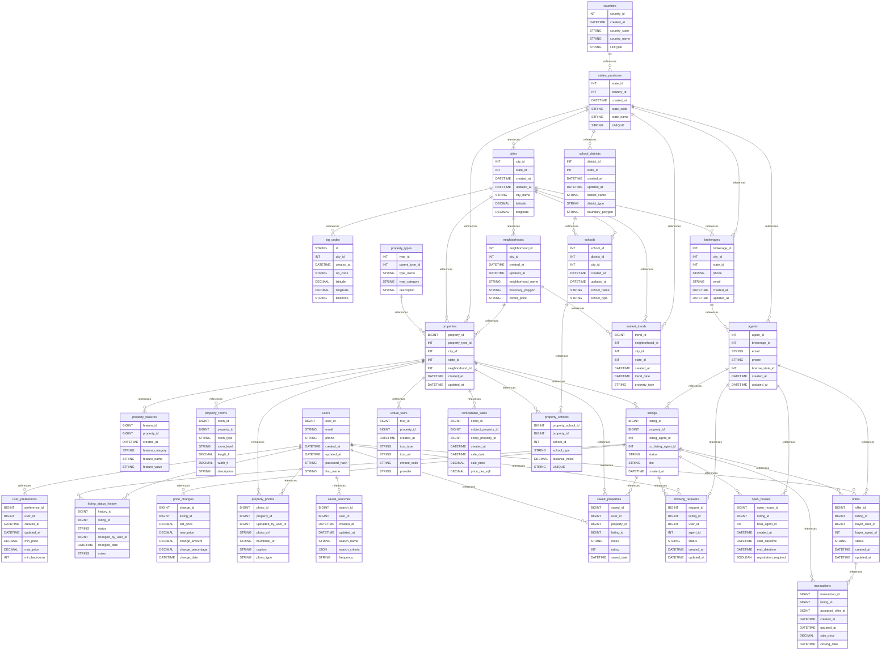

# 🏡 Real Estate Platform

A comprehensive MySQL database schema for a modern real estate platform supporting property listings, agent management, virtual tours, market analytics, and end-to-end transaction coordination.

## 📊 Database Overview

- **Industry**: Real Estate & Property Management
- **Complexity**: Very High
- **Tables**: 29
- **Key Features**: MLS Integration, Spatial Search, Virtual Tours, Market Analytics, Transaction Management
- **Data Generator**: ✅ Available

## 🗂️ Schema Structure

### Location Management (5 tables)

1. **countries** - Country reference data
   - Country codes (ISO 2-letter)
   - Country names
   - Foundation for location hierarchy

2. **states_provinces** - State/province information
   - State codes and names
   - Links to countries
   - Second level of location hierarchy

3. **cities** - City demographics and data
   - City names and population
   - Median income statistics
   - Latitude/longitude coordinates
   - Links to states/provinces

4. **zip_codes** - Postal code mapping
   - ZIP/postal codes
   - Geospatial coordinates
   - Timezone information
   - Links to cities

5. **neighborhoods** - Detailed neighborhood data
   - Boundary polygons for map display
   - Center point coordinates
   - Median home prices and rent
   - Walk score and transit score
   - Crime rates and school ratings
   - Market statistics by area

### Property Management (4 tables)

6. **property_types** - Hierarchical property classification
   - Parent-child type relationships
   - Categories (residential, commercial, land, industrial, special)
   - Supports nested taxonomies (e.g., Residential → Single Family → Detached)

7. **properties** - Core property information
   - Complete address and location data
   - Geospatial point for mapping
   - Parcel numbers and legal descriptions
   - Physical attributes (bedrooms, bathrooms, square footage)
   - Construction details (year built, type, roof, heating/cooling)
   - HOA fees and tax assessments
   - Full-text search on addresses

8. **property_features** - Amenities and features
   - Feature categories (interior, exterior, amenity, utility, safety, green)
   - Feature name-value pairs
   - Flexible attribute storage
   - Links to properties

9. **property_rooms** - Room-level details
   - Room types and levels
   - Dimensions (length × width)
   - Detailed descriptions
   - Square footage calculations

### Agent & Brokerage Management (2 tables)

10. **brokerages** - Real estate companies
    - License numbers and compliance
    - Office locations and contact info
    - Agent count tracking
    - Active listings count
    - Established date for credibility

11. **agents** - Real estate professionals
    - License information by state
    - Brokerage affiliations
    - Specializations (JSON array)
    - Performance metrics (sales volume, transactions, days on market)
    - Ratings and reviews
    - Years of experience
    - Bio and profile photos

### User Management (2 tables)

12. **users** - Platform users
    - User types (buyer, seller, investor, renter, agent, admin)
    - Authentication (email/password hash)
    - Email and phone verification
    - Preferred contact methods
    - Last login tracking
    - Profile management

13. **user_preferences** - Search preferences
    - Price ranges (min/max)
    - Property requirements (bedrooms, bathrooms, sqft)
    - Preferred property types (JSON)
    - Preferred locations (cities, neighborhoods)
    - Must-have and nice-to-have features (JSON)
    - School rating requirements

### Listing Management (3 tables)

14. **listings** - Active property listings
    - Listing types (for_sale, for_rent, for_lease, auction)
    - Status workflow (coming_soon → active → pending → sold)
    - Pricing information (list price, original, per sqft)
    - Days on market tracking
    - Commission structure
    - MLS integration (MLS numbers)
    - Virtual tour and video URLs
    - View and inquiry counts
    - Full-text search on title and description

15. **listing_status_history** - Status change audit trail
    - Complete status history
    - Change timestamps
    - User who made changes
    - Notes for context
    - Compliance tracking

16. **price_changes** - Price adjustment history
    - Old and new prices
    - Calculated change amounts and percentages
    - Change dates and reasons
    - Market response tracking

### Property Media (2 tables)

17. **property_photos** - Image galleries
    - Photo URLs and thumbnails
    - Photo types (exterior, interior, aerial, streetview, floorplan)
    - Display ordering
    - Primary photo designation
    - Image dimensions and file sizes
    - Upload tracking

18. **virtual_tours** - 360° and video tours
    - Tour types (360, video, matterport)
    - Embed codes for integration
    - Provider information
    - View counts and duration tracking
    - Engagement metrics

### User Engagement (2 tables)

19. **saved_searches** - Alert preferences
    - Search criteria (JSON)
    - Alert frequency (instant, daily, weekly, monthly)
    - Last run timestamps
    - Match count tracking
    - Active/inactive status

20. **saved_properties** - Favorite properties
    - User favorites/bookmarks
    - Personal notes and ratings
    - Save date tracking
    - Links to properties and listings

### Showing Management (2 tables)

21. **showing_requests** - Property viewing appointments
    - Preferred dates and times
    - Alternate scheduling options
    - Status workflow (pending → confirmed → completed)
    - Agent assignments
    - Buyer messages

22. **open_houses** - Public showing events
    - Date/time scheduling
    - Host agent assignments
    - Registration requirements
    - Refreshments flag
    - Attendee tracking

### Transaction Management (2 tables)

23. **offers** - Purchase/rental offers
    - Offer types (standard, cash, contingent, backup)
    - Status workflow (draft → submitted → accepted/rejected)
    - Financial details (amount, earnest money, down payment)
    - Financing types (conventional, FHA, VA, cash)
    - Contingencies (JSON)
    - Closing dates
    - Expiry management

24. **transactions** - Closed deals
    - Accepted offer linkage
    - Final sale prices
    - Escrow and title company info
    - Transaction status tracking
    - Commission disbursements
    - Closing date management

### Market Analytics (2 tables)

25. **market_trends** - Historical market data
    - Location-based metrics (neighborhood, city, state)
    - Median prices (list and sold)
    - Price per square foot trends
    - Days on market averages
    - Inventory levels
    - Months of supply
    - Sale-to-list ratios

26. **comparable_sales** - Property comparisons
    - Subject and comparison properties
    - Sale dates and prices
    - Distance calculations
    - Similarity scoring
    - Value adjustments (JSON)

### Education & Amenities (3 tables)

27. **school_districts** - District information
    - District types (elementary, middle, high, unified)
    - Boundary polygons for mapping
    - District ratings
    - School and student counts
    - Website links

28. **schools** - Individual school data
    - School types and grade ranges
    - Location coordinates
    - Enrollment and ratios
    - Performance ratings
    - Test scores (JSON)
    - Spatial indexing for proximity

29. **property_schools** - Property-school associations
    - Assigned vs nearby schools
    - Distance calculations
    - School type relationships

## 🔑 Key Features

### Advanced Property Search
- **Multi-criteria filtering** (price, size, bedrooms, features)
- **Map-based search** with custom boundaries
- **Polygon drawing** for area selection
- **Commute time** calculations to work
- **School ratings** integration
- **Walk/Transit scores** for lifestyle

### Spatial Capabilities
- **Proximity searches** ("properties within 2 miles")
- **Polygon boundaries** for neighborhoods
- **Distance calculations** between properties
- **School district** mapping
- **Geofencing** for alerts
- **Heat maps** for pricing

### Market Intelligence
- **Automated valuations** (AVM)
- **Comparable sales** analysis
- **Price trend** tracking
- **Days on market** patterns
- **Inventory levels** by area
- **Seasonal adjustments**

### Agent Performance
- **Sales volume** tracking
- **Transaction counts** and success rates
- **Average days** to sell
- **Client ratings** and reviews
- **Commission** calculations
- **Lead routing** optimization

### Virtual Experience
- **360° tours** with Matterport
- **Drone footage** integration
- **Video walkthroughs**
- **Photo galleries** with ordering
- **Floor plans** and blueprints
- **Neighborhood videos**

## 📈 Use Cases

### Operational Queries

1. **Advanced Property Search with Spatial Filtering**
   ```sql
   -- Find properties within polygon with specific criteria
   WITH search_polygon AS (
     SELECT ST_GeomFromText('POLYGON((-122.5 37.7, -122.4 37.7, -122.4 37.8, -122.5 37.8, -122.5 37.7))') as boundary
   ),
   matching_properties AS (
     SELECT
       p.property_id,
       p.address_line1,
       p.bedrooms,
       p.bathrooms,
       p.building_size_sqft,
       p.year_built,
       l.list_price,
       l.price_per_sqft,
       l.days_on_market,
       n.neighborhood_name,
       n.walk_score,
       n.school_rating,
       ST_Distance_Sphere(p.location_point, POINT(-122.45, 37.75)) / 1609.34 as distance_miles,
       GROUP_CONCAT(DISTINCT pf.feature_name) as features,
       (SELECT COUNT(*) FROM property_photos WHERE property_id = p.property_id) as photo_count,
       CASE WHEN vt.tour_id IS NOT NULL THEN 'YES' ELSE 'NO' END as has_virtual_tour
     FROM properties p
     JOIN listings l ON p.property_id = l.property_id
     LEFT JOIN neighborhoods n ON p.neighborhood_id = n.neighborhood_id
     LEFT JOIN property_features pf ON p.property_id = pf.property_id
     LEFT JOIN virtual_tours vt ON p.property_id = vt.property_id
     CROSS JOIN search_polygon sp
     WHERE ST_Within(p.location_point, sp.boundary)
       AND l.status = 'active'
       AND l.list_price BETWEEN ? AND ?
       AND p.bedrooms >= ?
       AND p.bathrooms >= ?
       AND p.building_size_sqft BETWEEN ? AND ?
       AND p.year_built >= ?
       AND n.school_rating >= ?
     GROUP BY p.property_id
     HAVING features LIKE '%hardwood%' OR features LIKE '%pool%'
   )
   SELECT * FROM matching_properties
   ORDER BY distance_miles, list_price;
   ```

2. **Comparable Sales Analysis (CMA)**
   ```sql
   -- Find comparable properties for valuation
   WITH subject_property AS (
     SELECT
       property_id,
       property_type_id,
       location_point,
       building_size_sqft,
       bedrooms,
       bathrooms,
       lot_size_sqft,
       year_built
     FROM properties
     WHERE property_id = ?
   ),
   recent_sales AS (
     SELECT
       p.property_id,
       p.address_line1,
       p.building_size_sqft,
       p.bedrooms,
       p.bathrooms,
       p.lot_size_sqft,
       p.year_built,
       t.sale_price,
       t.closing_date,
       ST_Distance_Sphere(p.location_point, sp.location_point) / 1609.34 as distance_miles,
       -- Calculate similarity score
       (1 - ABS(p.building_size_sqft - sp.building_size_sqft) / sp.building_size_sqft) * 0.3 +
       (1 - ABS(p.bedrooms - sp.bedrooms) / GREATEST(sp.bedrooms, 1)) * 0.2 +
       (1 - ABS(p.bathrooms - sp.bathrooms) / GREATEST(sp.bathrooms, 1)) * 0.2 +
       (1 - ABS(p.year_built - sp.year_built) / 100) * 0.1 +
       (1 - LEAST(distance_miles / 2, 1)) * 0.2 as similarity_score,
       -- Calculate adjustments
       (p.building_size_sqft - sp.building_size_sqft) * 150 as sqft_adjustment,
       (p.bedrooms - sp.bedrooms) * 5000 as bedroom_adjustment,
       (p.bathrooms - sp.bathrooms) * 3000 as bathroom_adjustment,
       (YEAR(CURDATE()) - p.year_built - (YEAR(CURDATE()) - sp.year_built)) * -500 as age_adjustment
     FROM properties p
     JOIN listings l ON p.property_id = l.property_id
     JOIN transactions t ON l.listing_id = t.listing_id
     CROSS JOIN subject_property sp
     WHERE p.property_type_id = sp.property_type_id
       AND t.closing_date >= DATE_SUB(CURDATE(), INTERVAL 6 MONTH)
       AND ST_Distance_Sphere(p.location_point, sp.location_point) / 1609.34 <= 2
       AND p.building_size_sqft BETWEEN sp.building_size_sqft * 0.8 AND sp.building_size_sqft * 1.2
       AND ABS(p.bedrooms - sp.bedrooms) <= 1
   )
   SELECT
     property_id,
     address_line1,
     building_size_sqft,
     bedrooms,
     bathrooms,
     sale_price,
     closing_date,
     ROUND(distance_miles, 2) as distance_miles,
     ROUND(similarity_score * 100, 1) as match_percentage,
     sale_price + sqft_adjustment + bedroom_adjustment + bathroom_adjustment + age_adjustment as adjusted_value,
     sqft_adjustment,
     bedroom_adjustment,
     bathroom_adjustment,
     age_adjustment
   FROM recent_sales
   WHERE similarity_score >= 0.7
   ORDER BY similarity_score DESC
   LIMIT 10;
   ```

3. **Agent Performance Dashboard**
   ```sql
   -- Comprehensive agent metrics with rankings
   WITH agent_metrics AS (
     SELECT
       a.agent_id,
       CONCAT(a.first_name, ' ', a.last_name) as agent_name,
       b.brokerage_name,
       COUNT(DISTINCT l.listing_id) as total_listings,
       COUNT(DISTINCT CASE WHEN l.status = 'active' THEN l.listing_id END) as active_listings,
       COUNT(DISTINCT CASE WHEN l.status = 'sold' THEN l.listing_id END) as sold_listings,
       COUNT(DISTINCT CASE WHEN t.transaction_id IS NOT NULL THEN t.transaction_id END) as closed_transactions,
       SUM(CASE WHEN t.transaction_id IS NOT NULL THEN t.sale_price ELSE 0 END) as total_sales_volume,
       AVG(CASE WHEN l.status = 'sold' THEN l.days_on_market END) as avg_days_to_sell,
       AVG(CASE WHEN t.sale_price IS NOT NULL THEN t.sale_price / l.original_price END) as avg_sale_to_list_ratio,
       SUM(t.commission_paid_listing + COALESCE(t.commission_paid_buyer, 0)) as total_commissions,
       a.rating,
       a.years_experience
     FROM agents a
     LEFT JOIN brokerages b ON a.brokerage_id = b.brokerage_id
     LEFT JOIN listings l ON a.agent_id = l.listing_agent_id
     LEFT JOIN transactions t ON l.listing_id = t.listing_id
     WHERE l.listing_date >= DATE_SUB(CURDATE(), INTERVAL 12 MONTH)
     GROUP BY a.agent_id
   ),
   agent_rankings AS (
     SELECT
       *,
       RANK() OVER (ORDER BY total_sales_volume DESC) as volume_rank,
       RANK() OVER (ORDER BY closed_transactions DESC) as transaction_rank,
       RANK() OVER (ORDER BY avg_days_to_sell) as speed_rank,
       RANK() OVER (ORDER BY rating DESC) as rating_rank
     FROM agent_metrics
   )
   SELECT
     agent_name,
     brokerage_name,
     total_listings,
     active_listings,
     sold_listings,
     closed_transactions,
     FORMAT(total_sales_volume, 0) as total_sales_volume,
     ROUND(avg_days_to_sell, 1) as avg_days_to_sell,
     ROUND(avg_sale_to_list_ratio * 100, 1) as sale_to_list_percent,
     FORMAT(total_commissions, 0) as total_commissions,
     rating,
     years_experience,
     volume_rank,
     transaction_rank,
     speed_rank,
     rating_rank,
     (volume_rank + transaction_rank + speed_rank + rating_rank) / 4 as overall_rank
   FROM agent_rankings
   ORDER BY overall_rank;
   ```

### Analytical Queries

4. **Market Trend Analysis**
   ```sql
   -- Analyze market trends by neighborhood over time
   WITH monthly_metrics AS (
     SELECT
       n.neighborhood_id,
       n.neighborhood_name,
       DATE_FORMAT(l.listing_date, '%Y-%m') as month,
       COUNT(DISTINCT l.listing_id) as new_listings,
       COUNT(DISTINCT CASE WHEN l.status = 'sold' THEN l.listing_id END) as properties_sold,
       AVG(l.list_price) as avg_list_price,
       AVG(CASE WHEN t.sale_price IS NOT NULL THEN t.sale_price END) as avg_sale_price,
       AVG(l.price_per_sqft) as avg_price_per_sqft,
       AVG(l.days_on_market) as avg_dom,
       COUNT(DISTINCT CASE WHEN pc.change_id IS NOT NULL THEN l.listing_id END) as price_reductions,
       AVG(CASE WHEN t.sale_price IS NOT NULL THEN t.sale_price / l.original_price ELSE NULL END) as sale_to_original_ratio
     FROM neighborhoods n
     JOIN properties p ON n.neighborhood_id = p.neighborhood_id
     JOIN listings l ON p.property_id = l.property_id
     LEFT JOIN transactions t ON l.listing_id = t.listing_id
     LEFT JOIN price_changes pc ON l.listing_id = pc.listing_id AND pc.change_amount < 0
     WHERE l.listing_date >= DATE_SUB(CURDATE(), INTERVAL 24 MONTH)
     GROUP BY n.neighborhood_id, DATE_FORMAT(l.listing_date, '%Y-%m')
   ),
   trend_calculations AS (
     SELECT
       neighborhood_id,
       neighborhood_name,
       month,
       new_listings,
       properties_sold,
       avg_list_price,
       avg_sale_price,
       avg_price_per_sqft,
       avg_dom,
       price_reductions,
       sale_to_original_ratio,
       -- Calculate month-over-month changes
       LAG(avg_list_price) OVER (PARTITION BY neighborhood_id ORDER BY month) as prev_month_price,
       (avg_list_price - LAG(avg_list_price) OVER (PARTITION BY neighborhood_id ORDER BY month)) /
         LAG(avg_list_price) OVER (PARTITION BY neighborhood_id ORDER BY month) * 100 as price_change_pct,
       -- Calculate inventory metrics
       SUM(new_listings) OVER (PARTITION BY neighborhood_id ORDER BY month ROWS BETWEEN 2 PRECEDING AND CURRENT ROW) as rolling_3mo_listings,
       SUM(properties_sold) OVER (PARTITION BY neighborhood_id ORDER BY month ROWS BETWEEN 2 PRECEDING AND CURRENT ROW) as rolling_3mo_sales,
       -- Market temperature indicator
       CASE
         WHEN properties_sold > new_listings * 1.2 THEN 'HOT'
         WHEN properties_sold > new_listings * 0.8 THEN 'BALANCED'
         ELSE 'COOL'
       END as market_temperature
     FROM monthly_metrics
   )
   SELECT
     neighborhood_name,
     month,
     new_listings,
     properties_sold,
     ROUND(avg_list_price, 0) as avg_list_price,
     ROUND(avg_sale_price, 0) as avg_sale_price,
     ROUND(avg_price_per_sqft, 2) as avg_price_per_sqft,
     ROUND(avg_dom, 1) as avg_days_on_market,
     price_reductions,
     ROUND(sale_to_original_ratio * 100, 1) as sale_to_original_pct,
     ROUND(price_change_pct, 2) as month_over_month_change,
     rolling_3mo_listings,
     rolling_3mo_sales,
     ROUND(rolling_3mo_sales / NULLIF(rolling_3mo_listings, 0) * 100, 1) as absorption_rate,
     market_temperature
   FROM trend_calculations
   WHERE neighborhood_id = ?
   ORDER BY month DESC;
   ```

5. **School Impact on Property Values**
   ```sql
   -- Analyze correlation between school ratings and property values
   WITH property_school_data AS (
     SELECT
       p.property_id,
       p.building_size_sqft,
       p.bedrooms,
       n.neighborhood_name,
       l.list_price,
       l.price_per_sqft,
       MAX(CASE WHEN ps.school_type = 'assigned' AND s.school_type = 'elementary' THEN s.rating END) as elementary_rating,
       MAX(CASE WHEN ps.school_type = 'assigned' AND s.school_type = 'middle' THEN s.rating END) as middle_rating,
       MAX(CASE WHEN ps.school_type = 'assigned' AND s.school_type = 'high' THEN s.rating END) as high_rating,
       AVG(s.rating) as avg_school_rating,
       MIN(ps.distance_miles) as closest_school_distance
     FROM properties p
     JOIN listings l ON p.property_id = l.property_id
     JOIN neighborhoods n ON p.neighborhood_id = n.neighborhood_id
     LEFT JOIN property_schools ps ON p.property_id = ps.property_id
     LEFT JOIN schools s ON ps.school_id = s.school_id
     WHERE l.status = 'active'
       AND p.property_type_id IN (SELECT type_id FROM property_types WHERE type_category = 'residential')
     GROUP BY p.property_id
   ),
   school_tiers AS (
     SELECT
       *,
       CASE
         WHEN avg_school_rating >= 9 THEN 'Excellent (9-10)'
         WHEN avg_school_rating >= 7 THEN 'Good (7-8.9)'
         WHEN avg_school_rating >= 5 THEN 'Average (5-6.9)'
         ELSE 'Below Average (<5)'
       END as school_tier
     FROM property_school_data
   )
   SELECT
     school_tier,
     COUNT(*) as property_count,
     ROUND(AVG(list_price), 0) as avg_list_price,
     ROUND(AVG(price_per_sqft), 2) as avg_price_per_sqft,
     ROUND(PERCENTILE_CONT(0.5) WITHIN GROUP (ORDER BY list_price), 0) as median_list_price,
     ROUND(MIN(list_price), 0) as min_price,
     ROUND(MAX(list_price), 0) as max_price,
     ROUND(AVG(elementary_rating), 1) as avg_elementary_rating,
     ROUND(AVG(middle_rating), 1) as avg_middle_rating,
     ROUND(AVG(high_rating), 1) as avg_high_rating,
     ROUND(AVG(closest_school_distance), 2) as avg_distance_to_school,
     -- Calculate premium for good schools
     ROUND((AVG(price_per_sqft) - (SELECT AVG(price_per_sqft) FROM school_tiers WHERE school_tier = 'Below Average (<5)')) /
           (SELECT AVG(price_per_sqft) FROM school_tiers WHERE school_tier = 'Below Average (<5)') * 100, 1) as premium_percent
   FROM school_tiers
   GROUP BY school_tier
   ORDER BY avg_school_rating DESC;
   ```

6. **Investment Opportunity Finder**
   ```sql
   -- Find undervalued properties with high rental potential
   WITH property_valuations AS (
     SELECT
       p.property_id,
       p.address_line1,
       n.neighborhood_name,
       p.bedrooms,
       p.bathrooms,
       p.building_size_sqft,
       l.list_price,
       l.days_on_market,
       n.median_home_price as neighborhood_median,
       n.median_rent,
       -- Calculate price deviation from neighborhood median
       (l.list_price - n.median_home_price) / n.median_home_price * 100 as price_vs_median_pct,
       -- Estimate monthly rent (using 1% rule as baseline)
       GREATEST(n.median_rent, p.bedrooms * 500, l.list_price * 0.008) as estimated_monthly_rent,
       -- Calculate investment metrics
       (GREATEST(n.median_rent, p.bedrooms * 500, l.list_price * 0.008) * 12) / l.list_price * 100 as gross_rental_yield,
       l.list_price / (GREATEST(n.median_rent, p.bedrooms * 500, l.list_price * 0.008) * 12) as price_to_rent_ratio,
       -- Price reduction history
       (SELECT COUNT(*) FROM price_changes WHERE listing_id = l.listing_id AND change_amount < 0) as price_reductions,
       -- Market metrics
       n.walk_score,
       n.transit_score,
       n.school_rating,
       n.crime_rate
     FROM properties p
     JOIN listings l ON p.property_id = l.property_id
     JOIN neighborhoods n ON p.neighborhood_id = n.neighborhood_id
     WHERE l.status = 'active'
       AND l.listing_type = 'for_sale'
       AND p.property_type_id IN (
         SELECT type_id FROM property_types
         WHERE type_name IN ('Single Family', 'Condo', 'Townhouse')
       )
   ),
   opportunity_scores AS (
     SELECT
       *,
       -- Calculate opportunity score (0-100)
       LEAST(100, GREATEST(0,
         -- Price below median is good (max 25 points)
         CASE WHEN price_vs_median_pct < 0 THEN ABS(price_vs_median_pct) * 0.5 ELSE 0 END +
         -- High rental yield is good (max 25 points)
         CASE WHEN gross_rental_yield > 8 THEN 25
              WHEN gross_rental_yield > 6 THEN gross_rental_yield * 3
              ELSE 0 END +
         -- Long days on market suggests motivation (max 15 points)
         CASE WHEN days_on_market > 60 THEN 15
              WHEN days_on_market > 30 THEN days_on_market * 0.25
              ELSE 0 END +
         -- Price reductions suggest flexibility (max 10 points)
         price_reductions * 5 +
         -- Good location factors (max 25 points)
         (walk_score / 4) + (transit_score / 8) + (school_rating * 2) - crime_rate
       )) as opportunity_score
     FROM property_valuations
   )
   SELECT
     property_id,
     address_line1,
     neighborhood_name,
     bedrooms,
     bathrooms,
     building_size_sqft,
     FORMAT(list_price, 0) as list_price,
     days_on_market,
     FORMAT(neighborhood_median, 0) as neighborhood_median,
     ROUND(price_vs_median_pct, 1) as below_median_pct,
     FORMAT(estimated_monthly_rent, 0) as est_monthly_rent,
     ROUND(gross_rental_yield, 2) as rental_yield_pct,
     ROUND(price_to_rent_ratio, 1) as price_rent_ratio,
     price_reductions,
     walk_score,
     school_rating,
     ROUND(opportunity_score, 1) as opportunity_score,
     CASE
       WHEN opportunity_score >= 75 THEN 'EXCELLENT'
       WHEN opportunity_score >= 60 THEN 'VERY GOOD'
       WHEN opportunity_score >= 45 THEN 'GOOD'
       WHEN opportunity_score >= 30 THEN 'FAIR'
       ELSE 'POOR'
     END as investment_grade
   FROM opportunity_scores
   WHERE gross_rental_yield > 5
     AND price_to_rent_ratio < 20
   ORDER BY opportunity_score DESC
   LIMIT 20;
   ```

## 🚀 Getting Started

### 1. Create Database
```bash
mysql -u root -p < schema/00_create_database.sql
```

### 2. Create Schema
```bash
mysql -u root -p real_estate < schema/01_tables.sql
mysql -u root -p real_estate < schema/02_constraints.sql
mysql -u root -p real_estate < schema/03_indexes.sql
mysql -u root -p real_estate < schema/04_spatial.sql
mysql -u root -p real_estate < schema/05_views.sql
```

### 3. Generate Test Data
```bash
# Using the unified runner (recommended)
python generators/run_generators.py real_estate --test

# Or run directly
cd generators/real_estate
python generator.py
```

### 4. Load Generated Data
```bash
mysql -u root -p real_estate < generators/real_estate/output/*.sql
```

### 5. Run Example Queries
```bash
mysql -u root -p real_estate < queries/01_property_search.sql
mysql -u root -p real_estate < queries/02_market_analysis.sql
mysql -u root -p real_estate < queries/03_agent_performance.sql
mysql -u root -p real_estate < queries/04_investment_analysis.sql
```

## 📋 Business Rules

### Listing Management
- **MLS compliance** with RESO data dictionary standards
- **Coming soon** period before active listing
- **Automatic expiry** after listing period
- **Status transitions** must follow workflow
- **Commission splits** between agents

### Property Valuation
- **Comparable selection** within 0.5-2 miles
- **Recency requirement** - sales within 6 months
- **Size matching** - within 20% of subject
- **Similarity scoring** for accuracy
- **Adjustment calculations** for differences

### Agent Operations
- **License verification** by state
- **Brokerage affiliation** requirements
- **Dual agency** restrictions
- **Commission structures** by agreement
- **Performance tracking** for rankings

### User Privacy
- **Contact information** protection
- **Viewing history** confidentiality
- **Offer details** restricted access
- **Financial information** encryption
- **GDPR/CCPA** compliance

### Transaction Rules
- **Offer expiry** enforcement
- **Earnest money** requirements
- **Contingency periods** tracking
- **Closing timeline** management
- **Document retention** policies

## 🔍 Performance Optimizations

### Spatial Indexes
- **POINT columns** for property locations
- **POLYGON columns** for boundaries
- **Distance calculations** optimized
- **Bounding box** pre-filtering
- **R-tree indexes** for spatial queries

### Search Optimization
- **Full-text indexes** on descriptions
- **Composite indexes** for common filters
- **Covering indexes** for list views
- **Materialized views** for aggregates
- **Query result** caching

### Data Partitioning
- **Range partitioning** on listing dates
- **List partitioning** by state/region
- **Archive old listings** to history tables
- **Hot/cold data** separation
- **Read replicas** for searches

### Caching Strategy
- **Redis** for session data
- **CDN** for property photos
- **Query cache** for market stats
- **Elasticsearch** for advanced search
- **Memcached** for user preferences

## 📊 Sample Data Statistics

When using the data generator with default configuration:

- **Properties**: 50,000+ listings
- **Neighborhoods**: 200+ defined areas
- **Agents**: 500+ licensed professionals
- **Brokerages**: 50+ companies
- **Users**: 10,000+ registered accounts
- **Photos**: 20+ per property (1M+ total)
- **Virtual Tours**: 5,000+ properties
- **Transactions**: 10,000+ closed deals
- **Schools**: 500+ with ratings
- **Total Records**: ~2,000,000+

## 🎯 Learning Objectives

This example demonstrates:

1. **Spatial Data Management** - Geographic coordinates and polygon boundaries
2. **Hierarchical Structures** - Location and property type hierarchies
3. **Temporal Tracking** - Price history and status changes
4. **Media Management** - Photos, videos, and virtual tours
5. **Complex Workflows** - Offer negotiation and transaction closing
6. **Market Analytics** - Trend analysis and comparative valuations
7. **Search Optimization** - Multi-criteria filtering with spatial queries
8. **Performance Patterns** - Indexing strategies for large datasets
9. **Business Intelligence** - Agent rankings and investment analysis
10. **Compliance** - MLS standards and regulatory requirements

## 🔧 Customization

### Industry-Specific Extensions

1. **Commercial Real Estate**
   ```sql
   CREATE TABLE commercial_properties (
     property_id BIGINT PRIMARY KEY,
     property_class ENUM('A', 'B', 'C'),
     net_operating_income DECIMAL(12,2),
     cap_rate DECIMAL(5,3),
     occupancy_rate DECIMAL(5,2),
     leasable_area_sqft INT,
     parking_ratio DECIMAL(5,2),
     zoning_details TEXT,
     FOREIGN KEY (property_id) REFERENCES properties(property_id)
   );
   ```

2. **Rental Management**
   ```sql
   CREATE TABLE rental_applications (
     application_id BIGINT PRIMARY KEY,
     listing_id BIGINT,
     applicant_user_id BIGINT,
     monthly_income DECIMAL(10,2),
     credit_score INT,
     employment_status VARCHAR(50),
     references JSON,
     application_status ENUM('pending', 'approved', 'denied'),
     background_check_status ENUM('pending', 'passed', 'failed'),
     FOREIGN KEY (listing_id) REFERENCES listings(listing_id)
   );
   ```

3. **Property Management**
   ```sql
   CREATE TABLE maintenance_requests (
     request_id BIGINT PRIMARY KEY,
     property_id BIGINT,
     tenant_user_id BIGINT,
     issue_type VARCHAR(100),
     priority ENUM('emergency', 'high', 'medium', 'low'),
     description TEXT,
     status ENUM('open', 'in_progress', 'completed'),
     cost DECIMAL(10,2),
     FOREIGN KEY (property_id) REFERENCES properties(property_id)
   );
   ```

## 🛠️ Technologies

- **Database**: MySQL 8.0+
- **Engine**: InnoDB (ACID compliance, foreign keys)
- **Spatial Extensions**: MySQL Spatial for GIS features
- **Full-text Search**: MySQL FULLTEXT indexes
- **Character Set**: utf8mb4
- **Collation**: utf8mb4_unicode_ci

## 🔗 Integration Points

- **MLS Systems**: RESO Web API, IDX/VOW feeds
- **Mapping**: Google Maps, Mapbox, OpenStreetMap
- **Virtual Tours**: Matterport, Zillow 3D Home
- **Photography**: HDR processing, drone footage
- **Mortgage**: Loan origination systems
- **Title/Escrow**: Integration with title companies
- **Marketing**: Email campaigns, social media
- **Analytics**: Google Analytics, market data providers
- **Payment**: Stripe, PayPal for deposits
- **Document Management**: DocuSign, Adobe Sign

## 📚 Additional Resources

- [Generator Documentation](../generators/real_estate/README.md)
- [Query Examples](queries/)
- [Schema DDL](schema/)
- [Performance Tuning Guide](../performance-testing/README.md)
- [MLS Integration Guide](../docs/mls_integration.md)

## 🤝 Contributing

To improve this example:

1. Add blockchain property records
2. Implement AI-powered valuations
3. Add VR property tours
4. Create predictive analytics for pricing
5. Add smart contract integration

See [CONTRIBUTING.md](../CONTRIBUTING.md) for guidelines.

## 📝 License

This example is part of the MySQL Business-to-Schema project, licensed under MIT License.

## Database Architecture (Mermaid ERD)


