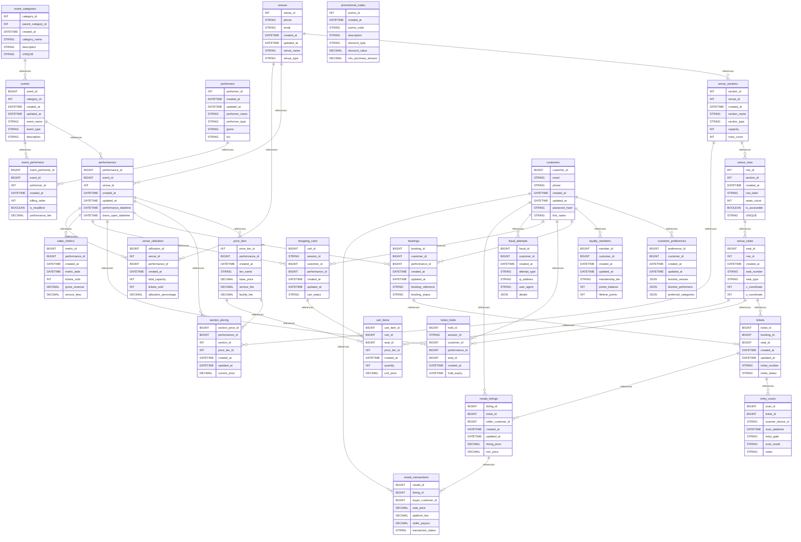

# 🎫 Event Ticketing Platform

A comprehensive MySQL database schema for a modern event ticketing platform supporting concerts, sports events, theater shows, and conferences with real-time seat selection, dynamic pricing, and fraud prevention.

## 📊 Database Overview

- **Industry**: Entertainment & Events
- **Complexity**: High
- **Tables**: 26
- **Key Features**: Real-time Seat Selection, Dynamic Pricing, Queue Management, Resale Marketplace, Fraud Prevention
- **Data Generator**: ✅ Available

## 🗂️ Schema Structure

### Venue Configuration (4 tables)

1. **venues** - Physical locations hosting events
   - Multiple venue types (stadium, arena, theater, concert_hall, club)
   - Geospatial coordinates for mapping
   - Capacity management (up to 100,000+)
   - Accessibility and parking information
   - Public transport details for visitors
   - Venue rules and policies

2. **venue_sections** - Seating areas within venues
   - Section types (orchestra, mezzanine, balcony, floor, lower_bowl, upper_bowl, club, suite)
   - View quality ratings (excellent, good, standard, obstructed)
   - Accessibility flags for ADA compliance
   - Default pricing tiers by section
   - Entry gate assignments for crowd control

3. **venue_rows** - Row configuration within sections
   - Row numbering (supports letters and numbers)
   - Seats per row count
   - Accessibility marking
   - Hierarchical organization

4. **venue_seats** - Individual seat inventory
   - Seat types (standard, accessible, companion, obstructed_view, premium)
   - X/Y coordinates for visual seat maps
   - Aisle seat identification
   - Notes for special conditions

### Event Management (5 tables)

5. **event_categories** - Event classification system
   - Hierarchical categories with parent-child relationships
   - Category descriptions
   - Supports nested taxonomies

6. **performers** - Artists, teams, speakers
   - Performer types (artist, band, team, speaker, company)
   - Genre classification
   - Social media integration (JSON)
   - Bio and promotional content

7. **events** - Main event information
   - Event types (single, tour, season, festival, conference)
   - Featured event flagging for promotion
   - Age restrictions and content warnings
   - Duration tracking for scheduling
   - Full-text search on name and description

8. **performances** - Individual show instances
   - Performance status workflow (scheduled → on_sale → sold_out/completed)
   - Doors open vs show start times
   - Sales window management (start/end dates)
   - Capacity tracking (total vs available)
   - Min/max price ranges for display

9. **event_performers** - Links events to performers
   - Billing order for multiple acts
   - Headliner designation
   - Performance fee tracking
   - Many-to-many relationship support

### Customer Management (3 tables)

10. **customers** - User accounts and profiles
    - Authentication (email/password hash)
    - Email and phone verification status
    - Multi-language preferences
    - Multi-currency support
    - Last login tracking
    - GDPR-compliant data management

11. **customer_preferences** - Personalization settings
    - Favorite venues (JSON array)
    - Favorite performers (JSON array)
    - Preferred event categories
    - Notification preferences (events, offers, reminders)
    - Recommendation engine input

12. **loyalty_members** - Rewards program
    - Tiered membership (basic → silver → gold → platinum → VIP)
    - Points balance and lifetime tracking
    - Membership expiry management
    - Perks configuration (JSON)
    - Benefits by tier level

### Pricing & Promotions (3 tables)

13. **price_tiers** - Pricing structure by performance
    - Base price plus fees structure
    - Service fee configuration
    - Facility fee addition
    - Tax rate management
    - Performance-specific pricing

14. **section_pricing** - Dynamic pricing by section
    - Current vs original pricing
    - Min/max price constraints
    - Price history tracking
    - Section-specific overrides
    - Real-time price updates

15. **promotional_codes** - Discount management
    - Percentage or fixed amount discounts
    - Minimum purchase requirements
    - Maximum discount caps
    - Usage limits and tracking
    - Performance/section restrictions (JSON)
    - Time-based validity

### Booking & Ticketing (3 tables)

16. **bookings** - Order management
    - Unique booking references
    - Status workflow (pending → confirmed/cancelled/refunded)
    - Payment status tracking
    - Fee breakdown (service, tax, discount)
    - Promo code application
    - Confirmation email tracking

17. **tickets** - Individual ticket records
    - Unique ticket numbers
    - Status management (valid, used, cancelled, transferred, resold)
    - Barcode/QR code generation
    - Entry gate assignment
    - Usage timestamp tracking
    - Transfer/resale support

18. **ticket_holds** - Temporary seat reservations
    - Session-based holds
    - Expiry management (typically 10 minutes)
    - Automatic release mechanism
    - Prevents double-booking
    - Anonymous cart support

### Cart & Checkout (2 tables)

19. **shopping_carts** - Session management
    - Cart status (active, expired, converted, abandoned)
    - Expiry tracking for cleanup
    - Performance association
    - Guest checkout support
    - Abandonment analytics

20. **cart_items** - Cart line items
    - Seat selection storage
    - Price tier application
    - Quantity for GA events
    - Service fee calculation
    - Duplicate prevention

### Access Control (2 tables)

21. **entry_scans** - Venue entry management
    - Scan results (success, duplicate, invalid, expired)
    - Scanner device tracking
    - Entry gate recording
    - Timestamp logging
    - Re-entry prevention

22. **fraud_attempts** - Security monitoring
    - Fraud types (duplicate_booking, bot_activity, payment_fraud, resale_violation)
    - IP address tracking
    - User agent logging
    - Action taken recording
    - Pattern detection support

### Secondary Market (2 tables)

23. **resale_listings** - Ticket resale marketplace
    - Listing price management
    - Minimum price floors
    - Status tracking (active, sold, expired, withdrawn)
    - Seller identification
    - Expiry management

24. **resale_transactions** - Resale fulfillment
    - Platform fee calculation
    - Seller payout tracking
    - Transaction status workflow
    - Dispute management
    - Buyer protection

### Analytics & Reporting (2 tables)

25. **sales_metrics** - Performance analytics
    - Daily sales tracking
    - Revenue aggregation
    - Average ticket price calculation
    - Conversion rate metrics
    - Cart abandonment analysis
    - Time-series data

26. **venue_utilization** - Capacity analytics
    - Utilization percentage tracking
    - Revenue per seat metrics
    - Performance comparison
    - Venue efficiency analysis

## 🔑 Key Features

### Real-time Seat Selection
- **Interactive seat maps** with X/Y coordinates
- **Temporary holds** preventing double-booking
- **Best available algorithm** for automatic selection
- **Accessibility compliance** with companion seats
- **View quality indicators** for transparency
- **Real-time availability** updates via websockets

### Dynamic Pricing Engine
- **Demand-based pricing** adjustments
- **Time-based pricing** (early bird, last minute)
- **Section-based tiers** for value differentiation
- **Promotional code** application
- **Min/max price** boundaries
- **Historical price** tracking

### Queue Management
- **Virtual waiting rooms** for high-demand events
- **Fair ticket distribution** algorithms
- **Session-based holds** with expiry
- **Bot detection** and prevention
- **Rate limiting** per IP/user
- **Priority access** for loyalty members

### Fraud Prevention
- **Duplicate booking** detection
- **Scalper identification** patterns
- **IP-based rate limiting**
- **CAPTCHA integration** points
- **Purchase limit** enforcement
- **Suspicious activity** logging

### Customer Experience
- **Guest checkout** option
- **Mobile ticketing** with QR codes
- **Ticket transfers** to friends
- **Apple Wallet/Google Pay** integration
- **Email/SMS** delivery options
- **Seat upgrade** opportunities

## 📈 Use Cases

### Operational Queries

1. **Real-time Seat Availability**
   ```sql
   -- Find available seats for a performance with holds
   WITH held_seats AS (
     SELECT seat_id
     FROM ticket_holds
     WHERE performance_id = ?
       AND hold_expiry > NOW()
       AND is_released = FALSE
   ),
   sold_seats AS (
     SELECT t.seat_id
     FROM tickets t
     JOIN bookings b ON t.booking_id = b.booking_id
     WHERE b.performance_id = ?
       AND b.booking_status IN ('confirmed', 'pending')
       AND t.ticket_status NOT IN ('cancelled', 'transferred')
   )
   SELECT
     vs.section_name,
     vr.row_number,
     vse.seat_number,
     vse.seat_type,
     sp.current_price,
     pt.service_fee,
     vs.view_quality
   FROM venue_seats vse
   JOIN venue_rows vr ON vse.row_id = vr.row_id
   JOIN venue_sections vs ON vr.section_id = vs.section_id
   JOIN section_pricing sp ON vs.section_id = sp.section_id
   JOIN price_tiers pt ON sp.price_tier_id = pt.price_tier_id
   WHERE sp.performance_id = ?
     AND vse.seat_id NOT IN (SELECT seat_id FROM held_seats)
     AND vse.seat_id NOT IN (SELECT seat_id FROM sold_seats WHERE seat_id IS NOT NULL)
   ORDER BY sp.current_price, vs.view_quality DESC, vr.row_number, vse.seat_number;
   ```

2. **Best Available Seats Algorithm**
   ```sql
   -- Find best available seats based on preferences
   WITH seat_scores AS (
     SELECT
       vse.seat_id,
       vs.section_name,
       vr.row_number,
       vse.seat_number,
       sp.current_price,
       -- Score calculation based on multiple factors
       (CASE vs.view_quality
         WHEN 'excellent' THEN 100
         WHEN 'good' THEN 75
         WHEN 'standard' THEN 50
         WHEN 'obstructed' THEN 25
       END +
       -- Prefer center seats
       ABS(vse.x_coordinate - (SELECT AVG(x_coordinate) FROM venue_seats)) * -0.1 +
       -- Prefer front rows in good sections
       CASE
         WHEN vs.view_quality IN ('excellent', 'good')
         THEN (SELECT COUNT(*) FROM venue_rows WHERE section_id = vs.section_id) - CAST(vr.row_number AS SIGNED)
         ELSE 0
       END +
       -- Prefer aisle seats slightly
       CASE WHEN vse.is_aisle THEN 5 ELSE 0 END
       ) as seat_score
     FROM venue_seats vse
     JOIN venue_rows vr ON vse.row_id = vr.row_id
     JOIN venue_sections vs ON vr.section_id = vs.section_id
     JOIN section_pricing sp ON vs.section_id = sp.section_id
     WHERE sp.performance_id = ?
       AND sp.current_price BETWEEN ? AND ?
       AND vse.seat_type IN ('standard', 'premium')
       AND vse.seat_id NOT IN (
         SELECT seat_id FROM ticket_holds
         WHERE performance_id = ? AND hold_expiry > NOW() AND is_released = FALSE
       )
       AND vse.seat_id NOT IN (
         SELECT t.seat_id FROM tickets t
         JOIN bookings b ON t.booking_id = b.booking_id
         WHERE b.performance_id = ? AND t.ticket_status = 'valid'
       )
   )
   SELECT
     seat_id,
     section_name,
     row_number,
     seat_number,
     current_price,
     seat_score
   FROM seat_scores
   ORDER BY seat_score DESC
   LIMIT ?;
   ```

3. **Dynamic Pricing Update**
   ```sql
   -- Update prices based on sales velocity and remaining capacity
   DELIMITER $$
   CREATE PROCEDURE update_dynamic_pricing(IN p_performance_id BIGINT)
   BEGIN
     DECLARE v_total_capacity INT;
     DECLARE v_sold_count INT;
     DECLARE v_days_until_event INT;
     DECLARE v_sales_velocity DECIMAL(10,2);
     DECLARE v_price_multiplier DECIMAL(5,2);

     -- Get performance metrics
     SELECT
       total_capacity,
       total_capacity - available_capacity,
       DATEDIFF(performance_datetime, NOW()),
       (total_capacity - available_capacity) / GREATEST(DATEDIFF(NOW(), sales_start_datetime), 1)
     INTO v_total_capacity, v_sold_count, v_days_until_event, v_sales_velocity
     FROM performances
     WHERE performance_id = p_performance_id;

     -- Calculate price multiplier based on demand
     SET v_price_multiplier = CASE
       -- High demand: >75% sold with >7 days to go
       WHEN v_sold_count / v_total_capacity > 0.75 AND v_days_until_event > 7 THEN 1.25
       -- Very high demand: >90% sold
       WHEN v_sold_count / v_total_capacity > 0.90 THEN 1.35
       -- Last minute premium: <3 days and <50% sold
       WHEN v_days_until_event < 3 AND v_sold_count / v_total_capacity < 0.5 THEN 0.85
       -- Standard demand
       ELSE 1.0
     END;

     -- Update section pricing
     UPDATE section_pricing sp
     JOIN price_tiers pt ON sp.price_tier_id = pt.price_tier_id
     SET sp.current_price = LEAST(
       GREATEST(
         pt.base_price * v_price_multiplier,
         COALESCE(sp.min_price, pt.base_price * 0.5)
       ),
       COALESCE(sp.max_price, pt.base_price * 2.0)
     )
     WHERE sp.performance_id = p_performance_id;

     -- Log the price change
     INSERT INTO sales_metrics (performance_id, metric_date, average_ticket_price)
     SELECT
       p_performance_id,
       CURDATE(),
       AVG(current_price)
     FROM section_pricing
     WHERE performance_id = p_performance_id
     ON DUPLICATE KEY UPDATE
       average_ticket_price = VALUES(average_ticket_price);
   END$$
   DELIMITER ;
   ```

### Analytical Queries

4. **Revenue Analytics Dashboard**
   ```sql
   -- Comprehensive revenue analysis by event and venue
   SELECT
     e.event_name,
     v.venue_name,
     p.performance_datetime,
     p.total_capacity,
     COUNT(DISTINCT b.booking_id) as total_bookings,
     COUNT(t.ticket_id) as tickets_sold,
     p.total_capacity - p.available_capacity as seats_sold,
     ROUND((p.total_capacity - p.available_capacity) / p.total_capacity * 100, 2) as occupancy_rate,
     SUM(b.total_amount) as gross_revenue,
     SUM(b.service_fee_amount) as service_fees,
     SUM(b.tax_amount) as taxes_collected,
     SUM(b.discount_amount) as discounts_given,
     AVG(b.total_amount / (SELECT COUNT(*) FROM tickets WHERE booking_id = b.booking_id)) as avg_ticket_price,
     COUNT(DISTINCT CASE WHEN b.promo_code_used IS NOT NULL THEN b.booking_id END) as promo_redemptions,
     COUNT(DISTINCT CASE WHEN lm.membership_tier IN ('gold', 'platinum', 'vip') THEN b.customer_id END) as vip_customers,
     COUNT(DISTINCT sc.cart_id) as total_carts_created,
     SUM(CASE WHEN sc.cart_status = 'abandoned' THEN 1 ELSE 0 END) / COUNT(DISTINCT sc.cart_id) * 100 as cart_abandonment_rate
   FROM performances p
   JOIN events e ON p.event_id = e.event_id
   JOIN venues v ON p.venue_id = v.venue_id
   LEFT JOIN bookings b ON p.performance_id = b.performance_id AND b.booking_status = 'confirmed'
   LEFT JOIN tickets t ON b.booking_id = t.booking_id
   LEFT JOIN customers c ON b.customer_id = c.customer_id
   LEFT JOIN loyalty_members lm ON c.customer_id = lm.customer_id
   LEFT JOIN shopping_carts sc ON p.performance_id = sc.performance_id
   WHERE p.performance_datetime BETWEEN ? AND ?
   GROUP BY p.performance_id
   ORDER BY p.performance_datetime DESC;
   ```

5. **Customer Lifetime Value Analysis**
   ```sql
   -- Calculate customer value and identify VIPs
   WITH customer_stats AS (
     SELECT
       c.customer_id,
       CONCAT(c.first_name, ' ', c.last_name) as customer_name,
       c.email,
       COUNT(DISTINCT b.booking_id) as total_bookings,
       COUNT(DISTINCT t.ticket_id) as total_tickets,
       SUM(b.total_amount) as lifetime_revenue,
       AVG(b.total_amount) as avg_order_value,
       MAX(b.booking_datetime) as last_purchase,
       DATEDIFF(NOW(), MAX(b.booking_datetime)) as days_since_purchase,
       COUNT(DISTINCT e.event_id) as unique_events,
       COUNT(DISTINCT v.venue_id) as unique_venues,
       GROUP_CONCAT(DISTINCT ec.category_name) as preferred_categories,
       COALESCE(lm.membership_tier, 'none') as loyalty_tier,
       COALESCE(lm.points_balance, 0) as loyalty_points
     FROM customers c
     LEFT JOIN bookings b ON c.customer_id = b.customer_id AND b.booking_status = 'confirmed'
     LEFT JOIN tickets t ON b.booking_id = t.booking_id
     LEFT JOIN performances p ON b.performance_id = p.performance_id
     LEFT JOIN events e ON p.event_id = e.event_id
     LEFT JOIN event_categories ec ON e.category_id = ec.category_id
     LEFT JOIN venues v ON p.venue_id = v.venue_id
     LEFT JOIN loyalty_members lm ON c.customer_id = lm.customer_id
     GROUP BY c.customer_id
   ),
   customer_segments AS (
     SELECT
       *,
       CASE
         WHEN lifetime_revenue > 5000 AND total_bookings > 20 THEN 'Champion'
         WHEN lifetime_revenue > 2000 AND total_bookings > 10 THEN 'Loyal'
         WHEN days_since_purchase < 90 AND total_bookings > 5 THEN 'Potential Loyalist'
         WHEN days_since_purchase < 30 THEN 'New Customer'
         WHEN days_since_purchase > 365 THEN 'At Risk'
         WHEN days_since_purchase > 180 THEN 'Needs Attention'
         ELSE 'Regular'
       END as customer_segment
     FROM customer_stats
   )
   SELECT
     customer_segment,
     COUNT(*) as segment_size,
     AVG(lifetime_revenue) as avg_lifetime_value,
     AVG(total_bookings) as avg_bookings,
     AVG(avg_order_value) as avg_order_size,
     AVG(days_since_purchase) as avg_recency,
     SUM(lifetime_revenue) as total_segment_revenue
   FROM customer_segments
   GROUP BY customer_segment
   ORDER BY avg_lifetime_value DESC;
   ```

6. **Fraud Detection Report**
   ```sql
   -- Identify potential fraud patterns and suspicious activity
   WITH booking_patterns AS (
     SELECT
       b.customer_id,
       c.email,
       COUNT(DISTINCT b.booking_id) as bookings_count,
       COUNT(DISTINCT b.performance_id) as unique_performances,
       COUNT(DISTINCT DATE(b.booking_datetime)) as booking_days,
       COUNT(DISTINCT t.ticket_id) as total_tickets,
       SUM(CASE WHEN b.booking_status = 'cancelled' THEN 1 ELSE 0 END) as cancelled_bookings,
       MAX(tickets_per_booking) as max_tickets_per_order
     FROM bookings b
     JOIN customers c ON b.customer_id = c.customer_id
     JOIN (
       SELECT booking_id, COUNT(*) as tickets_per_booking
       FROM tickets
       GROUP BY booking_id
     ) t_counts ON b.booking_id = t_counts.booking_id
     LEFT JOIN tickets t ON b.booking_id = t.booking_id
     WHERE b.booking_datetime >= DATE_SUB(NOW(), INTERVAL 30 DAY)
     GROUP BY b.customer_id
   ),
   resale_activity AS (
     SELECT
       seller_customer_id,
       COUNT(*) as listings_count,
       AVG(listing_price / (SELECT price_paid FROM tickets WHERE ticket_id = rl.ticket_id)) as avg_markup
     FROM resale_listings rl
     WHERE listed_datetime >= DATE_SUB(NOW(), INTERVAL 30 DAY)
     GROUP BY seller_customer_id
   ),
   fraud_scores AS (
     SELECT
       bp.customer_id,
       bp.email,
       bp.bookings_count,
       bp.total_tickets,
       COALESCE(ra.listings_count, 0) as resale_listings,
       COALESCE(ra.avg_markup, 1) as resale_markup,
       fa.fraud_attempts,
       -- Calculate fraud risk score
       (
         CASE WHEN bp.max_tickets_per_order > 8 THEN 20 ELSE 0 END +
         CASE WHEN bp.bookings_count > 10 AND bp.booking_days = 1 THEN 30 ELSE 0 END +
         CASE WHEN bp.cancelled_bookings / NULLIF(bp.bookings_count, 0) > 0.5 THEN 25 ELSE 0 END +
         CASE WHEN COALESCE(ra.listings_count, 0) > 5 THEN 15 ELSE 0 END +
         CASE WHEN COALESCE(ra.avg_markup, 1) > 2.0 THEN 20 ELSE 0 END +
         CASE WHEN fa.fraud_attempts > 0 THEN 40 ELSE 0 END
       ) as risk_score
     FROM booking_patterns bp
     LEFT JOIN resale_activity ra ON bp.customer_id = ra.seller_customer_id
     LEFT JOIN (
       SELECT customer_id, COUNT(*) as fraud_attempts
       FROM fraud_attempts
       WHERE created_at >= DATE_SUB(NOW(), INTERVAL 30 DAY)
       GROUP BY customer_id
     ) fa ON bp.customer_id = fa.customer_id
   )
   SELECT
     customer_id,
     email,
     bookings_count,
     total_tickets,
     resale_listings,
     ROUND(resale_markup, 2) as avg_resale_markup,
     COALESCE(fraud_attempts, 0) as previous_fraud_attempts,
     risk_score,
     CASE
       WHEN risk_score >= 80 THEN 'HIGH'
       WHEN risk_score >= 50 THEN 'MEDIUM'
       WHEN risk_score >= 25 THEN 'LOW'
       ELSE 'MINIMAL'
     END as risk_level
   FROM fraud_scores
   WHERE risk_score > 0
   ORDER BY risk_score DESC;
   ```

## 🚀 Getting Started

### 1. Create Database
```bash
mysql -u root -p < schema/00_create_database.sql
```

### 2. Create Schema
```bash
mysql -u root -p event_ticketing < schema/01_tables.sql
mysql -u root -p event_ticketing < schema/02_constraints.sql
mysql -u root -p event_ticketing < schema/03_indexes.sql
mysql -u root -p event_ticketing < schema/04_procedures.sql
```

### 3. Generate Test Data
```bash
# Using the unified runner (recommended)
python generators/run_generators.py event_ticketing --test

# Or run directly
cd generators/event_ticketing
python generator.py
```

### 4. Load Generated Data
```bash
mysql -u root -p event_ticketing < generators/event_ticketing/output/*.sql
```

### 5. Run Example Queries
```bash
mysql -u root -p event_ticketing < queries/01_seat_availability.sql
mysql -u root -p event_ticketing < queries/02_booking_process.sql
mysql -u root -p event_ticketing < queries/03_revenue_analytics.sql
mysql -u root -p event_ticketing < queries/04_fraud_detection.sql
```

## 📋 Business Rules

### Ticket Sales
- **Purchase limits** per customer to prevent scalping
- **Hold duration** of 10 minutes for seat selection
- **Sales windows** with configurable start/end times
- **Age restrictions** enforcement for events
- **Refund policies** based on time before event

### Pricing Rules
- **Dynamic pricing** adjusts based on demand and time
- **Service fees** added to base ticket price
- **Group discounts** for bulk purchases
- **Early bird pricing** for advance sales
- **VIP/loyalty member** special pricing

### Seat Selection
- **Accessible seating** with companion seat requirements
- **Best available** algorithm considers view quality and price
- **Section capacity** limits for safety compliance
- **Obstructed view** disclosure requirements
- **Hold expiry** releases seats back to inventory

### Fraud Prevention
- **Velocity checks** on rapid purchases
- **IP-based rate limiting** for bot prevention
- **Credit card verification** for high-value orders
- **Resale price caps** to prevent price gouging
- **Transfer restrictions** on certain ticket types

### Entry Management
- **One-time use** QR codes prevent re-entry fraud
- **Gate assignments** for crowd control
- **Scan logging** for security audit trails
- **Invalid ticket handling** procedures
- **Capacity monitoring** for safety compliance

## 🔍 Performance Optimizations

### Indexes
- **Composite indexes** on (performance_id, seat_id) for availability queries
- **Covering indexes** for frequently accessed seat data
- **Full-text indexes** on event names and descriptions
- **Temporal indexes** on datetime fields for range queries

### Caching Strategy
- **Redis** for shopping cart sessions
- **Seat map caching** for venue configurations
- **Price tier caching** for stable pricing
- **CDN** for seat map visualizations
- **Query result caching** for popular events

### Database Optimizations
- **Read replicas** for browsing and search
- **Connection pooling** for high concurrency
- **Partitioning** on sales_metrics by date
- **Archive strategy** for old bookings
- **Stored procedures** for complex operations

### Queue Management
- **Message queues** for booking processing
- **Virtual waiting rooms** for high-demand sales
- **Batch processing** for bulk operations
- **Async processing** for email confirmations
- **Load balancing** across multiple servers

## 📊 Sample Data Statistics

When using the data generator with default configuration:

- **Venues**: 15 venues (5 stadiums, 5 theaters, 5 arenas)
- **Events**: 500+ events across categories
- **Performances**: 1,000+ scheduled shows
- **Customers**: 10,000+ registered users
- **Bookings**: 50,000+ confirmed orders
- **Tickets**: 200,000+ issued tickets
- **Price Tiers**: 3-5 per performance
- **Loyalty Members**: 2,000+ enrolled
- **Resale Listings**: 500+ active listings
- **Total Records**: ~300,000+

## 🎯 Learning Objectives

This example demonstrates:

1. **Inventory Management** - Complex seat/section/venue hierarchy
2. **Real-time Processing** - Concurrent booking prevention with holds
3. **Dynamic Pricing** - Demand-based price adjustments
4. **Queue Systems** - Fair distribution for high-demand events
5. **Fraud Detection** - Pattern recognition and prevention
6. **State Machines** - Booking and ticket status workflows
7. **Financial Processing** - Fee calculation and revenue tracking
8. **Analytics** - Customer segmentation and revenue optimization
9. **Geospatial Features** - Venue mapping and distance calculations
10. **Full-text Search** - Event and performer discovery

## 🔧 Customization

### Industry-Specific Extensions

1. **Sports Season Tickets**
   ```sql
   CREATE TABLE season_ticket_holders (
     holder_id BIGINT PRIMARY KEY,
     customer_id BIGINT,
     venue_id INT,
     section_id INT,
     seat_ids JSON,
     season_year INT,
     package_type ENUM('full', 'half', 'partial'),
     payment_plan ENUM('full', 'monthly', 'quarterly'),
     auto_renew BOOLEAN DEFAULT TRUE
   );
   ```

2. **Festival Multi-Day Passes**
   ```sql
   CREATE TABLE festival_passes (
     pass_id BIGINT PRIMARY KEY,
     festival_event_id BIGINT,
     pass_type ENUM('single_day', 'weekend', 'vip', 'camping'),
     valid_dates JSON,
     inclusions JSON,
     price DECIMAL(10,2),
     capacity_limit INT
   );
   ```

3. **Group Sales Management**
   ```sql
   CREATE TABLE group_bookings (
     group_booking_id BIGINT PRIMARY KEY,
     organization_name VARCHAR(255),
     contact_person VARCHAR(255),
     performance_id BIGINT,
     requested_seats INT,
     approved_seats INT,
     group_discount_percent DECIMAL(5,2),
     payment_terms ENUM('deposit', 'net30', 'net60'),
     status ENUM('inquiry', 'quoted', 'confirmed', 'cancelled')
   );
   ```

## 🛠️ Technologies

- **Database**: MySQL 8.0+
- **Engine**: InnoDB (ACID compliance, foreign keys)
- **Full-text Search**: MySQL FULLTEXT indexes
- **Geospatial**: MySQL spatial extensions
- **Character Set**: utf8mb4
- **Collation**: utf8mb4_unicode_ci

## 🔗 Integration Points

- **Payment Gateways**: Stripe, PayPal, Square
- **Ticket Delivery**: Email, SMS, Apple Wallet, Google Pay
- **Venue Systems**: Ticketmaster, AXS, SeatGeek APIs
- **Analytics**: Google Analytics, Segment
- **Marketing**: Mailchimp, SendGrid, Braze
- **Maps**: Google Maps, Mapbox for venue location
- **Fraud Prevention**: Sift, Riskified
- **Customer Support**: Zendesk, Intercom

## 📚 Additional Resources

- [Generator Documentation](../generators/event_ticketing/README.md)
- [Query Examples](queries/)
- [Schema DDL](schema/)
- [Performance Tuning Guide](../performance-testing/README.md)
- [Integration Guide](../docs/API_DOCUMENTATION.md)

## 🤝 Contributing

To improve this example:

1. Add virtual/streaming event support
2. Implement blockchain ticketing for authenticity
3. Add augmented reality seat preview
4. Create social features for group attendance
5. Add predictive analytics for pricing optimization

See [CONTRIBUTING.md](../CONTRIBUTING.md) for guidelines.

## 📝 License

This example is part of the MySQL Business-to-Schema project, licensed under MIT License.

## Database Architecture (Mermaid ERD)


