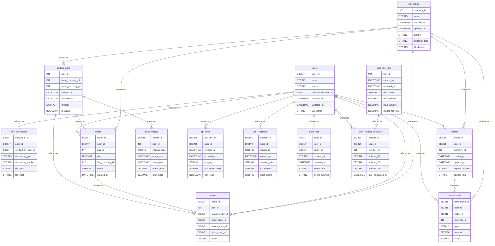

# 💱 Cryptocurrency Exchange Platform

A comprehensive MySQL database schema for a modern cryptocurrency exchange, supporting spot trading, wallet management, KYC/AML compliance, and high-frequency trading operations with advanced security features.

## 📊 Database Overview

- **Industry**: Financial Technology / Cryptocurrency
- **Complexity**: Very High
- **Tables**: 16
- **Key Features**: Order Book, Trading Engine, KYC/AML, Multi-Currency Wallets
- **Data Volume**: Designed for millions of trades per day
- **Partitioning**: Time-based partitioning for price history and audit logs

## 🗂️ Schema Structure

### User Management & Security

1. **users** - Exchange users with KYC/AML information
   - Personal and verification details
   - KYC levels (none, basic, intermediate, advanced)
   - Trading and withdrawal limits
   - 2FA and security settings
   - Referral system support

2. **kyc_documents** - Identity verification documents
   - Multiple document types (passport, ID, proof of address)
   - Verification workflow tracking
   - Document hashing for integrity
   - Expiry date management

3. **user_sessions** - Active user sessions
   - Multi-device support
   - Session token management
   - Activity tracking
   - Automatic expiry

4. **api_keys** - API access for algorithmic trading
   - Granular permissions (read, trade, withdraw)
   - IP whitelist support
   - Usage tracking and rate limiting
   - Secret key hashing

### Trading Infrastructure

1. **currencies** - Supported cryptocurrencies and fiat
   - Blockchain configuration
   - Token contract addresses
   - Deposit/withdrawal settings
   - Network confirmation requirements

2. **trading_pairs** - Available trading markets
   - Price and quantity precision
   - Min/max order limits
   - Maker/taker fee structure
   - 24h statistics caching

3. **orders** - Trading orders (limit, market, stop)
   - Multiple order types and time-in-force options
   - Partial fill tracking
   - Fee calculation
   - Order source tracking (web, mobile, API)

4. **trades** - Executed trades
   - Maker/taker matching
   - Fee distribution
   - Price discovery
   - Trade value calculation

### Financial Management

1. **wallets** - User cryptocurrency wallets
   - Available vs locked balance
   - Deposit address generation
   - Balance reconciliation
   - Multi-currency support

2. **transactions** - Deposits and withdrawals
   - Blockchain transaction tracking
   - Confirmation counting
   - Risk scoring and manual review
   - Internal transfer support

3. **user_fee_tiers** - Volume-based fee discounts
   - 30-day volume calculation
   - Tiered fee structure
   - VIP tier benefits
   - Automatic tier updates

4. **user_trading_volumes** - Rolling volume tracking
   - 24h, 7d, 30d windows
   - USD equivalent calculation
   - Fee tier assignment

### Market Data

1. **price_history** - OHLCV candlestick data
   - Multiple timeframes (1m to 1M)
   - Volume tracking
   - Partitioned by time for performance
   - Trade count statistics

### Compliance & Audit

1. **audit_logs** - Comprehensive activity logging
   - All critical operations tracked
   - Before/after value storage (JSON)
   - IP and user agent logging
   - Partitioned by year

## 🔑 Key Features

### Order Matching System
- **Order Types**: Limit, Market, Stop-Limit, Stop-Market
- **Time in Force**: GTC, IOC, FOK, GTD
- **Order Book**: Optimized indexes for bid/ask queries
- **Partial Fills**: Support for large order execution
- **Self-Trade Prevention**: Maker/taker must be different users

### Security Features
- **2FA Support**: TOTP-based authentication
- **API Key Management**: Granular permissions and IP whitelisting
- **Session Management**: Multi-device tracking with auto-expiry
- **Failed Login Protection**: Account locking after attempts
- **Audit Trail**: Complete logging of all sensitive operations

### KYC/AML Compliance
- **Multi-Level KYC**: Progressive verification levels
- **Document Management**: Secure storage with hash verification
- **Risk Scoring**: AML risk assessment (0-100 scale)
- **Manual Review Queue**: Flag high-risk transactions
- **Regulatory Reporting**: Comprehensive audit logs

### Wallet Management
- **Hot/Cold Separation**: Available vs locked balances
- **Multi-Currency**: One wallet per currency per user
- **Deposit Addresses**: Unique addresses with memo/tag support
- **Balance Tracking**: Real-time balance updates via triggers
- **Withdrawal Limits**: Daily limits based on KYC level

## 📈 Use Cases

### Common Queries

1. **Order Book Depth**
```sql
-- Get order book for BTC/USDT
SELECT
    side,
    price,
    SUM(remaining_quantity) as total_quantity,
    COUNT(*) as order_count
FROM orders
WHERE pair_id = 1  -- BTC/USDT
    AND status IN ('open', 'partially_filled')
GROUP BY side, price
ORDER BY
    side DESC,
    CASE WHEN side = 'sell' THEN price END ASC,
    CASE WHEN side = 'buy' THEN price END DESC
LIMIT 20;
```

2. **User Portfolio Value**
```sql
-- Calculate total portfolio value in USD
SELECT
    u.user_id,
    u.email,
    SUM(
        w.total_balance *
        COALESCE(
            (SELECT last_price FROM trading_pairs
             WHERE base_currency_id = w.currency_id
               AND quote_currency_id = 3), -- USDT
            1 -- For stablecoins
        )
    ) as portfolio_value_usd
FROM users u
JOIN wallets w ON u.user_id = w.user_id
WHERE w.total_balance > 0
GROUP BY u.user_id;
```

3. **24-Hour Trading Volume**
```sql
-- Get 24h volume for all pairs
SELECT
    tp.symbol,
    COUNT(t.trade_id) as trade_count,
    SUM(t.quantity) as volume,
    SUM(t.value) as volume_usd,
    MIN(t.price) as low_24h,
    MAX(t.price) as high_24h,
    FIRST_VALUE(t.price) OVER (
        PARTITION BY t.pair_id
        ORDER BY t.executed_at DESC
    ) as last_price
FROM trades t
JOIN trading_pairs tp ON t.pair_id = tp.pair_id
WHERE t.executed_at >= DATE_SUB(NOW(), INTERVAL 24 HOUR)
GROUP BY tp.pair_id, tp.symbol;
```

4. **Pending KYC Reviews**
```sql
-- Get KYC documents awaiting review
SELECT
    u.user_id,
    u.email,
    u.first_name,
    u.last_name,
    kd.document_type,
    kd.uploaded_at,
    TIMESTAMPDIFF(HOUR, kd.uploaded_at, NOW()) as hours_pending
FROM kyc_documents kd
JOIN users u ON kd.user_id = u.user_id
WHERE kd.verification_status = 'pending'
ORDER BY kd.uploaded_at ASC;
```

5. **High-Value Transaction Monitoring**
```sql
-- Monitor large withdrawals for compliance
SELECT
    t.transaction_id,
    u.email,
    c.symbol,
    t.amount,
    t.amount * tp.last_price as value_usd,
    t.blockchain_address,
    t.status,
    t.risk_score,
    t.created_at
FROM transactions t
JOIN users u ON t.user_id = u.user_id
JOIN currencies c ON t.currency_id = c.currency_id
LEFT JOIN trading_pairs tp ON c.currency_id = tp.base_currency_id
    AND tp.quote_currency_id = 3 -- USDT
WHERE t.type = 'withdrawal'
    AND t.amount * COALESCE(tp.last_price, 1) > 10000 -- $10k+
    AND t.status = 'pending'
ORDER BY t.created_at DESC;
```

## 🚀 Getting Started

### 1. Create Database
```bash
mysql -u root -p < schema/00_create_database.sql
```

### 2. Create Schema
```bash
mysql -u root -p crypto_exchange < schema/01_tables.sql
mysql -u root -p crypto_exchange < schema/02_constraints.sql
mysql -u root -p crypto_exchange < schema/03_indexes.sql
```

### 3. Load Sample Data (when available)
```bash
mysql -u root -p crypto_exchange < data/01_currencies.sql
mysql -u root -p crypto_exchange < data/02_trading_pairs.sql
mysql -u root -p crypto_exchange < data/03_fee_tiers.sql
```

### 4. Generate Test Data (when generator is ready)
```bash
cd generators/cryptocurrency
python generator.py --users 10000 --days 30
```

## 📋 Business Rules

### Trading Rules
- Orders must have sufficient balance (locked on creation)
- Self-trading is prevented (maker != taker)
- Market orders execute immediately or cancel
- Stop orders trigger when stop price is reached
- Minimum order value enforced per pair

### KYC/AML Rules
- Withdrawal limits based on KYC level
- High-risk transactions flagged for manual review
- Documents expire and require renewal
- Progressive KYC unlocks features
- AML risk scoring affects limits

### Fee Structure
- Maker fees typically lower than taker fees
- Volume-based discounts (30-day rolling)
- Fee tiers automatically updated
- VIP tiers with additional benefits
- Withdrawal fees per currency

### Security Rules
- Failed login attempts trigger account lock
- Sessions expire after inactivity
- API keys require IP whitelist for withdrawals
- 2FA required for sensitive operations
- All critical actions logged to audit trail

## 🔍 Indexes

Optimized for high-frequency trading patterns:

- **Order Book**: Composite indexes for bid/ask queries
- **Trade History**: Time-based partitioning and indexes
- **User Operations**: Covering indexes for portfolio queries
- **Compliance**: Indexes for KYC queue and audit trails
- **Market Data**: Optimized for OHLCV chart queries

## 📊 Performance Considerations

### Partitioning Strategy
- **audit_logs**: Yearly partitions for compliance retention
- **price_history**: Quarterly partitions for market data
- **trades**: Consider daily partitions for high-volume pairs

### Caching Recommendations
- Order book depth (Redis sorted sets)
- 24h statistics (update every minute)
- User balances (write-through cache)
- Price tickers (WebSocket broadcast)

### Scaling Considerations
- Read replicas for market data queries
- Separate OLAP database for analytics
- Message queue for order matching
- Microservice for blockchain interactions

## 🎯 Learning Objectives

This example demonstrates:

1. **Financial Systems** - Double-entry bookkeeping principles
2. **High-Frequency Trading** - Order matching and execution
3. **Compliance** - KYC/AML implementation patterns
4. **Security** - Multi-layer authentication and authorization
5. **Performance** - Handling millions of trades efficiently
6. **Audit Trails** - Regulatory compliance logging
7. **Real-time Systems** - WebSocket and event-driven updates

## 🔧 Customization Options

### Additional Features to Consider

1. **Margin Trading**
```sql
CREATE TABLE margin_positions (
    position_id BIGINT UNSIGNED PRIMARY KEY,
    user_id BIGINT UNSIGNED,
    pair_id INT UNSIGNED,
    side ENUM('long', 'short'),
    leverage DECIMAL(5,2),
    entry_price DECIMAL(30,18),
    liquidation_price DECIMAL(30,18),
    collateral DECIMAL(30,18),
    unrealized_pnl DECIMAL(30,18)
);
```

2. **Staking Rewards**
```sql
CREATE TABLE staking_pools (
    pool_id INT UNSIGNED PRIMARY KEY,
    currency_id INT UNSIGNED,
    apy DECIMAL(5,2),
    minimum_stake DECIMAL(30,18),
    lock_period_days INT
);
```

3. **Copy Trading**
```sql
CREATE TABLE copy_trading (
    follow_id BIGINT UNSIGNED PRIMARY KEY,
    follower_user_id BIGINT UNSIGNED,
    trader_user_id BIGINT UNSIGNED,
    allocation_percentage DECIMAL(5,2),
    max_position_size DECIMAL(20,2)
);
```

## 🛠️ Technologies

- **Database**: MySQL 8.0+ with JSON support
- **Engine**: InnoDB for ACID compliance
- **Partitioning**: Range partitioning for time-series data
- **Character Set**: utf8mb4 for international support
- **Collation**: utf8mb4_unicode_ci

## 📚 Additional Resources

- [MySQL Partitioning Guide](https://dev.mysql.com/doc/refman/8.0/en/partitioning.html)
- [Financial System Design](https://martinfowler.com/articles/patterns-of-distributed-systems/)
- [Order Matching Engines](https://www.investopedia.com/terms/m/matchingorders.asp)
- [KYC/AML Best Practices](https://www.fatf-gafi.org/)

## 🤝 Contributing

Areas for improvement:
1. Add futures/derivatives trading
2. Implement lending/borrowing
3. Add DeFi integration
4. Create mobile app schemas
5. Add blockchain node management

## 📝 License

Part of the MySQL Business-to-Schema project, MIT License.

## Database Architecture (Mermaid ERD)


