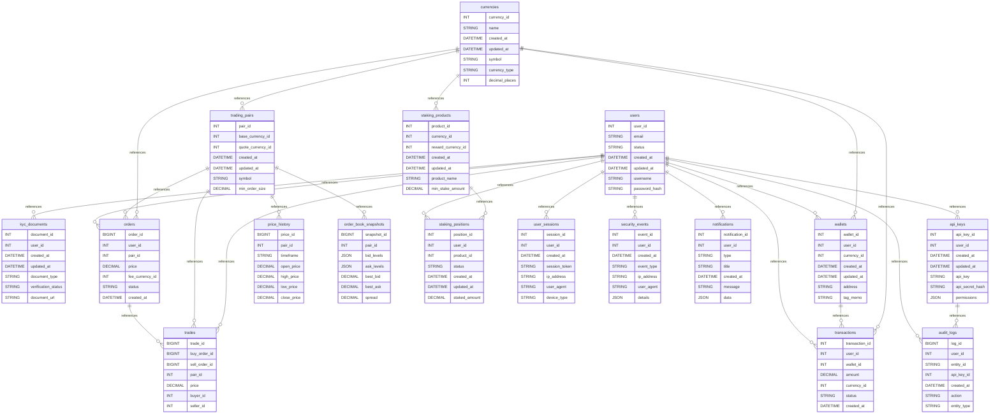

# 💱 Cryptocurrency Exchange (Spot + Staking)

Production-ready MySQL schema for a modern cryptocurrency exchange with spot trading, wallet management, KYC/AML compliance, and staking/yield features.

## 📊 Overview

- **Industry**: FinTech / Crypto
- **Complexity**: High
- **Database**: `crypto_exchange`
- **Focus**: Orders, trades, wallets, compliance, and auditability

## 🗂️ Schema Files

```
schema/
├── 00_create_database.sql
├── 01_tables.sql
├── 02_constraints.sql
└── 03_indexes.sql
```

## 🚀 Quick Start

```bash
# Create database
mysql -u root -p < schema/00_create_database.sql

# Apply schema
mysql -u root -p crypto_exchange < schema/01_tables.sql
mysql -u root -p crypto_exchange < schema/02_constraints.sql
mysql -u root -p crypto_exchange < schema/03_indexes.sql
```

## 🔍 Queries & Data

The `queries/` and `data/` folders are reserved for:
- Example analytics and reports
- Seed data for local testing

Add files as needed for your workflows.

## ✅ What This Example Demonstrates

- Order book and trade execution storage
- Multi-currency wallet balances and transactions
- KYC/AML compliance tracking
- API key governance and audit trails
- Indexing strategies for high-volume trading

## 📄 License

Part of the MySQL Business-to-Schema project, MIT License.

## Database Architecture (Mermaid ERD)


