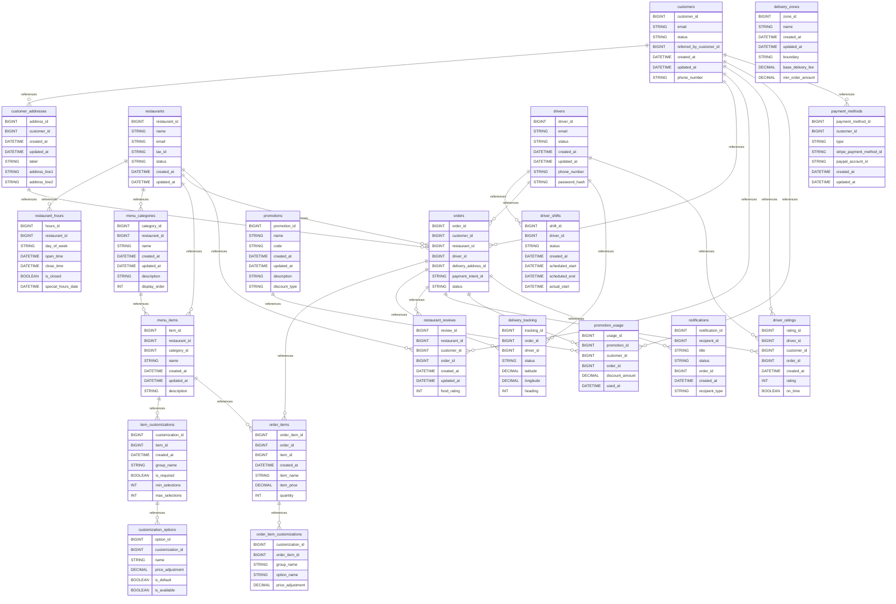

# 🍕 Food Delivery Platform

A comprehensive MySQL database schema for a modern food delivery platform supporting multi-restaurant marketplace, real-time order tracking, dynamic pricing, and sophisticated driver dispatch system similar to Uber Eats or DoorDash.

## 📊 Database Overview

- **Industry**: Food Delivery / On-Demand Services
- **Complexity**: Very High
- **Tables**: 24
- **Key Features**: Real-time Tracking, Surge Pricing, Multi-sided Marketplace
- **Data Volume**: Designed for millions of orders per month
- **Partitioning**: Time-based for tracking data

## 🗂️ Schema Structure

### Customer Management

1. **customers** - Platform users ordering food
   - Profile and preferences
   - Dietary restrictions tracking
   - Loyalty program with tiers
   - Referral system
   - Notification preferences

2. **customer_addresses** - Saved delivery locations
   - Multiple addresses per customer
   - GPS coordinates for accurate delivery
   - Special delivery instructions
   - Default address management

3. **payment_methods** - Saved payment options
   - Card tokenization
   - Multiple payment types
   - Default payment selection
   - PCI compliance ready

### Restaurant Management

1. **restaurants** - Partner restaurants
   - Business information and verification
   - Service area and delivery radius
   - Operating parameters
   - Rating and performance metrics
   - Featured/promoted status

2. **restaurant_hours** - Operating schedules
   - Daily schedules
   - Special hours for holidays
   - Automatic availability checking

3. **menu_categories** - Menu organization
   - Time-based availability (breakfast, lunch, dinner)
   - Display ordering
   - Category scheduling

4. **menu_items** - Food and beverage items
   - Detailed nutritional information
   - Dietary labels (vegan, halal, kosher)
   - Dynamic pricing support
   - Stock management
   - Popularity tracking

5. **item_customizations** - Modification options
   - Size variations
   - Add-ons and toppings
   - Required vs optional selections
   - Price adjustments

### Delivery Operations

1. **drivers** - Delivery personnel
   - Multi-modal delivery (car, bike, scooter)
   - Background check tracking
   - Performance metrics
   - Real-time location tracking
   - Earnings management

2. **driver_shifts** - Work scheduling
   - Shift planning
   - Performance tracking per shift
   - Earnings calculation

3. **delivery_zones** - Geographic service areas
   - GeoJSON boundaries
   - Zone-specific pricing
   - Surge pricing automation
   - Demand/supply monitoring

4. **delivery_tracking** - Real-time GPS tracking
   - Location breadcrumbs
   - Status updates
   - Distance calculations
   - Partitioned for performance

### Order Management

1. **orders** - Customer orders
   - Multi-stage workflow
   - Scheduled orders support
   - Comprehensive pricing breakdown
   - Payment processing
   - Cancellation and refunds

2. **order_items** - Order line items
   - Quantity management
   - Special instructions
   - Price history

3. **order_item_customizations** - Applied modifications
   - Selected options tracking
   - Price adjustments

### Reviews & Ratings

1. **restaurant_reviews** - Customer feedback
   - Multi-aspect ratings
   - Restaurant responses
   - Verified purchase badges
   - Helpful voting

2. **driver_ratings** - Delivery feedback
   - Service quality metrics
   - Performance indicators

### Marketing & Promotions

1. **promotions** - Discount campaigns
   - Multiple discount types
   - Targeting and segmentation
   - Usage limits
   - Time and day restrictions

2. **promotion_usage** - Redemption tracking
   - Per-customer limits
   - Analytics data

### Communications

1. **notifications** - Multi-channel messaging
   - Push, SMS, email support
   - Priority levels
   - Delivery tracking
   - Read receipts

## 🔑 Key Features

### Real-Time Order Tracking
- **GPS Tracking**: Live driver location updates
- **Status Updates**: Multi-stage order lifecycle
- **ETA Calculation**: Dynamic delivery time estimates
- **Push Notifications**: Real-time customer updates

### Dynamic Pricing System
- **Surge Pricing**: Automatic demand-based pricing
- **Zone-Based Fees**: Geographic delivery charges
- **Small Order Fees**: Minimum order enforcement
- **Time-Based Pricing**: Peak hours pricing

### Advanced Dispatch System
- **Smart Matching**: Driver-order pairing algorithm
- **Multi-Order Batching**: Efficient route optimization
- **Zone Management**: Geographic load balancing
- **Driver Availability**: Real-time capacity tracking

### Loyalty & Gamification
- **Points System**: Earn points on orders
- **Tier Benefits**: Bronze to Platinum levels
- **Referral Program**: Customer acquisition incentives
- **Promotional Engine**: Targeted discounts

## 📈 Use Cases

### Common Queries

1. **Find Nearby Restaurants**
```sql
-- Find restaurants within 5km of customer location
SELECT
    r.restaurant_id,
    r.name,
    r.average_rating,
    r.preparation_time_minutes,
    r.delivery_fee,
    r.minimum_order_amount,
    ST_Distance_Sphere(
        POINT(r.longitude, r.latitude),
        POINT(-122.4194, 37.7749)  -- Customer location
    ) / 1000 as distance_km
FROM restaurants r
WHERE r.status = 'active'
    AND r.delivery_enabled = TRUE
    AND ST_Distance_Sphere(
        POINT(r.longitude, r.latitude),
        POINT(-122.4194, 37.7749)
    ) / 1000 <= r.delivery_radius_km
ORDER BY distance_km;
```

2. **Check Restaurant Availability**
```sql
-- Check if restaurant is currently open
SELECT
    r.name,
    rh.open_time,
    rh.close_time,
    CASE
        WHEN rh.is_closed THEN 'Closed Today'
        WHEN CURTIME() BETWEEN rh.open_time AND rh.close_time THEN 'Open Now'
        ELSE 'Closed'
    END as status
FROM restaurants r
JOIN restaurant_hours rh ON r.restaurant_id = rh.restaurant_id
WHERE r.restaurant_id = 1
    AND rh.day_of_week = LOWER(DAYNAME(CURDATE()))
    AND (rh.special_hours_date IS NULL OR rh.special_hours_date = CURDATE());
```

3. **Driver Dispatch Query**
```sql
-- Find available drivers near restaurant
SELECT
    d.driver_id,
    d.first_name,
    d.average_rating,
    d.vehicle_type,
    ST_Distance_Sphere(
        POINT(d.current_longitude, d.current_latitude),
        POINT(r.longitude, r.latitude)
    ) / 1000 as distance_km
FROM drivers d, restaurants r
WHERE r.restaurant_id = 1
    AND d.status = 'active'
    AND d.is_available = TRUE
    AND ST_Distance_Sphere(
        POINT(d.current_longitude, d.current_latitude),
        POINT(r.longitude, r.latitude)
    ) / 1000 <= 5  -- Within 5km
ORDER BY distance_km, d.average_rating DESC
LIMIT 5;
```

4. **Calculate Order Totals**
```sql
-- Calculate order with promotions
WITH order_subtotal AS (
    SELECT
        o.order_id,
        SUM(oi.subtotal) as items_total,
        o.delivery_fee,
        o.service_fee,
        GREATEST(0, 10 - SUM(oi.subtotal)) * 2 as small_order_fee  -- $2 if under $10
    FROM orders o
    JOIN order_items oi ON o.order_id = oi.order_id
    WHERE o.order_id = 1
    GROUP BY o.order_id
),
applied_promo AS (
    SELECT
        p.discount_type,
        p.discount_value,
        p.max_discount_amount
    FROM promotions p
    WHERE p.code = 'SAVE20'
        AND p.is_active = TRUE
        AND NOW() BETWEEN p.valid_from AND p.valid_until
)
SELECT
    os.items_total,
    os.delivery_fee,
    os.service_fee,
    os.small_order_fee,
    CASE
        WHEN ap.discount_type = 'percentage' THEN
            LEAST(os.items_total * ap.discount_value / 100, COALESCE(ap.max_discount_amount, 999))
        WHEN ap.discount_type = 'fixed_amount' THEN
            ap.discount_value
        ELSE 0
    END as discount,
    os.items_total + os.delivery_fee + os.service_fee + os.small_order_fee -
    CASE
        WHEN ap.discount_type = 'percentage' THEN
            LEAST(os.items_total * ap.discount_value / 100, COALESCE(ap.max_discount_amount, 999))
        WHEN ap.discount_type = 'fixed_amount' THEN
            ap.discount_value
        ELSE 0
    END as total
FROM order_subtotal os
CROSS JOIN applied_promo ap;
```

5. **Zone Surge Pricing Analysis**
```sql
-- Monitor zone demand and surge status
SELECT
    z.name,
    z.active_drivers,
    z.pending_orders,
    z.pending_orders / GREATEST(z.active_drivers, 1) as demand_ratio,
    z.surge_multiplier,
    z.surge_active,
    z.surge_reason,
    z.average_wait_time_minutes
FROM delivery_zones z
WHERE z.is_active = TRUE
ORDER BY demand_ratio DESC;
```

## 🚀 Getting Started

### 1. Create Database
```bash
mysql -u root -p < schema/00_create_database.sql
```

### 2. Create Schema
```bash
mysql -u root -p food_delivery < schema/01_tables.sql
mysql -u root -p food_delivery < schema/02_constraints.sql
mysql -u root -p food_delivery < schema/03_indexes.sql
```

### 3. Load Sample Data (when available)
```bash
mysql -u root -p food_delivery < data/01_zones.sql
mysql -u root -p food_delivery < data/02_restaurants.sql
mysql -u root -p food_delivery < data/03_menu.sql
```

### 4. Generate Test Data (when generator is ready)
```bash
cd generators/food_delivery
python generator.py --customers 10000 --restaurants 500 --orders 50000
```

## 📋 Business Rules

### Order Processing
- Orders must have valid delivery address or pickup selection
- Payment authorization before restaurant confirmation
- Automatic assignment to nearest available driver
- Real-time status updates at each stage
- Scheduled orders up to 7 days in advance

### Pricing Rules
- Base delivery fee per zone
- Surge pricing during high demand (automatic)
- Small order fee if below minimum
- Service fee percentage on subtotal
- Tips 100% to drivers

### Driver Management
- Background check required before activation
- Maximum concurrent orders limit (default: 2)
- Automatic offline after 15 minutes inactivity
- Performance-based priority dispatch
- Weekly payout processing

### Restaurant Operations
- Menu items availability by time of day
- Stock management with daily limits
- Preparation time affects delivery estimates
- Commission percentage on orders
- Featured placement options

### Promotions
- First-time user discounts
- Loyalty tier benefits
- Limited-use promo codes
- Time and day restrictions
- Minimum order requirements

## 🔍 Indexes

Optimized for common access patterns:

- **Spatial Indexes**: GPS-based restaurant and driver search
- **Full-Text Search**: Restaurant and menu item discovery
- **Time-Based**: Order history and scheduling
- **Composite**: Complex filtering and sorting
- **Partitioned**: High-volume tracking data

## 📊 Performance Considerations

### Scaling Strategies
- **Read Replicas**: For customer-facing queries
- **Partitioning**: Delivery tracking by date
- **Caching**: Restaurant menus, zones, promotions
- **Queue System**: Order processing, notifications
- **CDN**: Menu images and restaurant assets

### Real-Time Requirements
- Driver location updates: < 100ms write
- Order status changes: < 500ms propagation
- Zone statistics: 5-minute aggregation
- Surge pricing: Automatic triggers

### Data Retention
- Orders: Permanent
- Tracking data: 30 days
- Notifications: 90 days
- Reviews: Permanent
- Driver locations: 24 hours

## 🎯 Learning Objectives

This example demonstrates:

1. **Marketplace Design** - Multi-sided platform architecture
2. **Real-Time Systems** - GPS tracking and live updates
3. **Dynamic Pricing** - Surge pricing algorithms
4. **Workflow Management** - Complex order lifecycle
5. **Geospatial Queries** - Location-based search and matching
6. **Performance at Scale** - High-volume transaction processing
7. **User Experience** - Personalization and recommendations

## 🔧 Customization Options

### Additional Features to Consider

1. **Group Orders**
```sql
CREATE TABLE group_orders (
    group_order_id BIGINT UNSIGNED PRIMARY KEY,
    organizer_customer_id BIGINT UNSIGNED,
    restaurant_id BIGINT UNSIGNED,
    deadline TIMESTAMP,
    delivery_address_id BIGINT UNSIGNED,
    status ENUM('collecting', 'submitted', 'delivered')
);
```

2. **Subscription Service**
```sql
CREATE TABLE subscriptions (
    subscription_id BIGINT UNSIGNED PRIMARY KEY,
    customer_id BIGINT UNSIGNED,
    plan_type ENUM('monthly', 'annual'),
    benefits JSON,
    free_delivery_remaining INT,
    discount_percentage DECIMAL(5,2)
);
```

3. **Virtual Restaurants**
```sql
CREATE TABLE virtual_brands (
    brand_id BIGINT UNSIGNED PRIMARY KEY,
    parent_restaurant_id BIGINT UNSIGNED,
    brand_name VARCHAR(255),
    dedicated_menu BOOLEAN,
    commission_rate DECIMAL(5,2)
);
```

## 🛠️ Technologies

- **Database**: MySQL 8.0+ with Spatial extensions
- **Engine**: InnoDB for ACID compliance
- **Spatial**: GPS and polygon operations
- **Partitioning**: Time-based for tracking data
- **Character Set**: utf8mb4 for emoji support

## 📚 Additional Resources

- [MySQL Spatial Functions](https://dev.mysql.com/doc/refman/8.0/en/spatial-functions.html)
- [Database Partitioning](https://dev.mysql.com/doc/refman/8.0/en/partitioning.html)
- [Real-time Systems Design](https://www.oreilly.com/library/view/designing-data-intensive-applications/9781449373320/)
- [Marketplace Architecture](https://www.marketplaceplatform.com/)

## 🤝 Contributing

Areas for improvement:
1. Add restaurant analytics dashboard
2. Implement driver routing optimization
3. Add machine learning for demand prediction
4. Create customer segmentation system
5. Add multi-language support

## 📝 License

Part of the MySQL Business-to-Schema project, MIT License.

## Database Architecture (Mermaid ERD)


